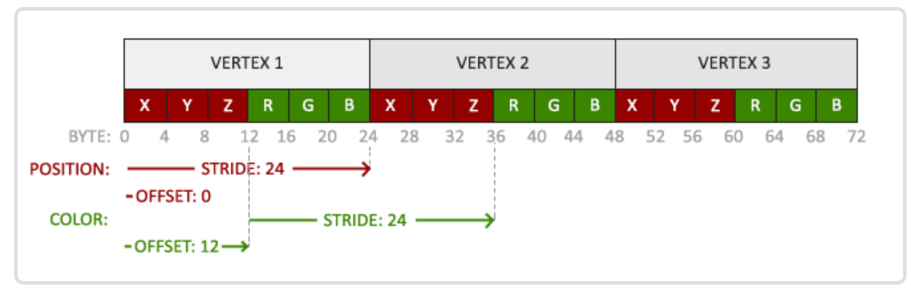

这是对learnopengl的简单笔记。原教程网址：[learnopengl](https://learnopengl-cn.github.io/)。原教程同时涉及图形学的基本理论与opengl API，本文更多关注API，而简化甚至省略了背后的图形学原理性内容。  

## 着色器结构  
一个典型的着色器有一下结构：  
```  
#version version_number  
in type in_variable_name;  
in type in_variable_name;  
  
out type out_variable_name;  
  
uniform type uniform_name;  
  
int main()  
{  
  // 处理输入并进行一些图形操作  
  ...  
  // 输出处理过的结果到输出变量  
  out_variable_name = weird_stuff_we_processed;  
}  
```  
关于顶点着色器，输入的变量为顶点属性。openGL保证至少有16个包含4分量的顶点属性可用。注意，一个作为顶点着色器输入的顶点属性*一个顶点的属性*，（后面会提到，location用于指定不同什么位置的数据输入到哪一个顶点着色器的输入变量），这么多一般够用了。用  
```  
int nrAttributes;  
glGetIntegerv(GL_MAX_VERTEX_ATTRIBS, &nrAttributes);  
```  
获取最大能有多少输入。一般用不上。  
## 着色器数据类型  
对着色器编程，更像一种特殊的硬件描述语言，而非普通的程序设计语言。它的输入是向量，有不同类型。名称很有规律。  
|名称|描述|  
|:-:|:-:|  
|vecn|n分量float|  
|ivecn|n分量int|  
|bvecn|n分量bool|  
|uvecn|n分量unsigned int|  
|dvecn|n分量double|  
用.x .y. .z .w依次访问数据。也可以组合访问：  
```  
vec3 v3(1.0, 0.5, 0.2);  
v3.xxyx...  //1.0,1.0,0.5,1.0  
```  
  
使用类似构造函数的方法进行创建、赋值。  
```  
vec2 v2(1.0,0.5);  
vec3 v3(v2, 1.0);	//this is allowed  
```  
## 输入输出与着色器的连接  
用 in out 声明输入、输出变量。  
  
顶点着色器的 *layout (location = 0) in...*：顶点着色器的输入之特殊之处在于要直接从显存中获取输入、必定有一个自带的（不用声明的）输出 一个vec4 的 *gl_Positon*。location用于指定哪些数据要被输入到这个声明的变量里，然后代码里的 *glVertexAttribArray* 函数里指定哪一些数据被定位到 location=0(或者其它)。  
  
当多个着色器之间有类型、名字相同的输入输出的时候，就能*连接到一起*，比如  
```  
// vertex shader  
out vec4 ourColor;  
...  
// fragment shader  
in vec4 ourColor;  
```  
这两个就能被成功连接。实现传输一些特殊的信息。  
## uniform  
uniform是存在于一个着色器程序中的*全局变量*，它可以被这个着色器程序中任意一个着色器访问。可以在外部人为指定uniform的值。uniform将保存上一次设定的值直到下次被修改。  
使用 *glGetUniformLocation* *glUniformxx*（后面两个xx前一个是有几个分量，后一个指定类型，f,i,d,ui,fv (a float array)...)  
```  
// glsl of shader  
uniform vec4 ourColor;  
  
//openGL  
int vertexColorLocation = glGetUniformLocation(shaderProgram, "ourColor");  
glUseProgram(shaderProgram);  
glUniform4f(vertexColorLocation, 0.0f, greenValue, 0.0f, 1.0f);  
```  
逻辑是：在着色器程序中获取uniform的位置，然后修改uniform。注意修改uniform的时候一定要先 Use 了相应的着色器程序。  
## 关于location  
从下面这个例子里可以直观地看出其作用。这里，我们将顶点颜色作为顶点属性输入到顶点着色器里，然后由顶点着色器将顶点颜色属性发送给片段着色器。  
**着色器**  
```  
// vertex shader  
#version 330 core  
layout (location = 0) in vec3 aPos;   // 位置变量的属性位置值为 0  
layout (location = 1) in vec3 aColor; // 颜色变量的属性位置值为 1  
  
out vec3 ourColor; // 向片段着色器输出一个颜色  
  
void main()  
{  
    gl_Position = vec4(aPos, 1.0);  
    ourColor = aColor; // 将ourColor设置为我们从顶点数据那里得到的输入颜色  
}  
  
// fragment shader  
#version 330 core  
out vec4 FragColor;  
in vec3 ourColor;  
  
void main()  
{  
    FragColor = vec4(ourColor, 1.0);  
}  
```  
注意这里就有两个location了，分别指定作为位置的输入和作为颜色的输入。  
**顶点属性**：  
```  
float vertices[] = {  
    // 位置              // 颜色  
     0.5f, -0.5f, 0.0f,  1.0f, 0.0f, 0.0f,   // 右下  
    -0.5f, -0.5f, 0.0f,  0.0f, 1.0f, 0.0f,   // 左下  
     0.0f,  0.5f, 0.0f,  0.0f, 0.0f, 1.0f    // 顶部  
};  
```  
注意一次输入给顶点着色器的顶点属性就是*一个顶点的属性*，它们当然得是挨着的。所以前面位置、后面颜色。  
  
**更新顶点格式**：  
```  
// 位置属性  
glVertexAttribPointer(0, 3, GL_FLOAT, GL_FALSE, 6 * sizeof(float), (void*)0);  
glEnableVertexAttribArray(0);  
// 颜色属性  
glVertexAttribPointer(1, 3, GL_FLOAT, GL_FALSE, 6 * sizeof(float), (void*)(3* sizeof(float)));//颜色偏移了三个元素  
glEnableVertexAttribArray(1);  
```  
说明：  
注意 glVertexAttribPointer 的第一个参数。这就指定了哪个是位置、哪个是颜色。  
  
指定顶点颜色后，OpenGL会自动在面片上进行颜色插值。  
  
### 关于VAO，VBO的更多理解  
VBO直接和一段显存绑定。要对显存进行操作，比如传输数据等，必须要先把 target (for example, GL_ARRAY_BUFFER, GL_ELEMENT_ARRAY_BUFFER)和相应的VBO（EBO）结构绑定(glBindBuffer(VBO))，然后再操作，比如传值等。  
而VAO记录了当时被绑定的VBO行为（特别是 glVertexAttribPointer, glEnableVertexAttribArray)，glBindVertexArray(VAO)就相当于调用了这些函数。每次传值之后都要 glVertexAttribPointer等，但是由于形式上是相同的，所以直接 glBindVertexArray(VAO) 就可以。  
看代码：想在每次渲染的时候更换VBO对应的值以达到随时间渐变效果：  
```  
		glUseProgram(shaderProgram);    //应用着色器程序  
  
        glBindBuffer(GL_ARRAY_BUFFER,VBO);  //必须绑定着！  
        glBufferData(GL_ARRAY_BUFFER,sizeof(vertices),vertices,GL_DYNAMIC_DRAW);  
        glBindBuffer(GL_ARRAY_BUFFER,0);  
        glBindVertexArray(VAO);//可见，使用了VAO就相当于使用了那几个被记录下的函数！  
  
        glDrawArrays(GL_TRIANGLES,0,3);  
```  
除了那个解绑VBO的（因为只有一个VBO），其它缺一不可！  
  
### 附.把着色器程序封装成C++类  
应当包含以下函数：  
```  
#ifndef SHADER_H  
#define SHADER_H  
  
#include <glad/glad.h>; // 包含glad来获取所有的必须OpenGL头文件  
  
#include <string>  
#include <fstream>  
#include <sstream>  
#include <iostream>  
  
  
class Shader  
{  
public:  
    // 程序ID  
    unsigned int ID;  
  
    // 构造器读取并构建着色器  
    Shader(const char* vertexPath, const char* fragmentPath);  
    // 使用/激活程序  
    void use();  
    // uniform工具函数  
    void setBool(const std::string &name, bool value) const;  
    void setInt(const std::string &name, int value) const;  
    void setFloat(const std::string &name, float value) const;  
};  
#endif  
```  
这个类初始化的时候输入glsl文件的地址字符串，然后构造函数中将其读进来并且编译、链接为完成的着色器程序。构造函数大概长这样（有一些陌生的用法，比如C++文件流，比如异常）：  
```  
Shader(const char* vertexPath, const char* fragmentPath)  
{  
    // 1. 从文件路径中获取顶点/片段着色器  
    std::string vertexCode;  
    std::string fragmentCode;  
    std::ifstream vShaderFile;  
    std::ifstream fShaderFile;  
    // 保证ifstream对象可以抛出异常：  
    vShaderFile.exceptions (std::ifstream::failbit | std::ifstream::badbit);  
    fShaderFile.exceptions (std::ifstream::failbit | std::ifstream::badbit);  
    try  
    {  
        // 打开文件  
        vShaderFile.open(vertexPath);  
        fShaderFile.open(fragmentPath);  
        std::stringstream vShaderStream, fShaderStream;  
        // 读取文件的缓冲内容到数据流中  
        vShaderStream << vShaderFile.rdbuf();  
        fShaderStream << fShaderFile.rdbuf();  
        // 关闭文件处理器  
        vShaderFile.close();  
        fShaderFile.close();  
        // 转换数据流到string  
        vertexCode   = vShaderStream.str();  
        fragmentCode = fShaderStream.str();  
    }  
    catch(std::ifstream::failure e)  
    {  
        std::cout << "ERROR::SHADER::FILE_NOT_SUCCESFULLY_READ" << std::endl;  
    }  
    const char* vShaderCode = vertexCode.c_str();  
    const char* fShaderCode = fragmentCode.c_str();  
  
	// 2. 编译着色器  
unsigned int vertex, fragment;  
int success;  
char infoLog[512];  
  
// 顶点着色器  
vertex = glCreateShader(GL_VERTEX_SHADER);  
glShaderSource(vertex, 1, &vShaderCode, NULL);  
glCompileShader(vertex);  
// 打印编译错误（如果有的话）  
glGetShaderiv(vertex, GL_COMPILE_STATUS, &success);  
if(!success)  
{  
    glGetShaderInfoLog(vertex, 512, NULL, infoLog);  
    std::cout << "ERROR::SHADER::VERTEX::COMPILATION_FAILED\n" << infoLog << std::endl;  
};  
  
// 片段着色器也类似  
[...]  
  
// 着色器程序  
ID = glCreateProgram();  
glAttachShader(ID, vertex);  
glAttachShader(ID, fragment);  
glLinkProgram(ID);  
// 打印连接错误（如果有的话）  
glGetProgramiv(ID, GL_LINK_STATUS, &success);  
if(!success)  
{  
    glGetProgramInfoLog(ID, 512, NULL, infoLog);  
    std::cout << "ERROR::SHADER::PROGRAM::LINKING_FAILED\n" << infoLog << std::endl;  
}  
  
// 删除着色器，它们已经链接到我们的程序中了，已经不再需要了  
glDeleteShader(vertex);  
glDeleteShader(fragment);  
}  
```  
