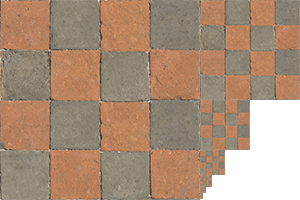

这是对learnopengl的简单笔记。原教程网址：[learnopengl](https://learnopengl-cn.github.io/)。原教程同时涉及图形学的基本理论与opengl API，本文更多关注API，而简化甚至省略了背后的图形学原理性内容。  

### 纹理概述  
纹理就是贴图。一般是2D纹理 (0.0-1.0 float)，表示纹理空间时二维空间，当然也有1D, 3D。纹理有自己的坐标系，添加纹理的过程就是把顶点坐标映射到纹理坐标，取该点（附近）的像素颜色，不同顶点间的点对应的纹理坐标插值处理，然后图案就有了纹理。  
### 全过程  
+ 生成纹理 glGenTexture()  
+ 绑定纹理（将这个生成的纹理绑定为当前处理的纹理对象）glBindTexture()。让 GL_TEXTURE_2D和实际纹理对象（genTexture来的）绑定，让后面的设置指向这个实际纹理对象。  
+ 设置纹理环绕方式、纹理过滤、多级渐远纹理 设置参数 glTexParameteri, glTexParameterfv...  
+ 给纹理载入图片数据 stbi_load  
+ 删除图片数据 stbi_image_free  
  **以上是搞定了纹理对象，下面将采样器和纹理对象对应！**  
+ 将片段着色器中的 uniform sampler2D.. 和 **纹理通道（我名）** GL_TEXTURE0 GL_TEXTURE1 GL_TEXTURE2...绑定（0 for GL-TEXTURE0, 1 for GL_TEXTURE1...)  
+ in render loop:  
   激活纹理通道 glActiveTexture(GL_TEXTURE0)...  
   将这个纹理通道和实际纹理对象绑定 glBindTexture(GL_TEXTURE2D, texture); 激活纹理通道后，GL_TEXTURE_2D 目标所绑定的那个纹理对象会绑定到被激活的纹理通道上。激活纹理通道后，再绑定目标与想要的纹理对象，就能把这个纹理对象和与这个纹理通道绑定的sampler in fragment shader 连接，这样片段采样器的这个sampler采样纹理的时候就会从这个纹理对象上采样。  
+ 详见最下面的样例 ！  
### 加载纹理(图片)  
使用**stb_image.h**加载纹理。把图片文件转换为一个char数组。  
  
下载stb_image.h，放到项目的include文件中。添加下面宏定义：  
```  
#define STB_IMAGE_IMPLEMENTATION //只加载用过的函数  
#include "stb_image.h"  
or #include <...>  
```  
加载图像：**stbi_load(...)**  
```  
int width, height, nrChannels;  
unsigned char *data = stbi_load("container.jpg", &width, &height, &nrChannels, 0);  
```  
转换为unsigned char数组！  
调用后width height会存放图片的宽、高！后面创建纹理要用。而nrChannels 放了颜色通道（层数）  
  
在这之前，可能需要先翻转y轴适应gl的原点在左下角的标准：  
```  
stbi_set_flip_vertically_on_load(true);//设置状态！  
```  
  
顺便，最后设置完纹理后可以释放图片：  
```  
stbi_image_free(data);  
```  
### 准备：生成纹理  
+ 生成纹理  
+ 绑定纹理（将这个生成的纹理绑定为当前处理的纹理对象）  
+ 设置纹理环绕方式、纹理过滤、多级渐远纹理  
+ 给纹理载入图片数据  
+ 删除图片数据  
  
涉及到一系列状态设置，记住目标（常是GL_TEXTURE_2D）是本体！对它的设置是对绑定在它身上的texture的处理！  
  
纹理同样用ID识别。  
```  
unsigned int texture;  
glGenTextures(1, &texture);  
```  
绑定纹理并载入数据：**glBindTexture(), glTexImage()**  
```  
glBindTexture(GL_TEXTURE_2D, texture);  
glTexImage2D(GL_TEXTURE_2D, 0, GL_RGB, width, height, 0, GL_RGB, GL_UNSIGNED_BYTE, data);  
glGenerateMipmap(GL_TEXTURE_2D); //生成mipmap  
```  
GL_TEXTURE_2D 是纹理目标（当然也可以是1D、3D），1D、2D、3D的纹理可以互不干扰。  
第二个参数指定多级渐远纹理的级别，填0表示手动设置。  
第三个表示纹理储存为何种格式。一般就是RGB格式。  
第四个、五个宽度高度，之前加载的时候设置的。  
第六个参数必须总是0（历史遗留问题）。  
第七个参数表示源数据的格式和数据类型，这里源数据是GL_RGB格式，GL_UNSIGNED_CHAR 类型  
最后一个是真正的图像数据数组。  
  
设置参数：环绕方式、纹理过滤、渐远纹理：**glTexParameteri()**  
  
环绕方式：当映射的纹理坐标超出范围时候怎么处理。  
  
|环绕方式|描述|  
|:-:|:-:|  
|GL_REPEAT|对纹理的默认行为。重复纹理图像。|  
|GL_MIRRORED_REPEAT|和GL_REPEAT一样，但每次重复图片是镜像放置的。|  
|GL_CLAMP_TO_EDGE|纹理坐标会被约束在0到1之间，超出的部分会重复纹理坐标的边缘，产生一种边缘被拉伸的效果。|  
|GL_CLAMP_TO_BORDER|超出的坐标为用户指定的边缘颜色。|  
可以对每个坐标轴使用不同的环绕方式：(s,t,r).  
```  
glTexParameteri(GL_TEXTURE_2D, GL_TEXTURE_WRAP_S, GL_MIRRORED_REPEAT);  
glTexParameteri(GL_TEXTURE_2D, GL_TEXTURE_WRAP_T, GL_MIRRORED_REPEAT);  
目标、轴、环绕方式。  
  
如果是GL_CLAMP_TO_BORDER，要指定一个颜色数组：  
float borderColor[] = { 1.0f, 1.0f, 0.0f, 1.0f };  
glTexParameterfv(GL_TEXTURE_2D, GL_TEXTURE_BORDER_COLOR, borderColor);  
这个似乎就不能设置坐标轴了。  
```  
纹理过滤：映射过来的这个点在纹理图附近有多个像素，选哪个？  
邻近过滤 **GL_NEAREST** 选最近的。  
线性过滤 **GL_LINEAR** 对附近像素以距离为权计算平均值。  
在图像放大或缩小的时候，可以设置过滤行为。  
```  
glTexParameteri(GL_TEXTURE_2D, GL_TEXTURE_MIN_FILTER, GL_NEAREST);  
glTexParameteri(GL_TEXTURE_2D, GL_TEXTURE_MAG_FILTER, GL_LINEAR);  
目标、放大/缩小过程，方式。  
```  
**MIPMAP**  
  
多级渐近纹理就是把图像缩小为1/2，对不同距离的顶点使用。这个过程由openGL完成，我们只要让它生成 Mipmap就行了。  
  
在涉及两个缩小过的图像的边界（比如1/2 1/4图像边界）怎么处理，也有线性、邻近过滤方法。  
|过滤方式|描述|  
|:-:|:-:|  
|GL_NEAREST_MIPMAP_NEAREST|使用最邻近的多级渐远纹理来匹配像素大小，并使用邻近插值进行纹理采样|  
|GL_LINEAR_MIPMAP_NEAREST|使用最邻近的多级渐远纹理级别，并使用线性插值进行采样|  
|GL_NEAREST_MIPMAP_LINEAR|在两个最匹配像素大小的多级渐远纹理之间进行线性插值，使用邻近插值进行采样|  
|GL_LINEAR_MIPMAP_LINEAR|在两个邻近的多级渐远纹理之间使用线性插值，并使用线性插值进行采样|  
同样，过滤方式也是对放大、缩小过程设置：也是**glTexParameteri()**  
```  
glTexParameteri(GL_TEXTURE_2D, GL_TEXTURE_MIN_FILTER, GL_LINEAR_MIPMAP_LINEAR);  
glTexParameteri(GL_TEXTURE_2D, GL_TEXTURE_MAG_FILTER, GL_LINEAR);  
```  
**不能将放大过滤的选项设置为多级过滤中的任何一种！！**  
  
以上这些都是一种状态设置，对绑定(Bind)在所指定的目标上的纹理对象起效。可以在数据传输给纹理对象前使用，但一定要在**绑定纹理后使用**！  
如果传输数据的时候在第2个参数用了0，手动设置多级纹理，要用：  
```  
glGenerateMipmap(GL_TEXTURE_2D);  
```  
生成多级纹理！！  
#### 总的代码：  
```  
unsigned int texture;  
glGenTextures(1, &texture);  
glBindTexture(GL_TEXTURE_2D, texture);  
// 为当前绑定的纹理对象设置环绕、过滤方式  
glTexParameteri(GL_TEXTURE_2D, GL_TEXTURE_WRAP_S, GL_REPEAT);  
glTexParameteri(GL_TEXTURE_2D, GL_TEXTURE_WRAP_T, GL_REPEAT);  
glTexParameteri(GL_TEXTURE_2D, GL_TEXTURE_MIN_FILTER, GL_LINEAR);  
glTexParameteri(GL_TEXTURE_2D, GL_TEXTURE_MAG_FILTER, GL_LINEAR);  
// 加载并生成纹理  
int width, height, nrChannels;  
unsigned char *data = stbi_load("container.jpg", &width, &height, &nrChannels, 0);  
if (data)  
{  
    glTexImage2D(GL_TEXTURE_2D, 0, GL_RGB, width, height, 0, GL_RGB, GL_UNSIGNED_BYTE, data);  
    glGenerateMipmap(GL_TEXTURE_2D);  
}  
else  
{  
    std::cout << "Failed to load texture" << std::endl;  
}  
stbi_image_free(data);  
```  
### 应用纹理  
应用纹理的修改主要在着色器上。不过每个顶点多个*纹理坐标*（一般是二维）的属性，所以顶点着色器上要多一个 **location**，并且配套相应的顶点数组、属性分配、使能等等。不再赘述。请我依样画瓢。  
  
顶点着色器不用太多修改，就是加一个属于纹理坐标的location 输入与对应的向片段着色器的输出。也许可以在顶点着色器中由顶点坐标生成纹理坐标.  
一个例子如下：  
```  
#version 330 core  
layout (location = 0) in vec3 aPos;  
layout (location = 1) in vec3 aColor;  
layout (location = 2) in vec2 aTexCoord;  
  
out vec3 ourColor;  
out vec2 TexCoord;  
  
void main()  
{  
    gl_Position = vec4(aPos, 1.0);  
    ourColor = aColor;  
    TexCoord = aTexCoord;  
}  
```  
主要处理片段着色器。片段着色器有内建的**数据类型** **采样器sampler1D sampler2D sampler3D**.这些是uniform  
采样器作用并非纹理坐标，相反，纹理坐标由顶点着色器输入。采样器的作用是**指定往那个纹理采样**，也就是说，一个片段着色器可以有多个纹理，用sampler指定选哪个。  
  
片段着色器中采样纹理：  
内建函数**texture(\<sampler\>,\<inputData\>)**，向采样器指定的纹理的指定点采样。  
内建函数混合**mix(texture(),texture(),val)**。前两个是两个纹理采样器，最后一个是第一个的占比，最后线性组合。  
  
例如：  
```  
#version 330 core  
out vec4 FragColor;  
  
in vec3 ourColor;  
in vec2 TexCoord;  
  
uniform sampler2D ourTexture;  
  
void main()  
{  
    FragColor = texture(ourTexture, TexCoord);  
	//可以直接 * 颜色数组来混合颜色.  
	FragColor = texture(ourTexture, TexCoord) * vec4(vec3, 1.0f);  
}  
```  
对sampler的指定在程序中完成：  
用**GLTEXTURE1-GLTEXTURE15**(至少16个，他们的值相连，可以用在循环中 )表示“纹理编号”，讲这些编号激活（glActiveTexture())、绑定纹理对象、赋值给sampler就能完成指定。  
  
加载、设置完纹理对象本身后，需要：  
片段着色器采样器uniform与纹理号码绑定——渲染之前将纹理号码与纹理对象本身绑定。  
```  
glActiveTexture(GL_TEXTURE0);  
glBindTexture(GL_TEXTURE_2D, texture1);  
texture1的参数设置、数据载入、传输...  
  
glActiveTexture(GL_TEXTURE1);  
glBindTexture(GL_TEXTURE_2D, texture2);  
texture2的参数设置、数据载入、传输...  
  
设置uniform(用自己的着色器类):  
ourShader.use(); // don't forget to activate/use the shader before setting uniforms!  
    // either set it manually like so:  
    glUniform1i(glGetUniformLocation(ourShader.ID, "texture1"), 0);  
    // or set it via the texture class  
    ourShader.setInt("texture2", 1);  
//最开始：将采样器和GL_TEXTUREX绑定！这个绑定和texture对象本身无关，可以不绑定texture到GL_TEXTURE_2D  
  
而每次渲染中，都应该要：  
glActiveTexture(GL_TEXTURE0);  
glBindTexture(GL_TEXTURE_2D, texture1);  
glActiveTexture(GL_TEXTURE1);  
glBindTexture(GL_TEXTURE_2D, texture2);  
绑定一次！  
//将GL_TEXTUREX与真正的texture对象绑定一次！这样完成texture向采样器的指定！  
```  
主营每次渲染中，都需要激活对应的纹理对象并绑定纹理！  
但对片段着色器sampler的uniform的设置则不需要每次都有。第一次设置后会一直都是这个，直到下次改变。  
  
而对应的片段着色器为：  
```  
#version 330 core  
...  
  
uniform sampler2D texture1;  
uniform sampler2D texture2;  
  
void main()  
{  
    FragColor = mix(texture(texture1, TexCoord), texture(texture2, TexCoord), 0.2);//mix实现纹理叠加  
	//等同于0.2是后面那个的权重！  
}  
```  
  
主要的工作在着色器与加载生成纹理，搞定之后，普通画图就行！  
  
### 用箱子+笑脸的双重纹理！  
[源代码](https://learnopengl.com/code_viewer_gh.php?code=src/1.getting_started/4.2.textures_combined/textures_combined.cpp)  
```  
#include <glad/glad.h>  
#include <GLFW/glfw3.h>  
#include <stb_image.h>  
  
#include <learnopengl/shader_s.h>  
  
#include <iostream>  
  
void framebuffer_size_callback(GLFWwindow* window, int width, int height);  
void processInput(GLFWwindow *window);  
  
// settings  
const unsigned int SCR_WIDTH = 800;  
const unsigned int SCR_HEIGHT = 600;  
  
int main()  
{  
    // glfw: initialize and configure  
    // ------------------------------  
    glfwInit();  
    glfwWindowHint(GLFW_CONTEXT_VERSION_MAJOR, 3);  
    glfwWindowHint(GLFW_CONTEXT_VERSION_MINOR, 3);  
    glfwWindowHint(GLFW_OPENGL_PROFILE, GLFW_OPENGL_CORE_PROFILE);  
  
#ifdef __APPLE__  
    glfwWindowHint(GLFW_OPENGL_FORWARD_COMPAT, GL_TRUE);  
#endif  
  
    // glfw window creation  
    // --------------------  
    GLFWwindow* window = glfwCreateWindow(SCR_WIDTH, SCR_HEIGHT, "LearnOpenGL", NULL, NULL);  
    if (window == NULL)  
    {  
        std::cout << "Failed to create GLFW window" << std::endl;  
        glfwTerminate();  
        return -1;  
    }  
    glfwMakeContextCurrent(window);  
    glfwSetFramebufferSizeCallback(window, framebuffer_size_callback);  
  
    // glad: load all OpenGL function pointers  
    // ---------------------------------------  
    if (!gladLoadGLLoader((GLADloadproc)glfwGetProcAddress))  
    {  
        std::cout << "Failed to initialize GLAD" << std::endl;  
        return -1;  
    }  
  
    // build and compile our shader zprogram  
    // ------------------------------------  
    Shader ourShader("4.2.texture.vs", "4.2.texture.fs");  
  
    // set up vertex data (and buffer(s)) and configure vertex attributes  
    // ------------------------------------------------------------------  
    float vertices[] = {  
        // positions          // colors           // texture coords  
         0.5f,  0.5f, 0.0f,   1.0f, 0.0f, 0.0f,   1.0f, 1.0f, // top right  
         0.5f, -0.5f, 0.0f,   0.0f, 1.0f, 0.0f,   1.0f, 0.0f, // bottom right  
        -0.5f, -0.5f, 0.0f,   0.0f, 0.0f, 1.0f,   0.0f, 0.0f, // bottom left  
        -0.5f,  0.5f, 0.0f,   1.0f, 1.0f, 0.0f,   0.0f, 1.0f  // top left  
    };  
    unsigned int indices[] = {  
        0, 1, 3, // first triangle  
        1, 2, 3  // second triangle  
    };  
    unsigned int VBO, VAO, EBO;  
    glGenVertexArrays(1, &VAO);  
    glGenBuffers(1, &VBO);  
    glGenBuffers(1, &EBO);  
  
    glBindVertexArray(VAO);  
  
    glBindBuffer(GL_ARRAY_BUFFER, VBO);  
    glBufferData(GL_ARRAY_BUFFER, sizeof(vertices), vertices, GL_STATIC_DRAW);  
  
    glBindBuffer(GL_ELEMENT_ARRAY_BUFFER, EBO);  
    glBufferData(GL_ELEMENT_ARRAY_BUFFER, sizeof(indices), indices, GL_STATIC_DRAW);  
  
    // position attribute  
    glVertexAttribPointer(0, 3, GL_FLOAT, GL_FALSE, 8 * sizeof(float), (void*)0);  
    glEnableVertexAttribArray(0);  
    // color attribute  
    glVertexAttribPointer(1, 3, GL_FLOAT, GL_FALSE, 8 * sizeof(float), (void*)(3 * sizeof(float)));  
    glEnableVertexAttribArray(1);  
    // texture coord attribute  
    glVertexAttribPointer(2, 2, GL_FLOAT, GL_FALSE, 8 * sizeof(float), (void*)(6 * sizeof(float)));  
    glEnableVertexAttribArray(2);  
  
  
    // load and create a texture  
    // -------------------------  
    unsigned int texture1, texture2;  
    // texture 1  
    // ---------  
    glGenTextures(1, &texture1);  
    glBindTexture(GL_TEXTURE_2D, texture1);  
     // set the texture wrapping parameters  
    glTexParameteri(GL_TEXTURE_2D, GL_TEXTURE_WRAP_S, GL_REPEAT);	// set texture wrapping to GL_REPEAT (default wrapping method)  
    glTexParameteri(GL_TEXTURE_2D, GL_TEXTURE_WRAP_T, GL_REPEAT);  
    // set texture filtering parameters  
    glTexParameteri(GL_TEXTURE_2D, GL_TEXTURE_MIN_FILTER, GL_LINEAR);  
    glTexParameteri(GL_TEXTURE_2D, GL_TEXTURE_MAG_FILTER, GL_LINEAR);  
    // load image, create texture and generate mipmaps  
    int width, height, nrChannels;  
    stbi_set_flip_vertically_on_load(true); // tell stb_image.h to flip loaded texture's on the y-axis.  
    // The FileSystem::getPath(...) is part of the GitHub repository so we can find files on any IDE/platform; replace it with your own image path.  
    unsigned char *data = stbi_load(FileSystem::getPath("resources/textures/container.jpg").c_str(), &width, &height, &nrChannels, 0);  
    if (data)  
    {  
        glTexImage2D(GL_TEXTURE_2D, 0, GL_RGB, width, height, 0, GL_RGB, GL_UNSIGNED_BYTE, data);  
        glGenerateMipmap(GL_TEXTURE_2D);  
    }  
    else  
    {  
        std::cout << "Failed to load texture" << std::endl;  
    }  
    stbi_image_free(data);  
    // texture 2  
    // ---------  
    glGenTextures(1, &texture2);  
    glBindTexture(GL_TEXTURE_2D, texture2);  
    // set the texture wrapping parameters  
    glTexParameteri(GL_TEXTURE_2D, GL_TEXTURE_WRAP_S, GL_REPEAT);	// set texture wrapping to GL_REPEAT (default wrapping method)  
    glTexParameteri(GL_TEXTURE_2D, GL_TEXTURE_WRAP_T, GL_REPEAT);  
    // set texture filtering parameters  
    glTexParameteri(GL_TEXTURE_2D, GL_TEXTURE_MIN_FILTER, GL_LINEAR);  
    glTexParameteri(GL_TEXTURE_2D, GL_TEXTURE_MAG_FILTER, GL_LINEAR);  
    // load image, create texture and generate mipmaps  
    data = stbi_load(FileSystem::getPath("resources/textures/awesomeface.png").c_str(), &width, &height, &nrChannels, 0);  
    if (data)  
    {  
        // note that the awesomeface.png has transparency and thus an alpha channel, so make sure to tell OpenGL the data type is of GL_RGBA  
        glTexImage2D(GL_TEXTURE_2D, 0, GL_RGBA, width, height, 0, GL_RGBA, GL_UNSIGNED_BYTE, data);  
        glGenerateMipmap(GL_TEXTURE_2D);  
    }  
    else  
    {  
        std::cout << "Failed to load texture" << std::endl;  
    }  
    stbi_image_free(data);  
  
    // tell opengl for each sampler to which texture unit it belongs to (only has to be done once)  
    // -------------------------------------------------------------------------------------------  
    ourShader.use(); // don't forget to activate/use the shader before setting uniforms!  
    // either set it manually like so:  
    glUniform1i(glGetUniformLocation(ourShader.ID, "texture1"), 0);  
    // or set it via the texture class  
    ourShader.setInt("texture2", 1);  
  
  
  
    // render loop  
    // -----------  
    while (!glfwWindowShouldClose(window))  
    {  
        // input  
        // -----  
        processInput(window);  
  
        // render  
        // ------  
        glClearColor(0.2f, 0.3f, 0.3f, 1.0f);  
        glClear(GL_COLOR_BUFFER_BIT);  
  
        // bind textures on corresponding texture units  
        glActiveTexture(GL_TEXTURE0);  
        glBindTexture(GL_TEXTURE_2D, texture1);  
        glActiveTexture(GL_TEXTURE1);  
        glBindTexture(GL_TEXTURE_2D, texture2);  
  
        // render container  
        ourShader.use();  
        glBindVertexArray(VAO);  
        glDrawElements(GL_TRIANGLES, 6, GL_UNSIGNED_INT, 0);  
  
        // glfw: swap buffers and poll IO events (keys pressed/released, mouse moved etc.)  
        // -------------------------------------------------------------------------------  
        glfwSwapBuffers(window);  
        glfwPollEvents();  
    }  
  
    // optional: de-allocate all resources once they've outlived their purpose:  
    // ------------------------------------------------------------------------  
    glDeleteVertexArrays(1, &VAO);  
    glDeleteBuffers(1, &VBO);  
    glDeleteBuffers(1, &EBO);  
  
    // glfw: terminate, clearing all previously allocated GLFW resources.  
    // ------------------------------------------------------------------  
    glfwTerminate();  
    return 0;  
}  
  
// process all input: query GLFW whether relevant keys are pressed/released this frame and react accordingly  
// ---------------------------------------------------------------------------------------------------------  
void processInput(GLFWwindow *window)  
{  
    if (glfwGetKey(window, GLFW_KEY_ESCAPE) == GLFW_PRESS)  
        glfwSetWindowShouldClose(window, true);  
}  
  
// glfw: whenever the window size changed (by OS or user resize) this callback function executes  
// ---------------------------------------------------------------------------------------------  
void framebuffer_size_callback(GLFWwindow* window, int width, int height)  
{  
    // make sure the viewport matches the new window dimensions; note that width and  
    // height will be significantly larger than specified on retina displays.  
    glViewport(0, 0, width, height);  
}  
```  
  
### 关于图像加载的jpg png  
前者面向禁止连续颜色，后者支持颜色RGB、灰度、索引、透明度Alpha等。  
所以为了生成纹理后正常使用纹理，在将图像传给纹理的时候 *glTexImage2D* 的时候，图像格式与生成后的图像格式（第3、7个参数）应该选择：  
jpg选择 *GL_RGB*.  
png选择 *GL_RGBA*  
