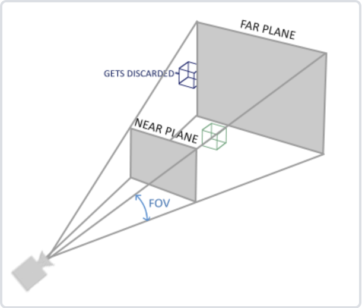

### 坐标系统  
从物体到屏幕经历了许多次坐标系统的变换，有这些变换是为了清晰地在不同层级处理物体，实现一种类似流水线的结构，有更强的灵活性。  
分别是：**物体（局部）坐标系——世界坐标系——观察（摄像机）坐标系——屏幕坐标系**。  
可以看出明显的好处，在局部（物体）坐标系下处理当前物体远远比直接在世界甚至观察坐标系下处理来得方便。坐标系之间的切换就是一些变换矩阵，我在大一上导航课上已经有了这样的体会。  
矩阵常用名称(破折号：A——B 表示从A坐标新变换到B坐标系)：  
+ 物体坐标系——世界坐标系：model  
+ 世界坐标系——观察(相机)坐标系：view。转化为观察坐标系，实际上就是把世界坐标系中的三个基坐标，用各种方法移动到符合**摄影机朝向、位置**的地方与姿态（一般摄影机对着z轴）。  
+ 观察坐标系——屏幕坐标系：projection 投影矩阵，截取一个平截头体。  
### 将顶点坐标转换为屏幕坐标  
直接在着色器里这么写：  
```  
#version 330 core  
layout(location=0) in vec3 aPos;  
uniform mat4 model;  
uniform mat4 view;  
uniform mat4 projection;  
void main  
{  
	gl_Position = projection*view*model*vec4(aPos,1.0f);  
}  
```  
就可以。就是把顶点坐标一次和坐标变换矩阵相乘。  
最后裁剪的投影过程中，要考虑近大远小的效果，实际上投影矩阵会修改顶点坐标第四维度的w的值，最后要用xyz的值除以w，将w化为1，而缩放的过程在这里也完成了。  
*model view*矩阵一般需要自己想怎么变换（平移、旋转等），而projection平截头体的矩阵可以用glm自动生成：  
```  
glm::mat4 proj(1.0f);  
proj = glm::perspective(glm::radians(45.0f), (float)width/(float)height, 0.1f, 100.0f);  
```  
其中radians将角度转换为弧度制，是视野的张角（下图中的FOV），第二个参数是视口（viewport）的宽高比，第三个是前截面的深度，第四个是后面那个截面的深度。  
  
顺便，如果使用正射投影（平行投影），则用*ortho*函数  
```  
glm::ortho(0.0f, 800.0f, 0.0f, 600.0f, 0.1f, 100.0f);  
```  
前两个左右坐标，中间两个顶底坐标，后两个前后坐标（深度）。  
  
样例可以见在[learnopengl](https://learnopengl-cn.github.io/)中找到。  
  
### 摄像机  
摄像机就是观察点，关于坐标变换中的**view**矩阵，将世界坐标转化为观察点坐标。这个过程实际上是将*世界坐标的自然基转化为以摄像机视线方向为z轴负方向的坐标基*。感觉就是把摄像机三轴坐标在世界坐标系下表示，然后取反，将世界坐标系转化为摄像机系。  
这个我应该能推出来？可以用glm::Look_At函数实现。  
```  
glm::Look_At(vec3 Position, vec3 Target, Vec3 Up);  
```  
第一个参数是摄像机坐标，第二个参数是摄像机所看的点（视线方向上的一点即可），第三个参数是“上坐标”（*上坐标用于和视线向量叉乘，计算右向量，上坐标不一定是世界坐标，但上坐标必须保证不和视线方向共线*）。这个上坐标一般是世界上坐标，但并不一定。只要能叉乘出右向量就行了。如果视线是正下方(0,-1,0)，仍用世界上坐标(0,1,0)的话右坐标为0，会出现除以0错误！  
  
则坐标的变换过程：  
+ model，将模型坐标转换为世界坐标，自己生成  
  glm::translate 平移  
  glm::rotate  旋转  
  glm::scale  缩放  
+ view, glm::look_at(...)  
+ proj, glm::perspective(...) （四棱锥）  
   glm::ortho(...)（平行投影）  
```  
投影计算后，openGL会自动进行深度除法，gl_position/=gl_position.w，所以不用写这个。  
但当点光源的阴影贴图等操作中，转换将片段坐标转化为光源视点的坐标后必须手动除以w。  
```  
### 摄像机类  
配合相应的回调函数，可以实现视野漫游。  
漫游式，fps式...用俯仰角和横着转的那个角，不考虑横滚角。用这两个角生成相应的前向量、上向量姿态，用前向量、右向量控制移动。  
