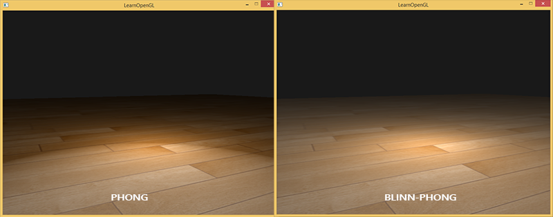

这是对learnopengl的简单笔记。原教程网址：[learnopengl](https://learnopengl-cn.github.io/)。原教程同时涉及图形学的基本理论与opengl API，本文更多关注API，而简化甚至省略了背后的图形学原理性内容。  

phone着色简单地分成三部分：环境光、漫反射光、镜面反射高光。  
### 一些定义  
三个单位方向向量：  
```  
光线方向：L = normalize(LightPos - FragPos);  
视线方向：V = normalize(ViewPos - FragPos);  
法向量：N ；  
光色：RGB向量；  
环境光色：Ka；(Ambient)  
漫反射光色：Kd; (diffuse)  
镜面反射光色：Ks; (specular)  
物体本来颜色：ObjectColor；  
颜色FragColor：RGB-标准化到0-1；  
```  
### Phone着色  
#### 环境光：  
直接用环境光色 * 环境光强度.  
```  
La = Ka * ambient_coefficiency;  
```  
#### 漫反射光  
漫反射光只和法向和光线方向有关.  
```  
Ld = Kd * max(V · L, 0.0) * diffuse_coefficiency;  
```  
#### 镜面反射光  
和反射光线和视线方向的夹角有关.  
```  
reflect_L = refletc(-L, N);  
Ls = Ks * (max(refletc_L · V, 0.0) ^ specular_coefficiency);  
specular_coefficiency 和高光的大小有光，越大，光斑越小、越亮。  
```  
#### 总光照  
```  
LightColor = La + Ld + Ls;  
```  
#### 最终颜色  
```  
FragColor = ObjectColor * LightColor; //物体颜色*光照影响  
```  
Phone着色的所有计算在片段着色器中在**世界坐标系下**完成  
### 材质与光照  
注意上面的 ObjectColor, Ka Ks Kd，这些系数，这表示物体对于不同类型的光的接受与反射程度不同。就像绿色的物体漫反射绿色光一样。最后反射光照和物体本来的颜色共同作用，形成入眼的颜色。  
**可以定义材质结构**：  
```  
struct Matrial{  
	vec3 Ka, Kd, Ks;  //意义见前面  
	vec3 ObjectColor; //本身的颜色  
	float ambient_coefficiency;  
	float diffuse_coefficiency;  
	float specular_coefficiency; //直接影响高光光斑  
};  
```  
这在着色器中定义为uniform，设置就是  
```  
OurShader.setVec3("material_name.Ka",...);  
名称就像C语言中访问结构体成员变量一样。  
```  
调整不同的材料值组合，可以造成不同的效果。  
  
同样光照也可以有类似的结构定义光色、环境光色等（一般就这两个）。我觉得漫反射和镜面反射的色光影响更应该是物体的性质，所以应该封装在物体材质里。  
### 光照贴图  
光照贴图和普通贴图一样，不过普通贴图贴出来的是**物体本身颜色ObjectColor**，而光照贴图贴出来的是**物体在不同位置对光照的响应，相当于K_**。  
一般说的就是漫反射贴图，从漫反射贴图读 *Kd* 算漫反射光照，而环境光一般是全局统一，镜面反射光直接用光源光色。  
```  
vec3 Kd = texture(diffuse_map, TexCoord).rgb;  
vec3 Ld = Kd * max(L · N, 0.0) * diffuse_coeffieciency;  
```  
### Blinn-Phone 优化  
是对Phone算法的一些优化，也是简化，能避免以下效果：  
  
  
  
Phone光照在镜面反射下面会有点问题（尤其在漫反射光照设置得比较暗），在反射光线与视线夹角为钝角的时候镜面反射直接没了，乍看这么算是合理的，但效果和我们的直觉不符合。  
  
Blinn-Phone优化做的是不用镜面反射光线和视线的夹角计算，而用**半程向量(halfway)：入射光线方向和视线方向的夹角的平分线**与**法向量**计算镜面反射光照。  
```  
vec3 halfway = normalize(L + V);  
vec3 Ls = Ks * max(dot(halfway,N),0.0) ^ specular_coef_Blinn;  
```  
注意Blinn下的镜面反射系数应该设置为Phone光照的**4-8倍**。  
  
在早期算力不强的时候，Blinn-Phone也直接用一个确定的入射光线向量计算，即用平行光代替点光源。  
