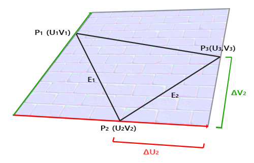

这是对learnopengl的简单笔记。原教程网址：[learnopengl](https://learnopengl-cn.github.io/)。原教程同时涉及图形学的基本理论与opengl API，本文更多关注API，而简化甚至省略了背后的图形学原理性内容。  

贴图部分没有什么API的内容，主要是理解原理，然后在着色器中恰当地采样、处理、使用。  

从一个贴图里读出法向量。  
注意这个法向量是在**切面空间**（以面片的法向为z轴定义的空间）的，这是法线贴图的前提之一，法线贴图中的法线方向是定义在每个面片的切面空间上的。即xoy是贴图平面，z是垂直与贴图平面的地方。  
所以要么把读到的法向量转化到世界坐标下计算，要么把光照、视线等所有向量转化到切面空间中计算（注意只是在算光照、颜色的时候）。  
  
### 切面空间  
切面空间，具体而言，就是以面片的法向量为 z 轴，以（将这个面片映射到法向纹理图上后）的纹理 u 轴（这一方向映射回面片上）为X轴，纹理 v 轴为Y轴 定义的坐标系。其中，纹理 u 轴在这个面片上对应的方向为切向量 T，纹理 v 轴为副切线 B。  
  
  
其中 红色轴是 T，绿色轴是 B。  
  
### 任意三角形面元求切面空间转化矩阵  
这一过程是在CPU里面而不是着色器里完成。  
  
计算起来非常简单，参考上图，其中UV是顶点在法线贴图中的纹理坐标。边 E1，E2，可用 TB 表示为：  
$$  
E_1=ΔU_1T+ΔV_1B \\  
  
E_2=ΔU_2T+ΔV_2B  
$$  
表示为矩阵：  
$$  
\begin{bmatrix}  
E_1 \\  
E_2  
\end{bmatrix}  
= \begin{bmatrix}  
\Delta U_1 & \Delta V_1 \\  
\Delta U_2 & \Delta V_2  
\end{bmatrix}  
\begin{bmatrix}  
T \\ B  
\end{bmatrix}  
$$  
直接对矩阵求逆（注意 2\*2 逆矩阵的求法：互换对角线、其它取反、除以行列式的值。  
$$  
\begin{bmatrix}  
T \\ B  
\end{bmatrix}  
= \frac{1}{\Delta U_1  \Delta V_2-\Delta U_2 \Delta V_1}  
\begin{bmatrix}  
\Delta V_2 & -\Delta V_1 \\  
-\Delta U_2 & \Delta U_1  
\end{bmatrix}  
\begin{bmatrix}  
E_1 \\ E_2  
\end{bmatrix}  
$$  
  
然后把这三个向量乘以变换矩阵 model （的左上角3\*3矩阵，不要平移）从模型坐标转换到世界坐标，变成世界坐标表示下的 T B 向量。  
这里就能得到切面空间的三轴 TBN 在世界坐标系的表示，则从切面空间到世界坐标系的变换直接是  
$$  
TBN = \begin{bmatrix}  
T & B & N  
\end{bmatrix}  
$$  
（针对列向量的变换，右乘列向量）  
  
  
另外，有一个细节，方向的变换似乎不能直接用点变换的矩阵来做，方向变换要保证大小不变。  
适用于法向量的变换矩阵就是：model的左上角3\*3矩阵的逆的转置。  
```  
mat3 NormModel = tranpose(inverse(mat3(model)));  
vec3 WorldNormal = NormModel * Normal;  
...  
```  
这个内容来自中文 learnopenGL。*但是这真的不是多此一举吗，model是局部坐标系到世界坐标系的变换，其左上角三乘三应该是旋转变化部分，理应是正交矩阵，那么求逆又转置不是变回原样了？我感觉上面的部分应该不对*  
  
### 法向贴图计算光照的两种思路  
把读到的法向量乘以TBN矩阵就可以得到世界坐标下的法向量。  
```  
vec3 Normal = texture(Normal_map, TexCoord).rgb;  
//TexCoord天然是切面空间坐标，不用改  
Normal = TBN*Normal;  
```  
有了世界坐标下的法向量，就可以进而算光照等。这样这个过程在片段着色器完成。  
  
**另一种思路是把所有其它计算光照用的向量：光线、视线转换到切面空间下**，直接在切面空间中算光照。这样可以不在片段着色器中计算任何变化，而在顶点着色器中完成一切变换，然后把相关向量输出到片段着色器中使用；在片段着色器中，所作的只是根据顶点着色器传入的坐标进行法线采样，然后计算光照。  
这样需要在顶点着色器中计算**TBN的逆矩阵将得到世界坐标到切面空间的变换矩阵**，然后完成所有变换计算并输出。  
这样的好处是，一般（尤其是复杂模型）顶点着色器的运行次数远少于片段着色器，这其实是非常大的优化。所以一般采用这种方法，即在顶点着色器中提前将需要的属性变换到切面坐标系，不再片段着色器中做任何变换。  
