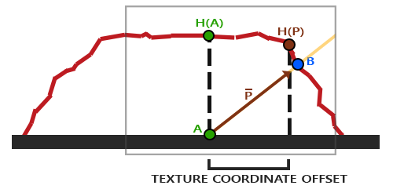

这是对learnopengl的简单笔记。原教程网址：[learnopengl](https://learnopengl-cn.github.io/)。原教程同时涉及图形学的基本理论与opengl API，本文更多关注API，而简化甚至省略了背后的图形学原理性内容。  

贴图部分没有什么API的内容，主要是理解原理，然后在着色器中恰当地采样、处理、使用。  

置换贴图和法线贴图结合可以营造相当真实的起伏！  
### 置换贴图  
置换着色其实就是在顶点着色器阶段，先从置换贴图读取高度值（*用rgb中的 r*），然后将顶点沿着其法线方向移动这个高度值，并把它当做真的坐标计算gl_position，并且输出为FragPos进入光照计算。  
总而言之，就是这就是“真的顶点坐标”！  
十分简单！  
### 视差贴图  
是一个比较巧妙的技巧，让一个平面看上去有“起伏”。视差贴图本身应该是记录了平面上每个点的“高度”  
其核心思想是，当看一个有高低起伏的“面”，我们视线与这个面“交于一点”，但我们看到的实际上是靠前一点的、凸起的面。如下图。  
  
  
  
我们的视线与下面的平面交在A点，但实际上我们看到的是B点。在图形学中为了方便的从一个平面渲染出一个看起来有起伏的平面，我们只要在渲染A点的时候，将A点空间坐标设置为B点的空间坐标就可以了。  
但是我们当然不能直接得到B点的坐标，只能估计。视察贴图基本上就是一个高度图，常见的、最基础的做法是将A的高度H(A) 斜过来、让那条线段和视线方向重合，然后做平面的投影，投下来的那个P点，加上其高度H(P)，就是A点的“新坐标”。  
  
当然还有其它问题，直接这么用效果很不好，包括严重的锯齿、无法处理陡峭面等，有很多零碎的优化，由于时间有点久忘了，先咕了（乐）。  
