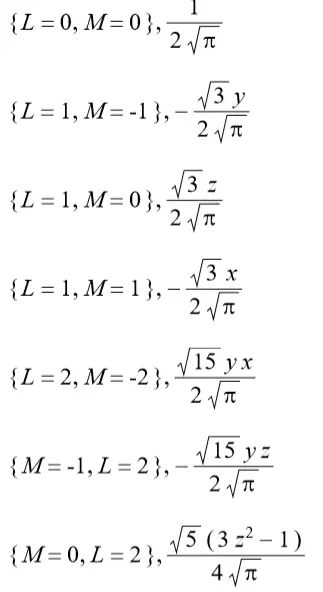

## 球谐函数  
就像泰勒展开的每个多项式前面的系数、傅里叶展开的每个三角函数前面的系数，球谐系数是对一组基函数的系数。  
和前面的泰勒展开和傅里叶展开一样，可以把函数展开为用球谐函数表示。展开越高越逼近。  
球谐函数长这样，很恐怖。它是在球坐标下的：  
  
  
  
接下来将用 $Y_l^m(x)$ 表示不同阶的球谐函数。  
  
而对某个函数用球谐函数展开，长这样：  
  
$$  
\begin{aligned}  
f(x)=\sum_{l=0}^\infty \sum_{m=-l}^lc_l^m Y_l^m(x)  
\end{aligned}  
$$  
其中 $c_l^m$ 就是球谐系数。  
而球谐系数的算法和傅里叶展开系数算法类似，不过扩展到了二维。  
$$  
c_l^m = \int_\Omega f(x)Y_l^m(x)dx  
$$  
这是球面积分，是半球面。  
  
### 球谐函数的性质  
球谐函数有很好的性质：**正交完备性，旋转不变性**。  
正交完备性：  
  
  
旋转不变性：  
旋转不变性指原有一个输入 $\vec u, (\theta,\phi)$，用球谐函数表示的值 $f(\vec u)$，将这个输入旋转为 $R^{\alpha,\beta,\gamma}\vec u$，新结果 $f(R^{\alpha,\beta,\gamma}\vec u)$ 可以直接通过原来的展开式获取，如下：  
  
其中，$d_{m', m}^l$是维格纳D矩阵，很复杂。  
  
正交完备性使得它可以成为化简积分式的工具。即把积分成分用球谐函数展开，然后相乘展开，把交叉项去掉（积分为0）。  
  
***  
此外，作为不懂装懂的“资本”，球谐函数是球坐标下拉普拉斯方程的解：  
  
  
## 球谐光照 - 视线相关光照  
用球谐函数表示光照。球谐函数本来就是二维上球坐标系上的，所以用来作为观察方向的映射到光照强度的方程非常方便，  
  
球谐函数也常常用来表示视线无关的漫反射光照的，我也不知道我看的到底是以视线方向为输入求视线相关光照的，还是以每个点的位置为输入算视线无关漫反射光照的，当然两个肯定都能用球谐光照解决。下面是我自己看了点东西+瞎琢磨的。  
  
因为是看 NeRF 相关文章的时候看到的，所以倾向于把球谐光照的光照方程理解为，对于每个体素（点），以观察方向为输入，得到这个体素在这个方向上的光照（颜色），这个延续了NeRF的思想。  
那么每个点的光照方程就是：  $L_{\vec S}(\vec v)$ 。每个体素都有这么个方程，在常见的场景(而非体渲染)里，这可能就是某个探针 probe 的光照表达，这是这个probe往周围某个方向散发出去的光照。*关于 probe 我还没有看，这个理解应该是用问题的，姑且这么写着*。  
考察一些关于环境光照的问题，探针可能就是把位置无关的环境光照放进一个“球形纹理”里。渲染环境光照的时候，直接把方向作为坐标在球形纹理上取值即可。  
  
这个光照方程用球谐函数近似，图形学里一般用二阶展开即可，一共 1+3+5=9 个系数。  
$$  
\begin{aligned}  
L_{\vec S}(\vec v)&=\sum_{l=0}^2 \sum_{m=-l}^l (C_{l}^m)^{(\vec S)} Y_l^m(\vec v)  \\  
L_{\vec S}(\vec v)&=\sum_{i=0}^9(C_i)^{(\vec S)}Y_i(\vec v)  
\end{aligned}  
$$  
球谐函数的值可以查表：  
  
注意由于是在单位圆上表示方向（单位向量），所以上表示直接用r=1近似。注意这个表和我在百度百科上看的不太一样（百科上还有虚数 i在里面，不明）。  
  
渲染之前，预先对每个点计算球谐系数，要计算球谐系数自然要把环境光照纹理上每个点的值算出来，这就是传统的渲染方程-光线追踪方法。这个计算中的球面积分用蒙特卡罗法即可（貌似均匀采样就行了），而采样中每个采样输入的光照的值用光线追踪等算法得到。  
重建的时候，只用**这个点的视线方向（或者发光方向）为（不同阶的球谐函数）的输入，与对应的球谐函数值（查表）相乘求和即可得到光照强度。**  
  
二阶球谐函数展开的情况下，rgb三个通道，每个9个系数，一共27个。  
NeRF的加速版本的Plenoxel, PlenOctree只用到一阶，rgb每个通道4个系数共12个。  
  
## 球谐光照与环境光  
### 利用正交不变性化简环境光方程  
**Spherical Harmonic Lighting:The Gritty Details**  
[解读](https://zhuanlan.zhihu.com/p/359856625)  
  
上面相当于只是用球谐系数表示了光照计算的结果，后面只用根据球谐系数就能得到光照。RGB三个通道每个通道需要9个球谐系数，一共需要27个球谐系数；一张纹理有三个通道，最后发现需要九张纹理表示所有球谐系数。太多了。  
  
首先，场景中任意一点的漫反射光照：  
$$  
L(p,n)=\int_{\Omega}L(p,w_i) n \cdot w_idw_i  
$$  
其中，p是这个点的位置，n是这个点的法向量，wi 是球面上的其它方向。这同样是半球面积分。中间有个点乘，表示其它方向来的光与法向的作用。  
  
把所有环境光当做是从天空盒射下来的，天空盒无限大，所以场景中任意一点都可以当做是天空盒的中心，所以结果就和位置p没什么关系，可以略去。这就是环境光照纹理的假设，环境光照是位置无关的；变为：  
$$  
L(p,n)=L(n)=\int_{\Omega}L(w_i) n \cdot w_idw_i  
$$  
这样，环境光光照就只和每个点的法线有关了。*IBL* 的思路就是，预先计算每个法向对应的 L(n)（此L(n)是光追后计算出的最终结果），形成一张贴图，在渲染的时候根据每个点的法向量找环境光照。此时环境光照只需要一张贴图。  
  
**但是贴图采样毕竟麻烦，有没有尽可能不需要贴图的方法？**  
上面这个式子可以用球谐函数的正交完备性化简。  
将积分中划分为两个部分：$L(w_i)$ 和 $t(n,w_i)=n\cdot w_i$.  
分别展开:  
$$  
\begin{aligned}  
L(w)&=\sum_{i=0}L_iY_i(w)  \\  
t(n,w)&=\sum_{i=0}t_i^{(n)}Y_i(w)  
\end{aligned}  
$$  
$L_i, t_i^{(n)}$ 为球谐系数，后者右上角的 n 表示这个是法向n的球谐系数。  
直接代回光照方程去：  
$$  
\begin{aligned}  
L(n)&=\int_{\Omega}L(w_i) n \cdot w_idw_i \\  
L(n)&=\int_{\Omega}L(w_i) t(n,w_i)dw_i \\  
L(n)&=\int_{\Omega}(\sum_{l=0}L_lY_l(w_i)) (\sum_{l=0}t_l^{(n)}Y_l(w_i))dw_i  \\  
\end{aligned}  
$$  
展开两个括号，提出常数项，并用*正交完备性* 删去为0的项，得到：  
$$  
\begin{aligned}  
L(n)&=\sum_{i=0}\sum_{j=0}(L_it_j^{(n)}\int_\Omega Y_i(w)Y_j(w)dw)  \\  
L(n)&=\sum_{i=0}L_it_i^{(n)}  
\end{aligned}  
$$  
很好！这样L(n)就只用关注球谐系数了！  
  
**Li**  
$$  
L_i=\int_\Omega L(w)Y_i(w)dw  
$$  
由于对位置位于天空盒中心的假设，这里直接忽略p。L(w) 直接根据方向在天空盒上采样即可（这里的 L(w) 显然是没有光追的原始值；而渲染方程中的球积分里的 L ，应该是递归的光追结果，*这里应该是存在一层近似！*）。  
  
**t~i~^(n)^**  
这个系数很显然是和法向有关的。  
$$  
t_i^{(n)}=\int_\Omega n\cdot w Y_i(w)dw  
$$  
这又是一个半球面积分，并且这个*法向* 是甩不掉的。。这片论文里，**不得不对每个法向 n 计算出了 t~i~^(n)^ 球谐系数（直接计算上面那个球积分），好在这里不存在三通道的问题（因为这只是和光线和法向的夹角有关，三通道在上面L那里，而L只需要算出L~i~九个系数即可），每个法向都要算这么九个系数，最后是需要 3 张存球谐系数的贴图（每个存3个）.**  
  
虽然本文没有达到最开始的设想，但用球谐函数的正交完备性进行化简的思路非常有用。  
  
### 利用旋转不变性解决上面的t系数问题  
**An Efficient Representation for Irradiance Environment Maps**  
[解读](https://zhuanlan.zhihu.com/p/363600898)  
  
因为旋转不变性比较复杂，这个更难。  

:::caution
**下面推导的东西大部分是我自己瞎琢磨，和原文无关。原文其实没太懂。故下面的内容是错的。但又不太想删。姑且放着。**
:::
***  
思路是，只计算法向竖直向上的 $t(n_0,w)$ 的9个球谐系数 $t_i^{(0)}$，这个不用贴图。任意法向都可以理解为从这个向上的法向旋转过去，然后利用旋转不变性的公式，从向上的球谐系数的展开式计算新法向的结果。  
  
这个文章对 L(w) 同样用旋转不变性进行了一次推导，最后好像和上面的看起来不太一样。这里略去这部分，只考虑 t 。  
对于竖直向上的 n0，有 $t(n_0,w)=\sum_{i=0}t_i^{(0)}Y_i(w)$  
对任意方向 $n=R^{\alpha, \beta, \gamma}n_0$，新的$t(n_0, w)$ 展开就是：  
$$  
\begin{aligned}  
t(n,w)&=t(R^{\alpha, \beta, \gamma} n_0,w)  \\  
&= R^{\alpha, \beta, \gamma} n_0 \cdot w \\  
&= n_0 \cdot  R^{-\alpha, -\beta, -\gamma} w  \\  
&= t(n_0,R^{-\alpha, -\beta, -\gamma} w)  \\  
&=\sum_{l=0}^\infty\sum_{m=-l}^l(t_l^m)^{(0)}Y_l^m(R^{-\alpha, -\beta, -\gamma} w)  
\end{aligned}  
$$  
而根据旋转不变性：  
$$  
Y_l^m(R^{-\alpha, -\beta, -\gamma} w)  = \sum_{m'=-l}^l D_{m',m}^l (R^{-\alpha, -\beta, -\gamma}) Y_l^{m'}(w)  
$$  
  
由于原始法向在z轴，光线与法向的夹角只用考虑与z轴的夹角 $\alpha$ 即可，另外连个不管，索性赋值为0.  
论文推导出，这种情况下，对于那个大D的项，有如下结论（这个结论不是无偏的，我也不知道什么意思）：  
  
可见最后直接和 $\alpha$ 无关了。这个结论是在原文推L(w)展开的时候推出来的，其中n显然也是个莫名其妙的法向，用在这感觉有问题..  
$$  
Y_l^m(R^{-\alpha, -\beta, -\gamma} w)  =Y_l^m(n) \sum_{m'=-l}^l \sqrt{\frac{4\pi}{2l+1}} Y_l^{m'}(w)  
$$  
代回去。  
$$  
\begin{aligned}  
t(n,w)&=\sum_{l=0}^\infty\sum_{m=-l}^l(t_l^m)^{(0)}Y_l^m(R^{-\alpha, -\beta, -\gamma} w)  \\  
&=\sum_{l=0}^\infty\sum_{m=-l}^l(t_l^m)^{(0)} Y_l^m(n) \sum_{m'=-l}^l \sqrt{\frac{4\pi}{2l+1}} Y_l^{m'}(w)  \\  
&=\sum_{l=0}^\infty \sum_{m'=-l}^l \sqrt{\frac{4\pi}{2l+1}} Y_l^{m'}(w)(\sum_{m=-l}^l(t_l^m)^{(0)} Y_l^m(n))  \\  
&=\sum_{l=0}^\infty \sum_{m=-l}^l \sqrt{\frac{4\pi}{2l+1}} Y_l^{m}(w)(\sum_{m'=-l}^l(t_l^{m'})^{(0)} Y_l^{m'}(n))  
\end{aligned}  
$$  
可得新的 $t_i^{(n)}$  
$$  
t_l^{m(n)} =  \sqrt{\frac{4\pi}{2l+1}} \sum_{m'=-l}^lt_l^{m'(0)} Y_l^{m'}(n)  
$$  
注意 $t_l^{m(n)}$ 是和m无关的，只和 l 有关。  
  
最后的渲染方程：  
$$  
\begin{aligned}  
L(n)&=\sum_{l=0}\sum_{m=-l}^l L_i^mt_i^{m(n)} \\  
&= \sum_{l=0}\sum_{m=-l}^l \sqrt{\frac{4\pi}{2l+1}}  L_l^m \sum_{m'=-l}^lt_l^{m'(0)} Y_l^{m'}(n)  \\  
&=\sum_{l=0}(\sum_{m=-l}^l \sqrt{\frac{4\pi}{2l+1}}  L_l^m) (\sum_{m'=-l}^lt_l^{m'(0)} Y_l^{m'}(n) ) \\  
\end{aligned}  
$$  
  
***  
这个结果应是错的，和原文不符。原文结果是：  
  
而 tl ，似乎是满足下面这样的关系的数列：  
  
右边那个是什么规律，我也不知道。  
中间推导过程、思路也完全不同。  
