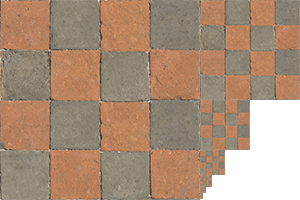
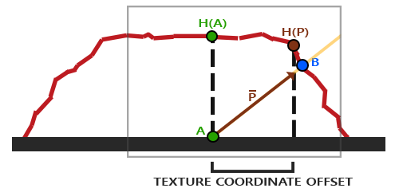

纹理本身是一组数据，里面可以是图像，可以是法向，可以是高度，可以是视差，可以是环境光照，可以是很多东西。纹理只是一组数据、一组存储，能通过索引（可以是uv坐标，可以是 $\theta \phi$ 方向，等等，看具体定义）访问其中的值，就像一个提前存下来的数组，实际渲染中，用来“打表”！  
  
## 三角形重心坐标  
场景中的三角形，每个顶点要怎么确定纹理坐标？建模软件中，往往需要对模型进行*纹理展开*，用户把几何形状复杂的模型切成相对没那么复杂的许多部分，将这些部分展开为平面得到uv坐标，然后把相应部分的纹理保存在纹理图的特定部位上），这个问题目前我还没搞懂，但不是三角形重心坐标关注的。重心坐标关注的不是这个，它解决的是插值问题：每个三角形顶点理所当然的拥有自己的“属性”，可以是uv坐标，可以是法线等其它，那三角形面片上任意一点的这些“属性”怎么来呢？  
三角形内任一点是个连续的问题，不能真的保存下来。这个过程显然是通过插值完成的。四边形可以双线性插值，那么三角形呢？这里就用到*重心坐标* 。  
  
**重心坐标**，即*用三角形三个顶点坐标表示三角形内任意点坐标的方法*。三角形三个顶点的位置分别为 $\vec A, \vec B, \vec C$，那么三角形内任意点可以表示为：$\vec P=\alpha \vec A+\beta \vec B + \gamma \vec C$，其中一定有 $\alpha+\beta+\gamma=1$。  
  
最后那个系数和为 1 的约束，实际上约束了这个公式表示的点一定在 ABC 三个顶点形成的平面上。高中应该接触过一个定理，任意三点 ABC，ABC外任意点O，将点 P 表示为 $\vec P=\alpha \vec {OA}+\beta \vec {OB} + \gamma \vec {OC}$，则 P 和 ABC 共面当且仅当 $\alpha+\beta+\gamma=1$。就是这个定理。  
  
另有：当且仅当 $\alpha>0, \beta>0, \gamma>0$ 的时候，P在三角形内部。  
和为1的约束使得点的重心坐标只要有两个即可。  
有了重心坐标，就可以用重心坐标作为权值，用三个顶点的值进行插值。  
  
最后，重心坐标*不具备仿射变换不变性*。重心坐标是和具体的形状相关的，形状上的变换，比如投影等，都会导致重心坐标变化。也就是说，想对屏幕空间上的某点用三角形插值，不能用其所在的三角形面片的顶点在屏幕空间的坐标，而应该转换回世界坐标，在原始形状上插值。  
  
## 插值  
一个实际的用处是，大图形在小纹理上采样。uv坐标往往并不恰好在像素点上，需要插值。常用的做法是双线性插值。十分简单此处不赘述。  
此外还有三线性插值等；注意三线性插值不一定非得是在正方体上插值，只要是执行了三次线性插值都是三线性插值（）  
  
## 大纹理。小空间：Mipmap  
小纹理到大空间存在必然缺陷，只能通过插值缓解。但大纹理到小空间呢？一张很大的方格纹理放到一块很大的地面上，地面从摄像机“脚下”一直眼神到摄像机很远的地方，发现很远的地方出现了“摩尔纹”，主要给我自己看，懒得配图了。  
分析后，这是由于实际距离很远的点，*很大的范围* 才对应屏幕上的一个像素；而我们渲染像素的时候只会在固定的小范围内采样，无法表现这个小像素中的高频变化。  
看起来这是采样不够的问题：每个像素只在纹理上固定的很小范围内采样，但实际上实际物体距离远的像素覆盖了纹理上很大的范围。由此可见，**超采样** 可以很好地解决这个问题。对每个像素点，在其与相邻像素之间（在纹理上）形成的范围内大量采样（比如采样512个点），这样可以基本上完全解决这个问题。  
但我们不希望对每个像素采样那么多点。一方面想到，可以提前对大范围取平均，把结果保存下来。这就是Mipmap，这个思路在算法上有另一个名字：范围查询 (Range Query)。  
Mipmap的思路是，（假定纹理分辨率是2的幂次的正方形），原始纹理是*第0层*，每变高一层，就把分辨率压缩到 1/2，具体就是对每个 2\*2 方格取平均值。如果原始纹理是 n\*n，则第 L 层纹理就是 n/(2^L^)\*(n/2^L^)。  
这样划分出了不同级别的正方形区域。采样的时候，这个像素覆盖了原本多大的纹理范围，就在相应层的MIPmap纹理图上采样。比如第L层的mipmap中每个点是x个纹理像素（乘积），而屏幕上每个像素覆盖了大约x个纹理像素，就从这L层MIPmap中采样。  
*如何确定屏幕上每个纹理占了多大的范围*，这是个近似很近似的过程。方法之一是，对于屏幕上像素点(x, y)，计算它自己以及其相邻的两个像素(x+1, y), (x, y+1)对应的纹理坐标(u, v)，然后“求微分 du/dx, dv/dy ”（就是横向和竖向，单位屏幕像素距离对应多少纹理像素距离——纹理像素也可以取u, v分量分别对应xy去计算，也可以直接取模长，反正都是很粗略的近似），变化率取其大者，*近似当做此像素对应的正方形纹理范围的边长 l*，那么其对应的纹理图层数为 $\frac{n}{2^L}=l, L=\log_2(n/l)$。这么算出来的 L 显然不是整数，可以直接取整在整数层级里去选，也可以对 L 分别上下取整，在两层Mipmap中找，然后插值。  
  
  
  
最后，Mipmap多出来的存储代价可以通过简单的等比数列求和算出来，理论上最多只多 1/3.  
  
### Ripmap  
直接用Mipmap不能完全解决问题，会出现 Overblur 过度模糊。这是因为Mipmap规定每个像素对应的区域一定是规正的正方形，而实际上这个区域可以是长条的长方形，可以是斜过来的图形，可以是不规则图形，将它们强硬的“近似”为正方形显然是大大加大了采样范围，造成 Overblur。  
Ripmap的方法是在Mipmap的基础上加入*各向异性过滤*，除了同时压缩横轴纵轴，还加入只压缩横轴、只压缩纵轴等的“长方形范围查询”，如果像素覆盖的纹理范围更接近长方形，就能查询长方形的范围。这能一定程度上解决问题。  
但是屏幕像素覆盖的纹理区域可以非常奇怪，上述方法都不能完全解决问题。还有很多其它方法来应对更多的覆盖范围，比如多次查询、不断用不同大小的椭圆查询，直到查询范围覆盖了整个目标像素的纹理范围。显然，这些方法都需要更大的开销。  
  
## 现代纹理  
如最开始的那段话所说，纹理只是一组提前存好的数据，这些数据是什么意思，完全看自己怎么定义怎么用。  
### 置换(Displacement)贴图  
置换贴图上记录每个顶点上下移动的距离，着色器中，在顶点着色器真的根据贴图中的值将顶点上下移动一段距离。  
但置换贴图的问题是，模型的顶点（三角形）必须足够多来匹配贴图的分辨率。只有当顶点足够多，贴图的效果才能真正体现。  
  
### 凹凸/法线贴图  
凹凸贴图和法线贴图本质上是同一种贴图，它们不真正改变任何顶点的位置，而是在贴图中存储*法线*。凹凸贴图看似是改变顶点（上下移动），实际上是因改变了顶点而改变顶点上的法向量。  
具体做法是，假设原本顶点高度都是0，法向指向z轴，应用了凹凸/法线贴图后形成新的表面曲面，在这个曲面上计算x, y方向的梯度，然后叉乘算新的法线，把新法线存入贴图，渲染的时候直接用贴图中的法线方向作为顶点法线即可。  
发现其中有一个假设是原本顶点的高度是0，这通过使用*切面空间* 达到。顶点的切面空间以原本法向（没有应用贴图）为z轴，切平面为xoy平面。法线贴图的使用一定是在切面空间中的，所以这里也涉及切面坐标系到局部坐标系的变换。  
  
可以在切面空间中采样法线，然后把法线变换到世界坐标中，接着再进行光照；也可以把光照方向等变换到切面空间，在切面空间中直接用采样的法线计算光照。  一般用后者，这涉及到顶点着色器和片段着色器的调用次数。  
  
和法线贴图和切面空间相关的内容，见同一文件夹下的图形学OpenGL相关节。  
  
### 视差贴图  
视差贴图同样是处理模型表面的高低起伏，其特点是能在很少顶点很少三角形的表面上模拟出一定效果的起伏。比如在一个只有几个三角形的矩形平面上模拟一个砖墙。  
  
视差贴图同样记录了表面上任意点的高度，但和法线贴图不同，法线贴图的表面高度最终影响的是顶点法向，而视差贴图的高度影响“*将哪个点看做是这个位置能看到的点”*。  
  
由于高度的存在，从某个方向去看某点A，视线可能在到达这个点A的过程中被点B遮住了，则这时候看到的其实是点B，也就是此时在渲染点A的时候应该拿点B去渲染(用点B的一切)。  
  
  
  
视差贴图的使用，在于如何从视差贴图上的表面高度，找到应该用那个点来代替该点。这里面有很多近似（很多近似可能根本没什么道理，比如直接拿A的坐标减去贴图中A的高度 \* 视线方向）以及技巧。有很多特定的技巧，比如处理陡升陡降，多次采样等，可以看[learnopengl](learnopengl.com)。  
  
### Cubic Textrue and Environmental Illumination  
在一个场景里环境光是大致固定的，环境光映射里*假设* 背景环境特别大，场景中任意一点在这个特别大的背景环境来看都是同一点。环境光映射（环境贴图）的光照是*位置无关的*，环境光照只和*方向* 有关，不同的方向投射过来不同的光照。  
渲染的时候，直接根据方向从环境光贴图上采样，然后用这个光照做渲染即可，光追还是简单的 Blinn-Phone 都可以。（关于环境光照，另有很多努力，提前计算环境光照下不同法向顶点的颜色，直接把这些颜色结果保存下来，NeRFs底下关于球谐系数的文章就是讨论这个）  
  
而，要把这个方向相关的光照值保存为纹理，这个纹理实际上表示了一个从方向 $(\theta, \phi)$ 到颜色 (r,g,b) 的映射，显然用一个球面能完美地保存下这个数据，并且采样非常方便。但是GPU不能给你一个球面去保存！  
如果直接把球面展开为平面，像世界地图那样，会有比较严重的扭曲和失真，地图学研究了很多方法去展开一个球，各自有各自的缺陷。  
图形学一般的做法是把*球面映射到正方体*，假设球面外面有一个外切的立方体，对于球上任意点P，从球心出发过该点P做射线，射线交外切立方体于一点，这一点则存储这个点P的值。这样用6个立方体贴图保存了这个球，也不会有太多扭曲，这就是 *Cubic Texture*。  
显然立方体贴图一个不好的地方是采样比较麻烦，至少得先判断这个方向在六张贴图的哪一张上。  
  
关于环境光映射和天空盒，这两个是点不同的。环境光映射保存的是场景中任意地方看到的方向相关的光照值（就是环境光照），在渲染物体的时候用，而天空盒就是无限远的颜色，在渲染没有物体的地方的时候用。天空盒是把相机放在原点往四面八方无穷远处看到的东西，保存在一个大立方体的内侧（其实本质也是存了一个球），一般只在渲染无物体的地方用（视线去向无穷远）。当然这两者的角色并不是完全分开的，比如在光追中，有时候光线追踪发现这条光线去到了无穷远，没有环境光贴图的情况下也可能直接在天空盒上采样当做这条去向了无穷远的光线的光照值，充当了类似环境光贴图的作用。  
  
### 三维纹理  
定义在三维空间上的纹理。具体没怎么了解。有提到什么噪声函数，可能是三维纹理空间开销太大，为了尽可能减小而引入的，用坐标+三维纹理中的值配合噪声函数获取最终纹理值。很多木纹，大理石纹等有用这种方法的实现的。  
此外体渲染的体素，也被当做广义上的三维纹理。  
  
