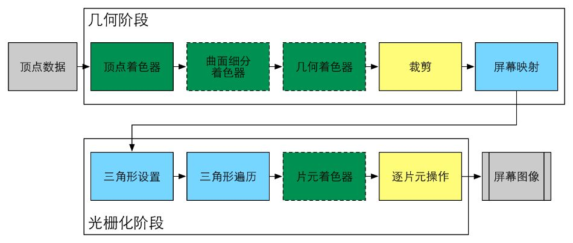
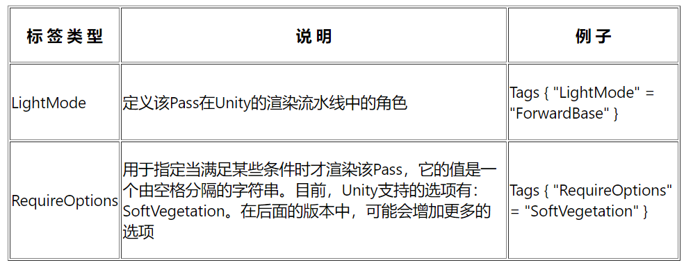

本文是《Unity Shader入门精要》的简单笔记之一，只有非常基础简单的一部分，主要关注Unity shader的概念、语法、用法等。不涉及基本的图形学原理。  

:::important
本文是Unity内置管线的Shader，使用CG着色器语言以及以.cginc结尾的各种依赖。而Unity内置管线正在过时，Unity正逐渐全面转向SRP，它更多使用HLSL着色器语言，以及以.hlsl结尾的各种依赖与内置变量/函数（这些内置依赖与工具的用法发生了较大变化）。虽然语法变化很少，而且仍然可以在SRP下使用CG和\*.cginc写Unity Shader，但建议考虑了解更新的技术。  
关于新的SRP管线及其Shader，强烈推荐[catlikecoding](https://catlikecoding.com/)，尤其是它的SRP教程能从零搭建一个有必要功能的自定义渲染管线，大大加深对渲染管线、Shader以及各种图形学基本理论的理解。  
:::

  
  
UnityShader本身不是一种Shader语言，而是对Unity提供的各种工具、功能的整合，它告诉Unity引擎依照我的Shader中提出的“要求”提供各种数据与资源，并且依照shader中定义的渲染身份准备不同的流程，将unityshader中特殊的 program 块作为真正意义上的shader（顶点/面元着色器，也有几何着色器，计算着色器），完成渲染过程。UnityShader更像一串结构化的指令，不过里面包含了真正作为 shader 的部分。UnityShader没有自己的HLSL，它对其他主流HLSL都有支持，如英伟达的CG，opengl的GLSL还有忘记哪家的HLSL。一般用前者，如果用后者，则对基于directX图形框架的设备不兼容（Win家）不同语言写出的着色器程序用 `CG/HLSL/GLSL##PROGRAM -- END##CG/HLSL/GLSL` 块括起来。注意 Unity 对这些语言提供支持但不代表完全一样，这些语言中的一些特性在Unity中不支持或者意义不同。  
  
UnityShader有Unity自己的表面着色器和顶点/面元型着色器，前者是对顶点/面元着色器的混合，有很多Unity实现的工具。但实际上，表面着色器最终也会被Unity拆分为顶点着色器和面元着色器，本质上是后者。也有更古老的兼容：古早GPU只支持函数式非常有限的编程（忘记严格来说是不是叫这个了——叫固定函数式）（甚至不是编程，只是调控GPU管线中的一些可设置项）。Unity对此提供有限的兼容，最终它也还是会在unity中变成 vertex and fragment shader。  
  
#### UnityShader结构  
vertex and fragment shader 更灵活并且更能延续我之前所学的皮毛。一个典型的UnityShader如下：  
```  
Shader "MyShaderName" {  
    Properties {  
        // 属性  
    }  
	// 可能有Tags{...，规定全局的一些需要告诉Unity的东西、标签}  
    SubShader {  
        // 针对显卡A的SubShader  
        Pass {  
            // 设置渲染状态和标签  
  
            // 开始Cg代码片段  
            CGPROGRAM  
            // 该代码片段的编译指令，例如：  
            #pragma vertex vert  
            #pragma fragment frag  
			// 一般要定义输入输出结构体.  
            // Cg代码写在这里  
  
            ENDCG  
  
            // 其他设置  
        }  
        // 其他需要的Pass  
    }  
    SubShader {  
        // 针对显卡B的SubShader  
    }  
  
    // 上述SubShader都失败后用于回调的Unity Shader  
    Fallback "VertexLit"  
}  
```  
最上面的 Shader"..." 指定了Shader的名称。  
  
##### Peoperties  
`Properties` 指定了 Shader 的属性，表明Shader中需要用到这些可以人为设置的变量——它们只是“表明”需要这些变量、但没有真正声明这些变量，如果真的要在shader中调用相应的变量，需要在后面的unityshader中正式声明（应该是在Subshader之前）。也就是说，Properties只是给 *inspector* 看的，inspector 发现shader中有这些属性，会在使用了这个shader的材质的inspector面板中显示相应的属性，可以让你指定。  
这些属性的格式为：`Name("display name", type) = defaultValue`  
Name为属性真正的名字，display name 为显示在inspector中的名字。Name的命名规范，一般是下划线 _ + 真正有意义的名字。在后续声明变量的时候，变量应该和 Name 保持一致。  
unityshader属性类型：  
  
Range 显示出来是一个滑动条，后三种用于纹理，inspector中可以让你选择纹理，或者纯色。纹理类型默认值的空大括号不能缺，它的默认值只能是Unity内置纹理，在大括号前面的字符串中给定内置纹理名字，比如颜色名字就是纯色的内置纹理。即使不给定默认内置纹理，纹理类型也必须用空字符串（只有双引号）+空大括号指定没有默认值。  
  
Properties 属性是 *ShaderLab* 属性，只是用来将该属性用 display name 显示在 inspector 中。而在CG代码中，我们应该用CG变量类型，所以在真正需要使用属性的时候，要在CGPROGRAM后面声明一个CG变量。  
  
  
##### SubShader  
  
SubShader里面是能给渲染管线用的全部着色器。包括Tags, 渲染设置，CGPROGRAM（CG写的着色器代码块）。  一个SubShader就可以指挥一次渲染，多个SubShader是给GPU做匹配的。考虑不同GPU的兼容不同、能力不同，可能要给出多个SubShader以备选择。而最后的 `Fallback`，表示当什么 SubShader 都无法匹配的时候用什么，一般是非常简单的内置shader，用字符串名称指定。可以缺省，表示什么都用不了就不管它的。  
  
Tags 用来指定材质的角色，有很多选项，比如 LightMode，Queue（它和渲染顺序有关）什么的，写这片文章的时候还不懂这是什么。而RenderSetup是渲染设置，可以设置如剔除背面。也有在 SubShader 块外面指定的 Tags和RenderSetup，这些将全局起效，作用于所有 SubShader；也有定义在Pass中的 Tags, RenderSetup，只作用于一个Pass.  
注意不同位置的 Tags 和 RenderSetup 也有不同的可设置项。  
  
  
  
  
一个 Pass 规定了一次完整的渲染流程（由Shadow Map，Bloom等知道，有时候渲染一些效果要走不止一次渲染流程），`CGPROGRAM...ENDCG` 就是一个完整的着色器代码，变量的声明、顶点片段着色器的代码、in out 的定义，都在这里完成。如上所说，Pass中也可以有自己的 Tags和渲染设置。部分如下：  
  
此外，Pass还有一些特殊的命令。  
**UsePass**：每一个Pass可以在开头定义自己的名字：`Name "PassName"`，然后在另一个 SubShader或者另一个UnityShader的某个Pass中，直接 `UsePass "ShaderName/PASSNAME"`，就可以了，但是注意 *Pass的Name会自动被Unity转化为全大写，所以引用的时候必须用PassName的全大写形式*。这样可以提高代码复用率。  
**GrabPass**：GrabPass，表示这个Pass的渲染结果不放到屏幕上，而是渲染到一张纹理上。  
  
如果一个SubShader只有一个Pass，可以省略 Pass。  
  
##### CGPROGRAM  
这这里面是真正的着色器代码。常见的结构是这样的：  
```  
Shader "..."{  
	Properties{  
		...  
	}  
	SubShader{  
		[Tags]...  
		[RenderSetup]...  
		Pass{  
			[Tags]...  
			CGPROGRAM  
			#progma vertex vert //指定顶点着色器在vert函数中.  
			#progma fragment frag //指定面元着色器在frag函数中.  
			// 声明变量，一定要包括上面 Properties的，名字一样.  
			// 定义in out 结构体，一般命名为a2v, v2f.  
			float vert(float4 v : POSITION): SV_POSITION{  
				...  
				return ...;  
			}  
			float4 frag() : SV_TARGET{  
				...  
				return ...; //返回颜色.  
			}  
			ENDCG  
		}  
	}  
}  
```  
这是最灵活的顶点、面元着色器写法。Unity中花了大力气提出了表面着色器，它不需要你写顶点、面元着色器，而是用一个着色器完成（实际上，在Unity中最后它会被处理成顶点、片元着色器）。Unity帮你完成了很多事情，比如可以直接用 `#progma surface surf Lambert` 可以指定 surf 为表面着色器，并且使用 Lambert 光照模型，免去自己实现光照计算。  
  
在上面简单的代码示意中，有很多变量后面跟着一个全大写单词，这些是UnityShader定义的**变量语义**，用于告知Unity这是什么，需要Unity为它准备什么。比如，写简单的OpenGL和GLSL时，我们需要自己在shader中定义输入输出结构体，在main的渲染循环里不断把所需要的数据（顶点位置、顶点纹理坐标、法向量等）用某些接口写入到GPU显存中，然后从GPU获取渲染出来的帧缓存，再在CPU中用接口把帧缓存替换到屏幕上。UnityShader不需要你关心这些细节，它帮你完成；但它需要你告诉它哪里需要它做什么事，这就是那些变量后面的大写单词所规定的。  
  
###### 变量语义  
常见的变量语义有：  
  
  
  
  
其中，顶点到片元着色器的TEXCOORD和COLOR可以用任意同类型的变量值去填充，可以灵活使用。SV_前缀的表示system value，有特殊意义，如 SV_POSITION为裁剪空间中的顶点坐标，就是变换到最后的顶点坐标。而 SV_TARGET 为最后要渲染到屏幕上的片元的颜色。SV_是Unity5之后的内容，有最广泛的兼容性。  
  
注意到上面语义里的数字0\~n，允许的资源不同其n也不同，这对应不同的 Shader Model（这是微软提出的一套标准）。可以用 `#progma target ...` 指定shader model等级。  
  
  
unityshader同样需要定义顶点着色器、片元着色器的输入输出结构体，用 `struct name{...}` 指定。一般输入顶点着色器为 a2v（应用阶段到顶点着色器），从顶点着色器到片元着色器为 v2f，片元着色器输出 SV_TARGET。变量语义定义在 struct 的各个成员上。  
  
