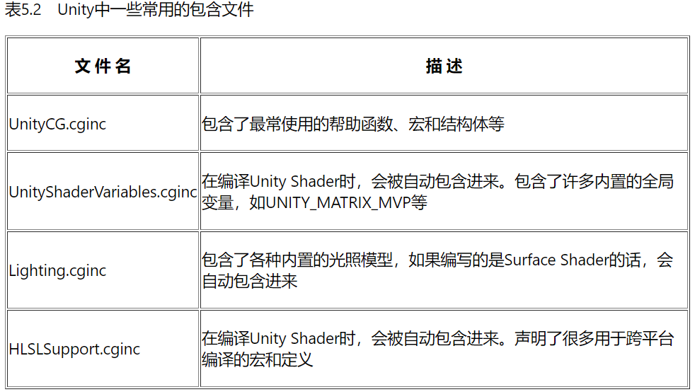
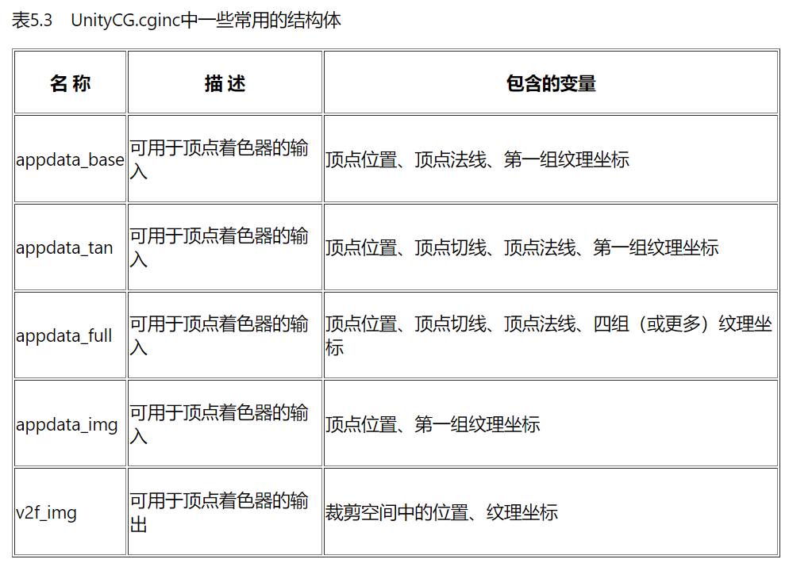
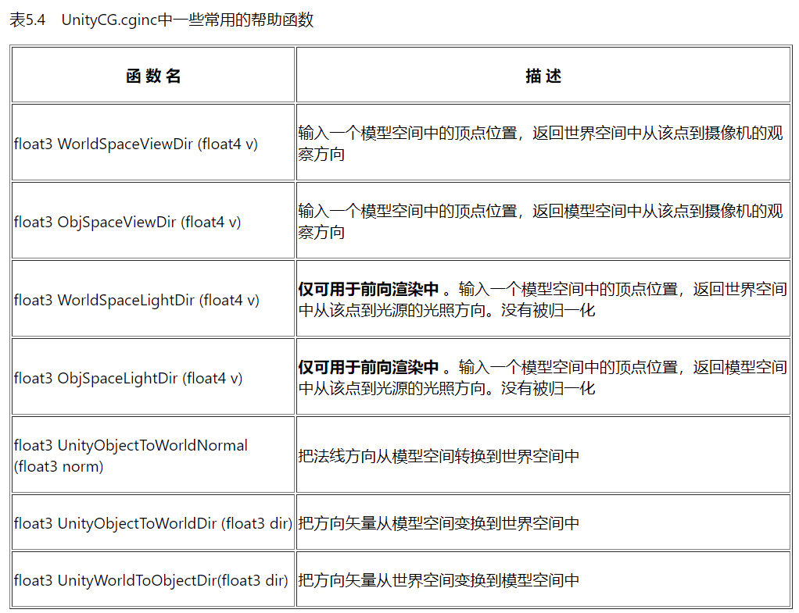
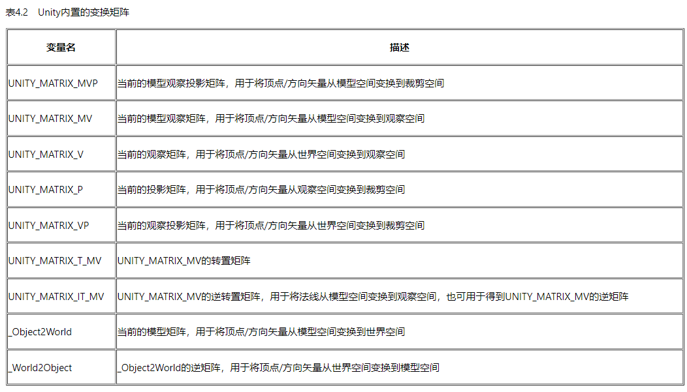
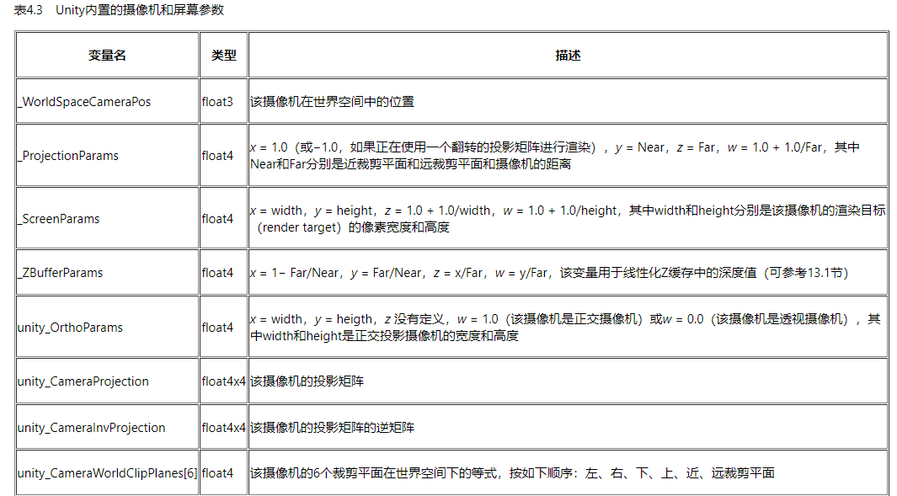

本文是《Unity Shader入门精要》的简单笔记之一，只有非常基础简单的一部分，主要关注Unity shader的概念、语法、用法等。不涉及基本的图形学原理。  

:::important
本文是Unity内置管线的Shader，使用CG着色器语言以及以.cginc结尾的各种依赖。而Unity内置管线正在过时，Unity正逐渐全面转向SRP，它更多使用HLSL着色器语言，以及以.hlsl结尾的各种依赖与内置变量/函数（这些内置依赖与工具的用法发生了较大变化）。虽然语法变化很少，而且仍然可以在SRP下使用CG和\*.cginc写Unity Shader，但建议考虑了解更新的技术。  
关于新的SRP管线及其Shader，强烈推荐[catlikecoding](https://catlikecoding.com/)，尤其是它的SRP教程能从零搭建一个有必要功能的自定义渲染管线，大大加深对渲染管线、Shader以及各种图形学基本理论的理解。  
:::

UnityShader 提供了大量内置的东西，包括内置变量，和一些已经实现的常用函数等。Unityshader内置的一些着色器以 `.cginc` 结尾，可以在 `CGPROGRAM` 中用 `#include "...cginc"` 引用。UnityShader提供的常用函数文件见 http://unity3d.com/cn/get-unity/download/ archive。在下载-内置着色器来直接获取。  
其中主要内容有：  
  
  
###### 内置的输入输出结构体（可以直接去文件中看）  
  
  
###### 常用的帮助函数  
如空间变换（模型、世界、切线），视线光源方向等。  
  
  
光照相关。  
  
  
###### 内置变量  
如变换矩阵，相机屏幕参数等。  
  
变换矩阵：  
  
  
相机和屏幕：  
  
