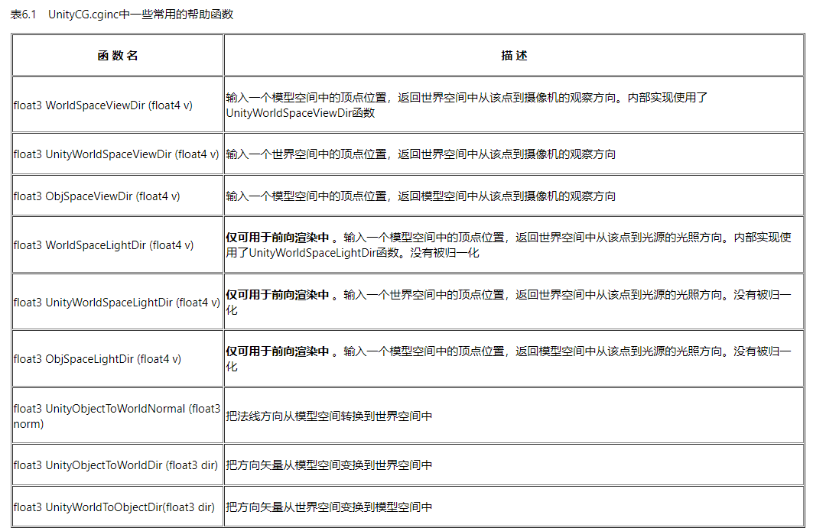

本文是《Unity Shader入门精要》的简单笔记之一，只有非常基础简单的一部分，主要关注Unity shader的概念、语法、用法等。不涉及基本的图形学原理。  

:::important
本文是Unity内置管线的Shader，使用CG着色器语言以及以.cginc结尾的各种依赖。而Unity内置管线正在过时，Unity正逐渐全面转向SRP，它更多使用HLSL着色器语言，以及以.hlsl结尾的各种依赖与内置变量/函数（这些内置依赖与工具的用法发生了较大变化）。虽然语法变化很少，而且仍然可以在SRP下使用CG和\*.cginc写Unity Shader，但建议考虑了解更新的技术。  
关于新的SRP管线及其Shader，强烈推荐[catlikecoding](https://catlikecoding.com/)，尤其是它的SRP教程能从零搭建一个有必要功能的自定义渲染管线，大大加深对渲染管线、Shader以及各种图形学基本理论的理解。  
:::

简单光照（如Blinn-Phone, Lambert）知道原理之后基本没有实现上的困难。这里不予赘述。需要注意的一点是，漫反射光照和环境光是不同的，环境光(ambient)直接加到输出结果里，而漫反射光照(diffuse)在Lambert模型中，是 漫反射颜色 \* 光照颜色 \* 光照方向和法线夹角的余弦值。  
  
这里贴上常见的和光照有关的内置帮助函数：  
  
很多内置帮助函数中只限于使用**前向光照渲染**，一般简单初级的光照都是这个。这是一个Tags，**在Pass中定义：`{Tags { "LightMode"="ForwardBase" }}`。**  
注意这些内置方向相关的函数中，**均不保证标准化**。  
  
在Unity 光照窗口中可以设置环境光，然后 *UNITY_LIGHTMODEL_AMBIENT* 可以获取环境光颜色。而有了 ForwardBase 标签后，引入 Lighting.cginc，可以获取 *\_LightColor0*（当前正在处理的光源颜色，必须forwardbase）。总之，有光照的的着色器中，都可以引入 Lighting.cginc。  
  
在简单的Phone着色中，albedo是漫反射率，有漫反射颜色和环境光照颜色之意，漫反射光照用它乘以光色乘以角度因子，环境光照用它乘以环境光。而specular是反射光色，它乘以光色乘以光/视角角度因子。而albedo的组成，可以有一个“底色”，再乘以漫反射纹理本身的颜色——**更多的时候直接是一个albedo纹理**。  
