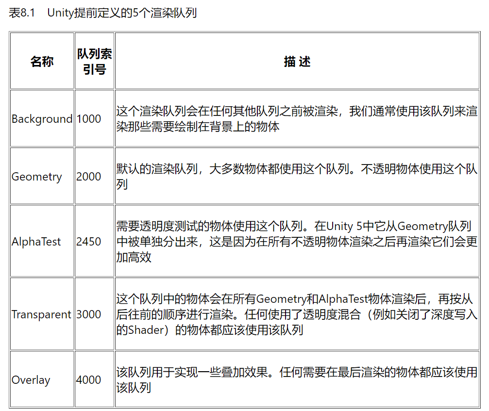
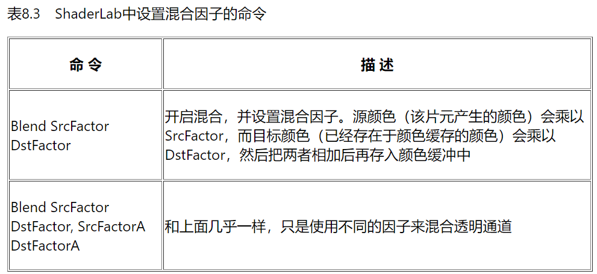
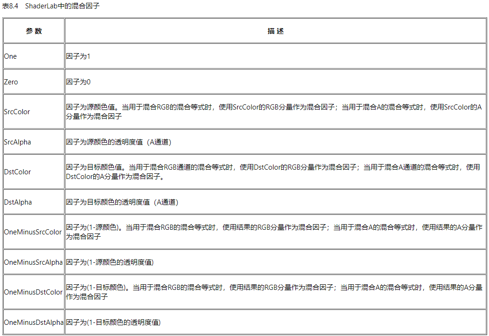
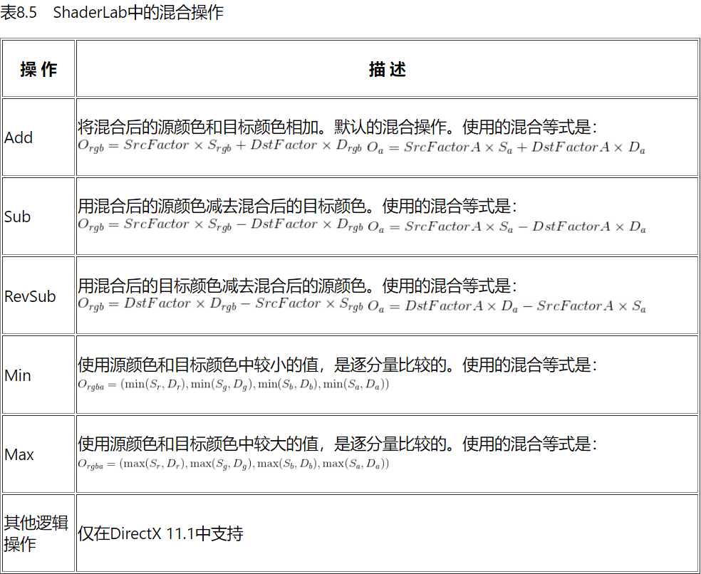
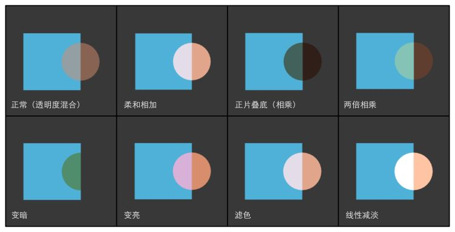

本文是《Unity Shader入门精要》的简单笔记之一，只有非常基础简单的一部分，主要关注Unity shader的概念、语法、用法等。不涉及基本的图形学原理。  

:::important
本文是Unity内置管线的Shader，使用CG着色器语言以及以.cginc结尾的各种依赖。而Unity内置管线正在过时，Unity正逐渐全面转向SRP，它更多使用HLSL着色器语言，以及以.hlsl结尾的各种依赖与内置变量/函数（这些内置依赖与工具的用法发生了较大变化）。虽然语法变化很少，而且仍然可以在SRP下使用CG和\*.cginc写Unity Shader，但建议考虑了解更新的技术。  
关于新的SRP管线及其Shader，强烈推荐[catlikecoding](https://catlikecoding.com/)，尤其是它的SRP教程能从零搭建一个有必要功能的自定义渲染管线，大大加深对渲染管线、Shader以及各种图形学基本理论的理解。  
:::

和图形学默认的一样，透明度实际上是“不透明度”。  
透明效果有两种：透明度测试和透明度混合。前者只用判断纹理的alpha通道，如果小于某一阈值，就直接丢掉这个颜色（discard;）；如果大于这个阈值，就完全显示这个颜色。这个不用多说。  
  
## 渲染队列  
介绍透明度混合的实现之前有必要介绍一下渲染队列(Tags, Queue...)。人们希望能对场景中的材质进行某种分类，大类之前以固定的前后顺序进行渲染。比如透明物体必须要在所有不透明物体渲染完之后才渲染，透明物体要让它后面的颜色“穿透”过来，渲染它之前必须保证所有可能穿透的颜色（不透明的）都已经被渲染。于是有了渲染队列，它是一个 Tags，全都是Unity内置的渲染队列（当然也可以自定义），用来调控不同类别材质之间的渲染顺序。  
  
透明度混合应该使用专门的 `"Transparent"` 队列。  
  
  
通过  
```  
Tags {"Queue"="Transparent"}  
```  
设置。  
  
## 透明度混合  
实现透明度混合的时候需要**关闭深度写入** `ZWrite off`。因为透明物体是透明的，不向不透明物体那样直接把颜色覆盖到buffer中，透明物体需要把经过透明度混合的东西继续向 ”前（浅）”传递，以实现完整的颜色混合。如果开启了深度写入，可能一些被透明物体遮住的东西就会被阻挡在深度测试之外、而不能正确渲染了。  
**（只有透明的材质关闭了深度写入，不透明的没有关闭。所以在渲染完所有不透明物体后，当前帧已经有了一个深度缓冲，深于此缓冲中的透明片元同样不会被渲染，不会造成错误）**  
  
但是关闭了深度写入之后，我们依然希望将透明物体按照从深到浅来渲染以实现正确的混合效果。但是不能。最后是回归了**画家算法**，尽量将物体按深度前后排序——但这当然是不能完全做到的（在有复杂的物体互相重叠的情况下），这个问题没有被真正解决。  
  
我们熟知的透明度混合算法是：$c'=\alpha c_{transparent}+(1-\alpha)c$。而片元着色器只能做到将包含了透明度的颜色值返回，不能直接存取颜色缓冲。**透明度混合的具体计算是通过Unity语义 `Blend` 进行设置的**。不设置Blend的时候，会直接把深度浅于当前深度缓冲的颜色写入到颜色缓冲中。  
  
### Unity Blend 命令  
在各自Pass的开头可以用Blend命令开启透明度混合（直接白白地写在CGPROGRAM之前就可以了）。不写Blend啥啥的时候，就不会开启透明度混合，只有在设置之后才会开启混合。  
  
常用的命令：`Blend SrcFactor DstFactor`  将颜色buffer替换为：SrcFactor \* 片元着色器返回的值 + DstFactor \* 颜色缓冲器中原有的颜色（这个混合包括alpha通道！）。  
  
  
  
第一个是常用的，第二个多了一组系数，这是把颜色和透明度分开来来混合：SrcFactor \* 片元着色器返回的值.rgb + DstFactor \* 颜色缓冲器中原有的颜色.rgb；SrcFactorA \* 片元着色器返回的值.a + DstFactorA \* 颜色缓冲器中原有的颜色.a。  
  
显然，Blend命令需要指定 SrcFactor, DstFactor。这个值同样都是被限制的，从以下选择：  
  
  
此外，还可以指定Blend时候进行的计算。常规来说，Blend是一个加权求和，实际上这正是默认情况。但是可以在设置混合因子之前，设置混合用的操作：`BlendOp BlendOperation`。  
可选的操作有：  
  
不指定的时候，就是Add.  
  
我们常知的透明度混合方法是：`Blend SrcAlpha OneMinusSrcAlpha`  
  
利用 透明度混合操作指定 + 透明度混合因子，可以得到一些特殊的效果（对应Photoshop）：  
```  
// 正常（Normal），即透明度混合  
Blend SrcAlpha OneMinusSrcAlpha  
  
// 柔和相加（Soft Additive）  
Blend OneMinusDstColor One  
  
// 正片叠底（Multiply），即相乘  
Blend DstColor Zero  
  
// 两倍相乘（2x Multiply）  
Blend DstColor SrcColor  
  
// 变暗（Darken）  
BlendOp Min  
Blend One One  
  
// 变亮（Lighten）  
BlendOp Max  
Blend One One  
  
// 滤色（Screen）  
Blend OneMinusDstColor One  
// 等同于  
Blend One OneMinusSrcColor  
  
// 线性减淡（Linear Dodge）  
Blend One One  
```  
  
  
### 实现透明度混合  
其实就是单纯的着色模型。着色器代码几乎没什么变化，只是要放在做不同的设置，放在不同的队列、设置透明度混合、从纹理采样alpha，然后直接返回颜色就可以了。  
  
```  
Properties{  
	_MainTex("MainTex", 2D) = "white" {}  
	...  
}  
SubShader{  
	Tags {  
			"Queue"="Transparent",  
			"IgnoreProjector"="True",  
			"RenderType"="Transparent"  
		}  
		Pass{  
			Tags {"LightMode"="ForwardBase"}  
			ZWrite off  
			Blend SrcAlpha OneMinusSrcAlpha  
			CGPROGRAM  
				sampler2D _MainTex;  
				float _MainTex_ST;  
				...  
				#progma vertex vert  
				#progma fragment frag  
				...  
				...(顶点着色器)...  
				float4 frag(v2f in):SV_Target {  
					float mainTex = tex2D(MainTex, in.texcoord * MainTex_ST.xy + MainTex_ST.zw);  
					...(计算光照，得到该片元颜色color, 透明度alpha)...  
					return float4(color, alpha);  
				}  
			ENDCG  
	}  
}  
```  
透明材质的所有subshader，pass都应该有Transparent的属性，所以关于透明的Tags加在SubShader中。除了队列，还有 `"IgnoreProjector="True"`（*我也不知道是什么*）,`"RenderType"="Transparent"`，RenderType也要设置成“透明”。  
  
## 延后关闭深度写入  
关闭深度写入导致一些混乱，尤其是模型间复杂的重叠关系时候。由于没有深度写入，无法真正地对片元排序，所以透明材质的片元之间的渲染顺序的混乱可能导致一些问题（因为一旦混合就会直接在颜色缓冲中留下不可逆的结果）。用延后关闭深度写入来缓解——希望一定程度上保留透明材质的深度信息。  
  
但是渲染透明材质的时候必须关闭深度写入，（嘶，话说在保证先渲染不透明材质的情况下，在渲染透明材质的时候开启深度写入最坏的结果也就是导致有材质没有渲染到吧）。这里的做法是把开启深度写入和透明度渲染分成了两个Pass。**Unity保证Pass按照前后顺序执行**。第一个Pass什么也不做，就只是让管线自己写入深度，更新深度buffer；第二个Pass关闭深度写入。这样的结果是渲染透明材质的时候只会渲染最浅的那个，模型内部不会有透明效果。——这和一边开启深度写入一边渲染有何区别？——难道是不统一?开启了透明度渲染导致有的地方有内部透明度、有的地方没有，不统一？  
```  
Shader "Unity Shader Book/Chapter8-Alpha Blending ZWrite" {  
    Properties {  
        _Color ("Main Tint", Color) = (1,1,1,1)  
        _MainTex ("Main Tex", 2D) = "white" {}  
        _AlphaScale ("Alpha Scale", Range(0, 1)) = 1  
    }  
    SubShader {  
        Tags {"Queue"="Transparent" "IgnoreProjector"="True" "RenderType"="Transparent"}  
  
        // Extra pass that renders to depth buffer only  
        Pass {  
            ZWrite On  
            ColorMask 0  
        }  
  
        Pass {  
			ZWrite Off  
            // 前面相同  
        }  
    }  
    Fallback "Diffuse"  
}  
```  
其中，`ColorMask` 命令指定了这个Pass给出的颜色缓冲是什么，0表示没有给出颜色缓冲，只进行管线的其它工作，包括z-buffer。它的选择为*任意RBGA* 的组合以及0.  
  
## 双面透明度  
有时候需要开启双面渲染（`Cull Off - 不剔除；Cull Front - 剔除前面；Cull Back - 剔除后面（默认）；`）。  
同样的，存在关闭深度写入带来的混乱。背面的面元有可能后于前面被渲染。  
解决方法是用**两个Pass**，第一个Pass渲染背面的，第二个Pass渲染正面（靠近相机一面的）的。  
