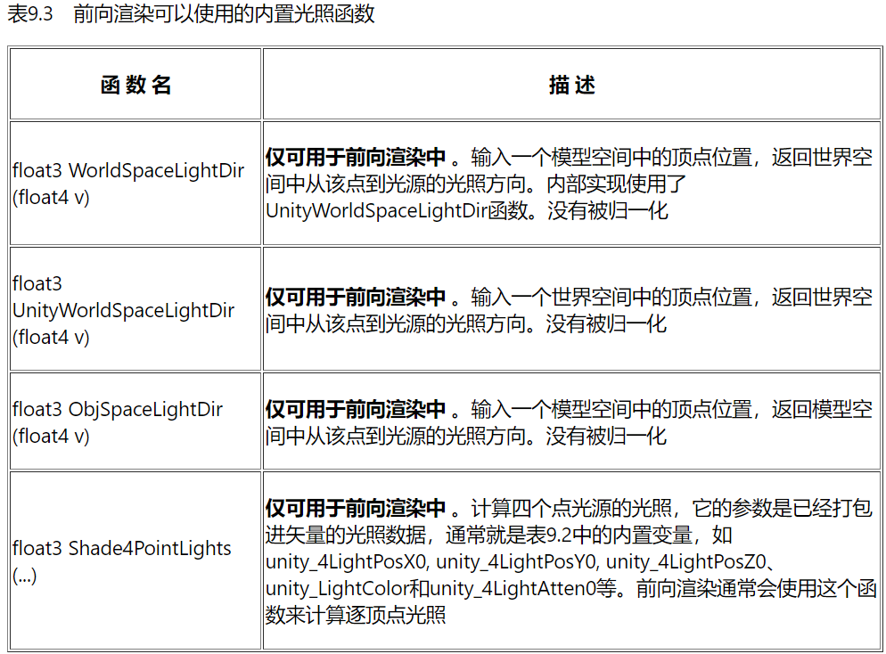

本文是《Unity Shader入门精要》的简单笔记之一，只有非常基础简单的一部分，主要关注Unity shader的概念、语法、用法等。不涉及基本的图形学原理。  

:::important
本文是Unity内置管线的Shader，使用CG着色器语言以及以.cginc结尾的各种依赖。而Unity内置管线正在过时，Unity正逐渐全面转向SRP，它更多使用HLSL着色器语言，以及以.hlsl结尾的各种依赖与内置变量/函数（这些内置依赖与工具的用法发生了较大变化）。虽然语法变化很少，而且仍然可以在SRP下使用CG和\*.cginc写Unity Shader，但建议考虑了解更新的技术。  
关于新的SRP管线及其Shader，强烈推荐[catlikecoding](https://catlikecoding.com/)，尤其是它的SRP教程能从零搭建一个有必要功能的自定义渲染管线，大大加深对渲染管线、Shader以及各种图形学基本理论的理解。  

这一篇是这个简短系列的最后一篇文章，因为之后在作业要求下跟着[catlikecoding](https://catlikecoding.com/)搭建SRP，便没再看这书了。  
:::

渲染路径主要有：前向渲染，延时渲染，顶点渲染。最后一种其实就是逐顶点光照，在早先因为硬件能力不足单独有了这种，但实际上逐顶点光照完全可以在前向渲染中用顶点着色器实现。Unity 5.x 移除了顶点渲染路径，这里不讨论它。  
  
不同的渲染路径用于处理不同的渲染任务（尤其是光照方面），Unity为不同的渲染路径（相同的渲染路径也有不同的“Mode”、有不同的目的）配置不同的参数，UnityShader只能通过这些Unity引擎给你配置了的量（以有限的内置变量的方式访问）来访问光源属性，从而完成渲染任务。  
  
## 前向渲染：ForwordBase, ForwardAdd.  
Unity光源有不同的等级：在light组件的rendermode中设置：Auto, important, not important，指定光源是逐像素光源、逐顶点光源还是球谐函数(SH）处理。  
  
前向渲染有两种：forwordbase用来渲染逐像素的环境光（一般是平行光）和前四个非重要光源；而forwordadd渲染其它逐像素光源——每个逐像素光源都会计算一次 ForwordAdd Pass。  
  
  
可见，对于两个pass我们首先要加 "LightMode"="ForwardBase/Add" 的 Tags，然后两个pass分别要有 #pragma multi_compile_fwdbase 和#pragma multi_compile_fwdadd 编译指令，最后 add pass 需要开启 Blend One One 来让计算出的颜色叠加，而非覆盖。  
  
前向渲染的内置变量与函数：  
  
  
  
forwordbase渲染什么光源；forwardadd渲染什么光源（Blend One One），有什么内置变量函数......  
  
## 延时渲染 Deferred  
延迟渲染是一种很有年纪的渲染加速技术。z-buffer等让很多不该被渲染（将会被覆盖）的面元也参与了片元着色器的计算；管线中会产生很多这样的浪费，延时渲染试图他们。  
延时渲染一般是两个阶段两个pass，用到额外的缓冲 G-buffer。第一个pass不计算任何光照，而只是写入深度，把通过了深度测试的片元的坐标、纹理坐标、法线、光照方向等等各种需要的信息全部存入G-buffer。然后在第二个pass中，取出G-buffer的信息，直接计算光照。  
这样可以减少计算光照中的浪费。  
  
G-buffer有格式限制：  
  
  
延迟渲染有很多限制，比如第二个Pass的渲染只能选择unity内置的standard光照模型等。当然也可以替换 Internal-DeferredShading.shader 文件，替换“内置”光照模型。详见[官方文档](http://docs.unity3d.com/Manual/RenderTech-DeferredShading.html )。  
  
延迟渲染可访问的内置变量等在 UnityDeferred Library.cginc  
  
