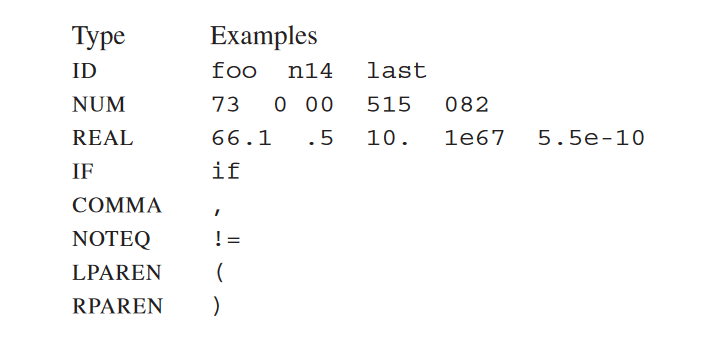
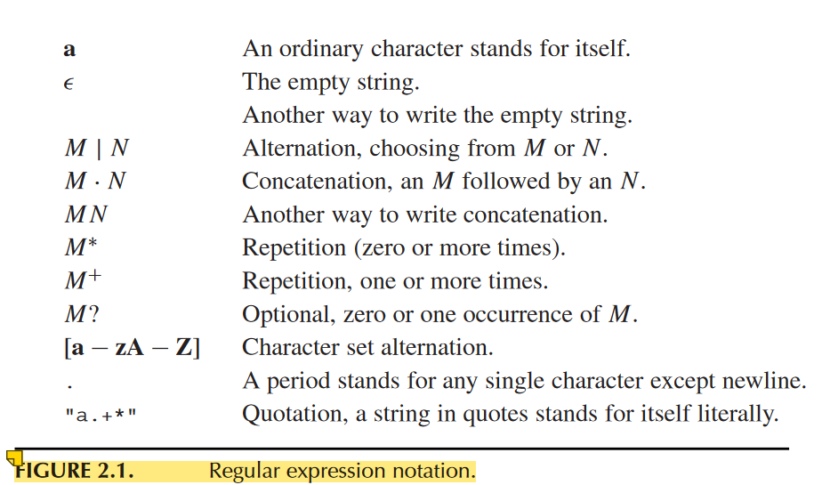
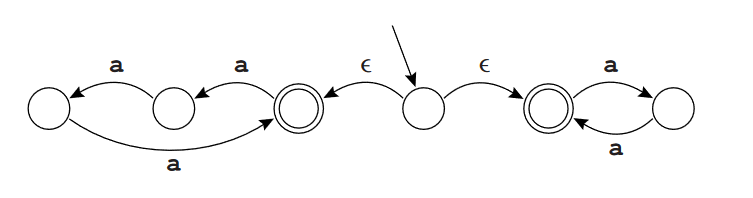
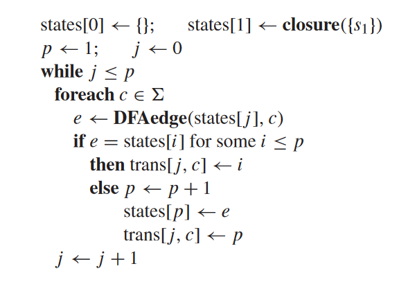

:::note
Compiler系列的笔记是对 编译虎书 *Modern Compiler Implementation in C*  的笔记。虽然这本书以理论代码结合为特点，笔记中为了方便不记录大部分实现相关的内容，而只记录一些关键思想和理论。  
但是很遗憾，阅读完前端部分就没再往下读了，且没有真正编程实现纸上谈兵终究效果有限..  
:::

## 词法分析  
*Lexical Analysis* 就是词法分析。所谓词法，就是程序语法中的规定了每个标识符、数字、关键词等的形成规则的规则，依据这些规则形成的标识符、数字、关键词等称为词素 token。  
比如，一个示例的程序语言中可能有以下类型的词素：  
  
其中，左边为每种词素的 type，右边为每种词素的实例。  
ID就是变量名称，NUM是数字（整数），REAL是实数，IF是 if 关键词，COMMA是逗号，NOTEQ是不等于!=，LPAREN是左小括号，RPAREN是右小括号。  
  
词法分析器的任务是，对于输入的源代码文本，依次提取出每一个每一个词素，判断出这个词素的类型，并且喂给接下来的句法分析器(Parser)。 也就是说，词法分析器的功能仅仅是按照既定的词法依次提取每个词素并且判断类型。  
  
## 正则表达式  
词素是字符按照一定规则形成的字符串，这个规则就是词法。一般用正则表达式表示词法。这个东西已经比较熟悉了，具体的定义见下表。  
  
  
## 有限状态机  
计组上已经熟悉，类似正则表达式的东西用有限状态机去判断。一般使用的状态机是*确定状态机*，每个状态向外指出若干边，每个边都有固定的条件让状态沿着这条边转移。但是当正则表达式比较多、比较复杂的时候，不容易直接写出确定状态机，这时候可以使用**不确定状态机**更简便地写出正则表达式对应的状态机。  
  
### 不确定状态机  
不确定状态机的就是状态机中有一些边是*无条件* 的，也就是条件是 $\epsilon$。比如下面这个不确定状态机，它表示要么是空字符串、要么是偶数个a、要么是3的倍数个a。  
  
  
对于复杂的正则表达式，这样的无条件边可以很容易地兼顾所有前缀的可能，而不需要从一开始就仔细地设计状态机来在一个大状态机中兼顾所有正则表达式的可能。表达式复杂的时候，这是很困难的。  
  
### 不确定状态机转化为确定状态机  
不确定状态机无法用计算机编程去执行，需要把不确定状态机转化为确定状态机才能用计算机求解。  
假设一组正则表达式（词法）对应的不确定状态机是 U，对应的确定状态机是 D。转化法的关键是：D中的一个状态，可以是U中状态的集合。而具体的做法是，模拟不确定状态机的运行。既然存在无条件转移边，那么每次在转移的时候，就先把这些无条件转移边转移个遍，走完所有可能可以直接到的地方。  
  
从起始状态开始（这时候还没有任何字符串进来），U中起始状态能达到的所有状态的集合为D中起始状态（从U中起始状态指出的无条件边、以及从这些无条件边转移后到达的状态的更多的无条件边），然后对于任何可能的输入，在状态集合中所有状态上模拟运行能达到的下一个状态，以及从这些到达的状态通过无条件边能到达的更多状态，最后得到一个新的状态集合。在D中，这个新的状态集合就是一个新状态，从起始状态经过条件为【刚才一步模拟的输入】的边转移到的新状态。重复上面的过程，不断从U的状态集合生成新状态集合，即不断从D的状态生成新状态；慢慢地，状态集合中的状态够少，能够确定这里属于那一条正则表达式分支、直至到达最后的终止状态，确定这个词素是哪种类型。  
  
上面，从一个状态（或一个状态集合中的所有状态）出发，求经过无条件边能到达的所有状态的集合的过程称为求这个状态的 $\epsilon-closure$ ($\epsilon$闭包)，记为 `closure(S)`, S是一个状态集合。  
从U的状态集合经过通过条件c能到达的新状态集合记为 $DFAedge(d, c) = closure(⋃_{s∈d} edge(s, c))$，其中 $edge(s,c)$ 为U中单个状态s经过条件c能*直接* 到达的新状态（未必是$\epsilon$闭包）。显然，这个DFAedge就是DFA的一条边，d是D的一个状态也是这个边的起点，其值是这个状态经过条件c所能到达的新状态。DFAedge是D中状态到状态的函数。  
最后的转换算法伪代码是：  
  
其中，trans\[,]是确定状态机的转移矩阵，j是确定状态机中的状态编号，而c是在j状态下迎来了c字符。$\sum$ 是词法的字符集。  
伪代码中，1是应该确定状态机的启示状态，0一定是空，0状态经过任何字符都只能回到0状态，感觉倒像是一个错误状态。  
  
有了确定自动机后，就可以不难地写出正则表达式定义的词法对应的词法解析器了。  
