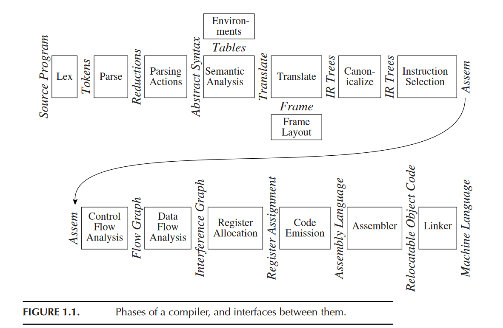
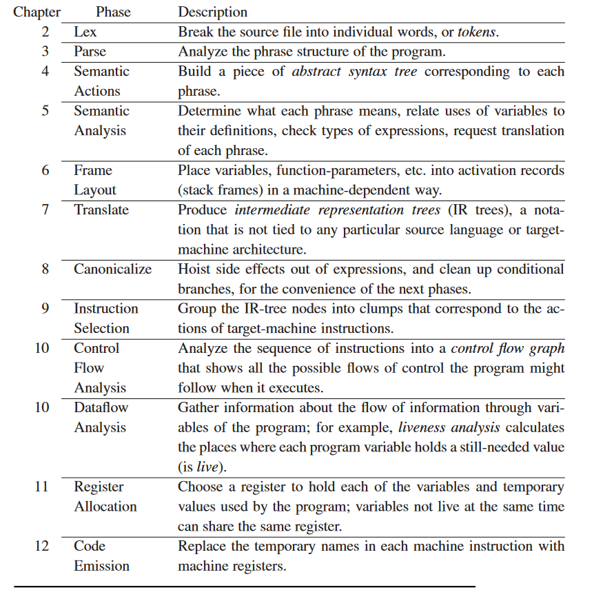

:::note
Compiler系列的笔记是对 编译虎书 *Modern Compiler Implementation in C*  的笔记。虽然这本书以理论代码结合为特点，笔记中为了方便不记录大部分实现相关的内容，而只记录一些关键思想和理论。  
但是很遗憾，阅读完前端部分就没再往下读了，且没有真正编程实现纸上谈兵终究效果有限..  
:::
  
***  
  
编译器是把程序源代码依照程序语言规则翻译成机器代码的过程，对应将高级程序语言翻译成汇编代码的过程。  
一个经典的编译器包含了以下成分和过程（这个图包括了汇编和链接）：    
一些详细点的解释是：  
  
  
这个很长的流程被分为了前中后端，具体哪个对应哪个忘了。编译器中有自己的虚拟语法，所有程序源代码经过最初几个过程后都会变成虚拟语法传递给后续环节，所以要把编译器应用到不同语言只用改前端的几个部分，尤其是词法句法器；想要编译成不同的汇编代码只用改后面的几个环节。  
  
***  
一些关于编译器实现的东西中，往往能见到 *无副作用*，这个表示编译器程序中的每个过程，不能因它的处理对象（不同的源代码中不同的成分）产生变化（包括自己某些的全局变量等），这些源代码的不同和变化应该且只应该存储、体现在一些特定的数据结构变量上。  
