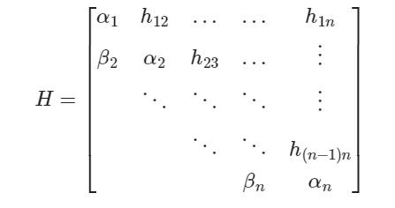
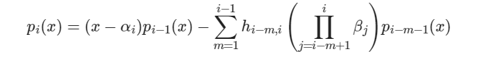

线性代数很多东西都忘了，虽然看一下能比较快地想起来一些，但忘了就是忘了。这里记录一些额外遇到的东西。本文是上海森堡矩阵与特征多项式。  
大部分来自 oi-wiki.org.    
### 特征多项式  
**特征值的定义**，对于矩阵 A，存在常数 $\lambda$，非零向量 $p$，  
$$ Ap = \lambda p $$  
移项到一边：  
$$ (\lambda I_n - A)p=0 $$  
其中向量 $p$ 非零，因而上面的线性方程有非零解，左边的矩阵行列式为0：  
$$ |\lambda I_n - A|=0 $$  
这个方程的解 $\lambda$ 就是特征值，特征值的重数就是*代数重数*，带入每个特征值到上面那个方程中，解除非零特征向量 $p$，这些特征向量加上零向量构成了解空间，特征值对应的解空间的维数（*基础解系的向量个数*）称为*几何维数*。  
  
那个行列式拆开就是一个关于 $\lambda$ 的多项式，因而特征多项式定义为：  
$$ p_A(x)=|xI_n - A| $$  
假设 A 的特征值为 $\lambda_1, \lambda_2......\lambda_m$，重数为$d_1...d_m$，即这些特征是是上面多项式等于0时候的解！根据代数基本定理，特征多项式可以因式分解为：  
$$ p_A(x)=|xI_n - A| = (x-\lambda_1)^{d_1}...(x-\lambda_m)^{d_m} $$  
  
### 相似矩阵  
如果存在可逆矩阵 P，使得  
$$ B = P^{-1}AP $$  
则称 A,B 相似。  
  
+ 相似矩阵有相同的特征值与特征多项式。  
  
而对于一个上三角矩阵，它的特征多项式就是$(x-a_{ii})$之积，特征值就是对角线上的元素。  
求特征值与特征多项式，可以考虑相似变换为相似的上三角阵。  
  
相似变换，左乘是行变换，右乘是列变换，相似变换就是行变换上做了什么，列变换上同样这么做。发现*用高斯消元的思路*，处理到主对角线向下平移一单位的那个对角线（称次对角线）的时候，每次用行变换将元素清零，完全相同的列变换可能使得这个元素变得不是0，无法清零。  
  
于是退而求其次，用上海森堡矩阵。  
  
### 上海森堡矩阵与海森堡算法求特征多项式  
  
这样的矩阵称为海森堡矩阵，主对角线下面那个 $\beta$ 列称为次对角线。次对角线下面全为0，是上海森堡矩阵。  
可以用高斯消元的思路用在相似变换上，得到海森堡矩阵。  
  
海森堡矩阵存在一个依次取主对角线上的子矩阵递推特征多项式的算法：  
  
  
归纳得：  
  
一直递推到 $p_n$ 即为最终的特征多项式。  
  
### 其它补充  
#### 换位公式  
$$ \lambda^n|\lambda I_m-AB|=\lambda^m|\lambda I_n-BA| $$  
说明 AB 与 BA 有相同的非零特征值。  
  
#### 舒尔（schur）引理  
矩阵 A 的特征值 $\lambda_i$，任意多项式 $f(A)$，其结果的特征值为$f(\lambda_i)$。  
特别地，kA 特征值 $k\lambda_i$，A^m^ 特征值$\lambda_i^m$  
  
#### 哈密对-凯莱定理与最小多项式  
A的特征多项式 $p_A(x)=|xI_n-A|$, 一定有 $p_A(A)=0$。可见必然存在一个非零多项式，使$f(A)$为零矩阵。*零化多项式*。  
特征多项式是一个零化多项式。  
*最小多项式*：次数最小（最大次数最小）的零化多项式。  
不考虑根的重数的时候，最小多项式与特征多项式有相同的根。*特征多项式可以整除最小多项式*，即次数项相同，次数更大。  
如果特征值的几何维数=代数重数，特征多项式是零化多项式。  
  
#### 相似对角化  
如果几何维数=代数重数，或有n个线性无关的特征向量时，可以相似对角化为相似的对角矩阵。  
相似变化矩阵为这 n 个线性无关的特征向量所组成。  
  
#### Jordan标准型  
不能相似对角化可以化为Jordan标准型，咕了。  
