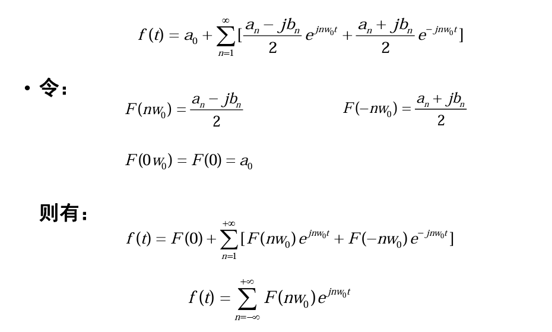

傅里叶变换是对原信号的分解，把一个函数分解为一系列基函数的加权和。傅里叶变换是基于傅里叶基函数的变换，把函数拆解为傅里叶基函数的加权和。傅里叶基函数和数分里学过的傅里叶级数有密切关系，它是正交基，所以傅里叶变换是正交变换。  
  
对于周期函数，可以用傅里叶级数进行分解，周期函数为傅里叶级数的加权和；而对于非周期函数，可以当做周期无穷大的周期函数，可以分解为傅里叶级数的积分。  
  
将连续傅里叶变换离散化得到离散的傅里叶变换，包括对周期离散函数的离散时间傅里叶变换（感觉见得少），以及对非周期函数的离散频谱傅里叶变换（进行周期延拓后），后者是常说的离散傅里叶变换DFT。  
  
对DFT进行算法上（仅仅是算法）的优化，得到快速傅里叶变换FFT。  
  
## 正交基与连续周期函数傅里叶级数分解  
基函数是一个函数集合 $\{g_i(t)\}$，完备正交基需满足以下性质：  
$$  
\begin{aligned}  
\int_{t_1}^{t_2}g_i(t)g_j(t)dt&=\begin{cases}  
0, i=j  \\  
1, i\neq j  
\end{cases}  \\  
\forall i,\int_{t_1}^{t_2}g_i(t)x(t)dt &= 0, \quad iff. \quad x(t)\equiv 0  
\end{aligned}  
$$  
第一行是正交性，第二行是完备性。**第二个公式有问题。完备性的定义是，对空间内的任何函数，都可以用这组基函数唯一准确地表示。它可能有充要条件（不是很清楚...），但第二行那个应该有问题**。用正交基进行的变换是正交变换。  
  
只有完备正交基的变换才能在变换后写等于号，非完备的正交基变换后只能约等于。变换的方法是让变换前后的函数的平方误差最小，求解这个最优化问题。  
  
假设一组正交基（不一定完备）$\{f_1(t),f_2(t),\dots,f_n(t)\}$，分解函数 $f(t)$ 为(下面的式子其实不能写等于)  
$$  
f(t)=\sum_{i=1}^n a_if_i(t)  
$$  
求解系数 $a_i$ 的方法是，让变换后的函数 $\^f(t)=\sum_{i=1}^n a_if_i(t)$与原函数$f(t)$的某个范围内的平方误差尽可能小，即最小化:  
$$  
\begin{aligned}  
\Delta^2 &= |\^f(t)-f(t)| \\  
&=\frac{1}{T_2-T_1}\int_{T_1}^{T_2}[\^f(t)-f(t)]^2dt \\  
&=\frac{1}{T_2-T_1}\int_{T_1}^{T_2}[\sum_{i=1}^n a_if_i(t)-f(t)]^2dt  
\end{aligned}  
$$  
调整系数 $a_i$ 使得 $\Delta^2$ 最小，是一个最小二乘最优化问题，解法就是对 $a_i$ 求偏导，让导数为0。经过一系列推导，得到的结果是：  
$$  
\frac{1}{T_2-T_1}[\int_{t_1}^{t_2}2a_if^2(t)dt-\int_{T_1}^{T_2}2f(t)f_i(t)dt]=0  
$$  
最后，如果$f(t)$是实函数，则：  
$$  
a_i=\frac{\int_{T_1}^{T_2}f(t)f_i(t)dt}{\int_{T_1}^{T_2}f_i(t)f_i(t)dt}=\frac{\int_{T_1}^{T_2}f(t)f_i(t)dt}{K_i}  
$$  
如果是复数函数，则：  
$$  
a_i=\frac{\int_{T_1}^{T_2}f(t)f^*_i(t)dt}{\int_{T_1}^{T_2}f_i(t)f^*_i(t)dt}=\frac{\int_{T_1}^{T_2}f(t)f^*_i(t)dt}{K_i}  
$$  
上面就是系数 $a_i$ 的求解方法。如果无完备性，则 $f(t)\approx\sum_{i=1}^na_if_i(t)$，如果有完备性，可以取等。  
  
傅里叶级数是完备正交基应该比较熟悉了，三角形式为：  
$$  
\{\cos(nw_1t), \sin(nw_1t)\}  
$$  
而复指数形式为：  
$$  
\{e^{jnw_1t}\}  
$$  
  
它正交且完备，所以前面的 $K_i\equiv1$，所以周期函数(周期为 $T_0$)傅里叶级数分解，其三角形式为：  
  
数分里讲过的。  
  
用欧拉公式处理三角函数，可以得到复指数形式。  
  
  
有点奇怪... F直接被“定义”为了复数域上的奇函数？..  
  
## 连续非周期函数傅里叶变换  
这是我们一般说的傅里叶变换。连续非周期函数想要进行傅里叶变换，则把它当成周期无穷大的周期函数。$T_0\to+\infty$  
  
对周期为 $T_0$ 的函数做傅里叶变换，只用考虑周期是它1/1,1/2,1/3...的三角函数就可以了，也就是周期为 $T_0$ 的函数，做傅里叶分解时，公式里的 $w=\frac{2\pi}{T_0}$。把这个 $w$ 称为频谱间隔。  
  
可以看出，当 T 越来越大，频谱间隔 w 就越来越小。当 T 趋向无穷大，频谱就成连续的了，周期函数傅里叶分解中的离散频谱变成了连续频谱。  
$$  
F(nw_0)=\frac{1}{T_0}\int_{-T_0/2}^{T_0/2}f(t)e^{-jnw_0t}dt  
$$  
当 $T_0\to\infty$，上面那个式子就变为0，没有意义了。但物理意义上，任何信号的频谱总是存在的，因而对非周期函数的频谱进行重新定义，新的定义严格上说是 **频谱密度函数**。  
$$  
F(w)=\lim_{T_0\to\infty} T_0F(nw_0)=\int_{-\infty}^{+\infty}f(t)e^{-jwt}dt  
$$  
（必须乘以 $T_0$ 使之不为0）。  
在 $T_0\to\infty$ 即 $w_0\to0$时，$mw_0$ 越来越“接近”连续，最后离散频谱 $nw_0$ “变成”了连续频谱 $w$，最后定义连续的频谱密度函数 $F(w)$。  
  
**此后将用 $\~F$ 表示周期函数的离散频谱傅里叶分解，而 $F$ 专门表示非周期函数的连续傅里叶分解**。有了频谱密度函数后，接下来推导非周期函数的傅里叶变换的形式。  
  
首先，周期函数的傅里叶分解为：  
$$  
f(t)=\sum_{n=-\infty}^{+\infty}\~F(nw_0)e^{jnw_0t}  
$$  
令 $L(nw_0)=\~F(nw_0)e^{jnw_0t} / w_0$ （经典的不知道怎么冒出来的“令”），则  
$$  
f(t)=\sum_{n=-\infty}^{+\infty}L(nw_0)w_0  
$$  
周期无限长，$w_0\to0$，阶梯函数$L(nw_0)$逐渐变成“连续（指不是一级一级的）”函数$L(w)$，则上面的累加可以写成积分形式：  
$$  
f(t)=\int_{-\infty}^{+\infty}L(w)dw  
$$  
将频谱密度函数和上面的式子对比：  
$$  
\begin{aligned}  
f(t) &= \int_{-\infty}^{+\infty}L(w)dw  \\  
L(w)&=L(nw_0)=\~F(nw_0)e^{jnw_0t} / w_0 \\  
F(w)&=\~F(nw_0)T_0=\frac{2\pi \~F(nw_0)}{w_0}  
\end{aligned}  
$$  
可得  
$$  
\begin{aligned}  
L(w)&=\frac{F(w)}{2\pi}e^{jwt}  \\  
f(t)&=\int_{-\infty}^{+\infty}L(w)dw  \\  
f(t)&=\frac{1}{2\pi}\int_{-\infty}^{+\infty}F(w)e^{jwt}dw  
\end{aligned}  
$$  
上式就是傅里叶变换的逆变换，也就是从频谱密度函数得到原函数。可以用类似的思路，以“从原函数得到频谱系数的周期函数傅里叶分解”为起点，推导傅里叶变换的正变换。最终非周期函数傅里叶正逆变换的式子为：  
$$  
F(w)=\int_{-\infty}^{+\infty}F(w)e^{-jwt}dt  \\  
f(t)=\int_{-\infty}^{+\infty}f(t)e^{jwt}dw  
$$  
第一行是正变换：原函数$\to$频谱密度函数，第二行是逆变换：频谱密度函数$\to$原函数。  
  
## 连续傅里叶变换的性质  
+ 对称性  
  
如果时域上的函数 $f(t)$ 傅里叶变换后得到频域上的函数 $F(w)$，现把频域函数 F 当成在时域上，再次对 F 做傅里叶变换，得到的结果是 $2\pi f(-w)$. 定义傅里叶变换操作位 $\mathcal{F}$，对称性即：  
$$  
\begin{aligned}  
F(w)&=\mathcal{F}(f(t))  \\  
\mathcal{F}(F(t))&=2\pi f(-w)  
\end{aligned}  
$$  
  
+ 线性叠加性  
  
两个信号之和的傅里叶变换结果等于两个信号的傅里叶变换结果之和。  
  
+ 奇偶虚实性  
  
如果 f 是实偶函数，则 F(w) 为实偶函数。如果 f 是虚奇函数，则 F(w) 是虚奇函数。  
  
+ 尺度变换  
  
$$  
\begin{aligned}  
\mathcal{F}(f(t)) &= F(w)\\  
\mathcal{F}(f(at)) &= \frac{1}{|a|}F(\frac{w}{a})  
\end{aligned}  
$$  
从信号的“疏密”角度，很好直观理解。  
  
还有时移、频移、微分、积分等性质。  
  
## 题外话：系统函数与卷积  
  
系统函数即收到输入的刺激后，由 h(t) 根据输入 e(t) 发出反应；最终的输出 r(t) 是h(t)在连续不断变化的 h(t) 的作用下的混合叠加。  
  
最常见简单的两个系统函数是冲激响应函数与阶跃响应函数。冲激函数$\delta(t)$是每隔一定的时间间隔 $\Delta T$，就产生一个单值的“冲激”。  
  
  
  
  
在时间 $n\Delta T$ 的时候来了一个“冲激” $\delta(n\Delta T)$，产生了从 $n\Delta T$ 时刻开始的冲激响应函数 $\delta(n\Delta T)h(t-n\Delta T)\Delta T$。(最后的$\Delta T$如何直观解释...?)  
  
而这个时刻产生了这个相应函数，前面的时刻产生的相应函数也不会突然消失，它们会叠加，最后得到最终的输出：  
$$  
s(t)=\sum_{n=-\infty}^{+\infty}\delta(n\Delta T)h(t-n\Delta T)\Delta T  
$$  
  
当 $\Delta T \to 0$，也就变成连续的积分形式：  
$$  
s(t)=\int_{-\infty}^{+\infty}f(\tau)h(t-\tau)d\tau  
$$  
这就是严格意义上的卷积 $s(t)=f(t)\ast h(t)=\int_{-\infty}^{+\infty}f(\tau)h(t-\tau)d\tau$。可见h那一边（卷积符号的右边）那个是“反过来”的，和之后深度学习用的不太一样。  
  
卷积有交换律分配率结合律，卷积结果的导数等于其中一个函数的导数与另一个函数卷积，卷积后的积分等于其中一个函数积分后与另一个函数的卷积。  
  
时域卷积等于频域乘积，频域卷积等于时域乘积。  
  
## 离散傅里叶变换  
离散傅里叶变换有离散周期信号的离散时间傅里叶变换，以及非离散周期信号在离散频域的傅里叶变换，DFT指的是后者。  
  
离散周期信号 $x(n)$，周期为 N，则基频 $w_0=\frac{2\pi}{N}$，傅里叶基函数仍旧为 $\{e^{jkw_0n}=e^{j2\pi kn / N}\}$。  
  
只有N个离散傅里叶基函数：$e^{j2\pi kn/N}=e^{jkw_0n},k=0,1,2,\dots,N-1$。  
  
### 离散周期函数傅里叶分解  
  
有定理（推导：等比数列求和）：  
$$  
\begin{aligned}  
\sum_{n=0}^{N-1}e^{jkw_0n}=\begin{cases}  
N, &k=\pm N, \pm 2N, \dots \\  
0, &otherwise  
\end{cases}  
\end{aligned}  
$$  
  
离散周期函数傅里叶分解：  
$$  
x(n)=\sum_{k=0}^{N-1}a_k e^{j(kw_0n)}  
$$  
两边同时乘以 $e^{-jrw_0n}$，r为0,1,2...N-1中的任意值（神奇的一步）：  
$$  
x(n)e^{-jrw_0n}=\sum_{k=0}^{N-1}a_k e^{j(kw_0n)}e^{-jrw_0n}  
$$  
等式两边，对n从0到N-1累加求和  
$$  
\sum_{n=0}^{N-1}x(n)e^{-jrw_0n}=\sum_{n=0}^{N-1}\sum_{k=0}^{N-1}a_k e^{j(kw_0n)}e^{-jrw_0n}  
$$  
右边部分的两个求和中，由于 n, k 互相不影响，所以可以交换求和顺序。  
$$  
\sum_{n=0}^{N-1}x(n)e^{-jrw_0n}=\sum_{k=0}^{N-1}a_k\sum_{n=0}^{N-1}e^{j(k-r)w_0n}  \\  
\sum_{n=0}^{N-1}x(n)e^{-jrw_0n}=\sum_{k=0}^{N-1}a_k\sum_{n=0}^{N-1}e^{j(k-r)n(2\pi / N)}  
$$  
由前面的定理，当且仅当 k-r 为N的整数倍的时候，最右边那个求和式才不为0，但 k, r 的取值范围都是 0,1,2,...,N-1，所以**只有k-r=0**的时候右边那个求和式才不为0（为N），这样的“机会”只会出现一次，即 k=r 的时候，也就是：  
$$  
\begin{aligned}  
\sum_{n=0}^{N-1}x(n)e^{-jrw_0n}&=Na_r  \\  
\frac{1}{N}\sum_{n=0}^{N-1}x(n)e^{-jrw_0n}  &= a_r  
\end{aligned}  
$$  
  
即离散周期函数的傅里叶分解：  
$$  
\begin{aligned}  
a_k   &= \frac{1}{N}\sum_{n=0}^{N-1}x(n)e^{-jkw_0n} \\  
x(n) &= \sum_{k=0}^{n-1} a_k e^{jkw_0n}  
\end{aligned}  
$$  
第一行为正变换，第二行为逆变换。  
  
离散周期函数的傅里叶分解的性质，暂且略过。  
  
### 非周期离散函数的离散傅时间傅里叶变换  
它不是一般说的DFT，而是DTFT。两者的区别在于如何把非周期函数“变成”周期函数，前者是周期延拓，后者是当成周期无穷大。$T_0\to\infty,w_0\to0$。  
  
由于周期无穷大，所以频谱又成连续的了。$kw_0$可以表示任何频率，用 $\Omega$ 表示频率。令：  
$$  
X(\Omega)=\sum_{n=-\infty}^{+\infty} x(n)e^{-j\Omega n}  
$$  
回顾前面离散周期函数的傅里叶分解的 $a_k$，先直接把$X(\Omega)$代入进去有：  
$$  
a_k=\frac{1}{N}X(\Omega=kw_0)  \\  
x(n)=\frac{1}{N}\sum_{k=0}^{N-1}X(\Omega=kw_0)e^{j\Omega n}  
$$  
由于 $N\to \infty$，上面 $x(n)$ 的累加变成了积分，继而有离散时间傅里叶变换：  
$$  
x(n)=\frac{1}{2\pi}\int_{0}^{2\pi}X(\Omega)e^{j\Omega n}d\Omega \\  
X(\Omega)=\sum_{n=-\infty}^{+\infty} X(n) e^{-j\Omega n}  
$$  
  
其它性质等略。  
  
### 离散傅里叶变换DFT  
离散时间傅里叶变换，要求周期无穷大，需要数列长度无穷大，用的不多。一般的离散傅里叶变换DFT是做周期延拓处理，应对有限长度的数列。因为数列只有 0,1,...N-1，频谱是有限的，也就是**离散频谱**。  
令：  
$$  
\begin{aligned}  
X(k)=\sum_{n=0}^{N-1}x(n)e^{-jkw_0n}  
\end{aligned}  
$$  
回顾前面离散周期傅里叶变换的 $a_k$ 和 $x(n)$，有：  
$$  
a_k=\frac{1}{N} X(k)  \\  
x(n)=\sum_{k=0}^{N-1}a_ke^{jkw_0n}  \\  
x(n)=\frac{1}{N}\sum_{k=0}^{N-1}X(k)e^{jkw_0n} \\  
x(n)=\frac{1}{N}\sum_{k=0}^{N-1}X(k)e^{jkn(2\pi / N)}  
$$  
有DFT变换对：  
$$  
\begin{aligned}  
X(k)&=\sum_{n=0}^{N-1}x(n)e^{-jkw_0n} \\  
x(n)&=\frac{1}{N}\sum_{k=0}^{N-1}X(k)e^{jkn(2\pi / N)}  
\end{aligned}  
$$  
本质上和前面提到的离散周期傅里叶变换是一样的，只是换了种形式，$\frac{1}{N}$ 换了个位置... 其实不重要。  
  
其它的略。  
  
## 快速傅里叶变换FFT  
### 离散数学风格的分析  
DFT:  
$$  
\begin{aligned}  
X(k)&=\sum_{n=0}^{N-1}x(n)e^{-jkw_0n} \\  
x(n)&=\frac{1}{N}\sum_{k=0}^{N-1}X(k)e^{jkn(2\pi / N)}  
\end{aligned}  
$$  
  
按照 OI WIKI 上的思路，用离散数学的风格进行推导。**把离散信号x(n)看成一个生成函数的系数**：  
$$  
\begin{aligned}  
f(\alpha)&=x(0)+x(1)\alpha+x(2)\alpha^2+\dots+x(N-1)\alpha^{N-1}\\  
X(k) &=f(e^{-jk\frac{2\pi}{N}})  
\end{aligned}  
$$  
同理也可以对傅里叶逆变换做同样的处理：  
$$  
\begin{aligned}  
g(\beta)&=X(0)+X(1)\beta+X(2)\beta^2+\dots+X(N-1)\beta^{N-1}\\  
x(n) &=\frac{1}{N}f(e^{jn\frac{2\pi}{N}})  
\end{aligned}  
$$  
可想而知，可以对正逆傅里叶变换用同样的算法。  
  
同样可以从上面看出，傅里叶变换是一个线性算子，它可以写成矩阵形式  
  
图中的左下角是一个 i，和 j 一个意思。  
  
那么傅里叶的逆变换只用乘以逆矩阵就可以了。这个矩阵很特殊，看起来很像范德蒙矩阵.它的逆矩阵是什么？其实从上面那生成函数风格的两组式子就可以看出来了，其逆变换就是每个元素取倒数（指数乘以-1），然后除以 N （前面那个乘以 $\frac{1}{N}$ 即可。  
  
### FFT  
有了前面的分析之后，FFT变成了如何快速求解 $f(\alpha)=x(0)+x(1)\alpha+x(2)\alpha^2+\dots+x(N-1)\alpha^{N-1}$。计算一个这样的多项式，如果暴力解，秦九韶也要 O(N)，而傅里叶变换要计算 N 个这样的多项式，所以很长时间内傅里叶变换都是 O(N^2^)。  
  
要使算法突破 $O(N^2)$，或者突破计算单个f( )的时候的时间界，或者在计算后面的 X(k) 的时候，能直接用到算前面 X(k-i) 的时候算过的东西，避免独立地分别计算一个一个 X(k)。  
  
FFT的思路是**分治算法**。  
  
只考虑正变换，逆变换和正变换同理。将 f(x) 拆为偶数项和奇数项两组，注意一般保证 **N是2的幂，N不足2的幂就在高次位置补0**：  
$$  
\begin{aligned}  
f(\alpha)&=x(0)+x(1)\alpha+x(2)\alpha^2+\dots+x(N-1)\alpha^{N-1}  
 \\  
&x(0)+x(2)\alpha^2+\dots+ x(N-2)\alpha^{N-2} \\  
&x(1)\alpha+x(3)\alpha^3+\dots + x(N-1)\alpha^{N-1}  
\end{aligned}  
$$  
偶数项用 G( )，奇数项用 H( )  
$$  
\begin{aligned}  
G(\alpha)&=x(0)+x(2)\alpha+x(4)\alpha^2+\dots+x(N-2)\alpha^{\frac{N}{2}-1} \\  
H(\alpha)&=x(1)+x(3)\alpha+x(5)\alpha^2+\dots+x(N-1)\alpha^{\frac{N}{2}-1} \\  
f(\alpha)&=G(\alpha^2)+\alpha H(\alpha^2)  
\end{aligned}  
$$  
令 $w_N^k=e^{-jk\frac{2\pi}{N}}$，考虑到复数 j 的特殊性，有性质 $w_N^k=-w_N^{k+N/2}$（N/2是偶数），而且 $G(\alpha^2),H(\alpha^2)$ 都是偶函数，故而：  
$$  
\begin{aligned}  
f(w_N^k)&=G(w_N^{2k})+w_N^kH(w_N^{2k}) \\  
&=G(w_{\frac{N}{2}}^k)+w_N^kH(w_{\frac{N}{2}}^k) \\  
f(w_N^{k+\frac{N}{2}}) &= G(w_N^{2k})-w_N^kH(w_N^{2k}) \\  
&=G(w_{\frac{N}{2}}^k)-w_N^kH(w_{\frac{N}{2}}^k)  
\end{aligned}  
$$  
于是可以用减半了的 G, H 计算 f，而 G, H本身也可以当做一个 f，可以递归下去。由于递归到最底层，w的下角标一定是1，而且只有1项，是 O(1)，而每次合并的时候也只用加减，也是 O(1)，单算一个 f( ) 的时间复杂度是 O(logn)。  
  
因而最后时间复杂度是 O(nlogn)  
  
### 倍增法  
递归毕竟耗内存。可以自底向上地构建计算树，这里有些技巧：  
  
  
### 蝶形单元  
蝶形单元就是基于位逆序置换后的排列形成的自底向上计算的单元：  
  
  
  
对于上图的理解，在递归树中，令最下面那一层是 0 层，最上面（最终结果）那一层是 P=logN 层，蝶形算法自底向上计算，在算第 p 层的每个蝶形计算单元的时候，这个单元中的函数应该被当做 f（递归嘛），而 p-1 层中的内容才当做 G, H.  
  
逆变换也一样，只是代入的 $\alpha$ 不同，外加前面要乘以 1/N.  
  
## 二维离散傅里叶变换  
正变换：  
  
$$  
F(u,v)=\sum_{x=0}^{M-1}e^{-ju2\pi \frac{x}{M}}\sum_{y=0}^{N-1}f(x,y)e^{-jv2\pi\frac{y}{N}}  
$$  
逆变换：  
$$  
F(u,v)=\frac{1}{MN}\sum_{u=0}^{M-1}e^{jx2\pi \frac{u}{M}}\sum_{v=0}^{N-1}F(u,v)e^{jy2\pi\frac{v}{N}}  
$$  
  
调整求和顺序，二维傅里叶变换可以用两组一维傅里叶变换完成。  
  
## 频谱中心化  
绘制幅度谱（所谓幅度就是复数的模）的时候，未经处理直接绘制的话，高频在中间、低频在四周。一般习惯的幅度谱是低频在中间、高频在四周。好像有两种做法：  
+ 先往原图像 I(x,y) 每个像素乘以 (-1)^x+y^ 再傅里叶变换；  
+ 把转换后的频谱分为四象限，直接交换对角象限。  
  
两者效果好像不太一样。  
  
