:::caution
强化学习理论比较复杂，我是边看边瞎琢磨边记，有时候看到后面（或者过几天）发现前面想的不太对，就有了一些补丁性质的句子(或者干脆没改)，谨慎阅读...
:::
  
**DQN (Deep Q-Learning)** 是将深度神经网络引入强化学习的最早的工作（或者至少是最早取得比较可靠的结果的工作），Google DeepMind 用它发表了一篇 2013 年的 NPIS（Playing Atari with Deep Reinforcement Learning）、一篇 2015 年的 Nature（Human-level control through deep reinforcement learning）。这两篇都是DQN并且没有明显差别，后者把前者中没有明说的一些问题说清楚了些。  
  
此后DQN出现了很多改进，包括DDQN（Double DQN）等，包括后来OpenAI的DDPG Agent 也明确表示是从 DQN 改进来的。  
  
## DQN  
从整体上来说，DQN完全使用了Q-Learning的框架，它的“Deep”在于将卷积神经网络用来拟合 状态-动作 Q函数，从而使Q函数能够直接接收图像等高维的状态作为输入、而不依赖人工标注了。  
  
此前已经有试图使用线性函数或者MLP去估计Q函数，但是这些方法都非常不稳定。文章总结了将深度学习（有监督学习）引入强化学习的困难与水土不服之处：  
1. 深度学习往往需要大量人工标注过的数据集，类比地把深度学习模型的判断当做action，用它与标注的差异当做reward，这个reward是比较固定、即时的、清晰的。而强化学习同样需要从reward函数来学习，它往往是稀疏的、有噪声的、有延时的。对于“延时”，我的理解是，一个action对环境造成的影响，可能要在很多时间步之后才会体现出来，而只在当时显现出一个“不痛不痒”的中性结果。  
2. 深度学习中，往往假设采样得到的数据是**独立同分布**的，但是强化学习中，数据（状态、动作、奖励序列）相互之间是强相关的，而且随着强化学习agent学习到了新的策略，那么数据的分布也一定会随之变化。  
  
将系统每个时刻的状态表示为 $s_t=<x_1,a_1,x_2,a_2,x_3,\dots,x_{t-1},a_{t-1},x_t>$，这样每个状态都包含了前面的所有环境条件与当时采取的动作，包含了影响环境与结果的所有信息，这个状态的表示确实能把系统变成一个马尔科夫决策（MDP），每个状态只与上一个状态有关。但实际使用的时候当然并不真的用这个作为状态表示，而只能从中拿出几个 x，也不会包括 a，这实际上打破了马尔科夫性。不过我们依然当做它有来简化而已。  
  
DQN主要解决了两个问题：  
+ 使用CNN来作为对Q函数的估计，这样可以直接端到端地处理图像等高维信息了。  
+ Experience Replay 机制来让深度强化学习真正稳定下来。  
  
### 用CNN估计Q  
***  
Update 1122  
下面，以及后面一两篇文章里的，损失函数是让拟合函数Q具有Bellman等式的性质，是我”望文生义“直观感觉来的。实际上，从数学上来看，QLearning的更新式就是：  
$$  
Q(x,a)=Q(x,a)+\alpha(r+\gamma Q(x',a')-Q(x,a))  
$$  
而下面的Loss: $E[(y_i-Q(s,a;\theta_i))^2]$，求一次导之后，括号里面那个就出来了，这不就是上面Qlearning更新式子中的增量部分吗？不过乘以了一个系数 - Q本身对$\theta_i$的梯度。  
***  
用函数估计Q是在连续状态或连续动作下的常用做法。这里用CNN来估计Q使得能够处理图像等高维数据，即 $Q(s,a;\theta)$。  
  
如何确定一个CNN真的拟合了一个Q函数？做法是：如果这个CNN有Q函数的某些性质，就认为成功拟合了。这个性质就是 **Bellman等式**。Q使用 $\gamma$折扣累积函数，这里的Bellman等式采用最优形式：  
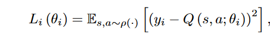  
其中  
  
而对于CNN表示的 Q，参数为 $\theta$，另(s, a, s')的情况下的 $y=r+\gamma max_{a'}Q(s', a'; \theta^-)=Q(s, a; \theta)$，最优化的目标是让这个 Q 具有 Bellman 等式的性质，应该最小化y和$Q(s, a; \theta)$的差距，即损失函数为：  
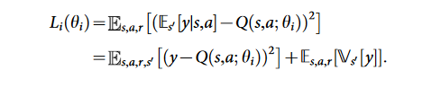  
  
这里 $\theta^-$ 和 $\theta$ 的差别为，前者专门用来计算Q(s', a')——即基于策略的预估；后者则用来计算当前状态-行为，即考虑当前真正反馈来的奖励。这是两个相同结构的网络，每步只更新 $\theta$，每 C 步将 $\theta$ 复制到 $\theta^-$。用上面的损失函数做梯度下降的时候，只对 $\theta$ 求导。  
在论文中, $\theta^-$ 参数的网络称作 *target* 网络，而 $\theta$ 的网络称作 *online* 网络。  
  
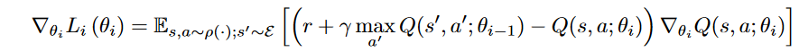  
  
当然实际上，Q也不直接以$s_t$为输入，而是以 $\phi(s_t)$ 为输入，$\phi$ 是一个和图像帧有关的预处理函数，具体看下面。  
  
此处省略具体这个 Q 是什么样。只是一个简单的CNN，连着一个全连接层和全连接输出层。  
  
### Experience Replay  
对于每个系统状态 st（此时的帧为$x_t$），在这个状态下采取某个行动 a，得到奖励 r，以及下一个帧 $x_{t+1}$。$s_{t+1}=\{s_t, a, x_{t+1}\}$。这样的“状态” s 并上当时的reward 被称为一次**经验**。每步都会将经验存储到D，而更新Q的时候不直接拿最新的执行结果做更新，而是从D中随机抽取出一个或一批来，用它们做更新。  
  
实际上，无法真的存下每个$s_t$与r，**第t步真正保存下来的经验是：$\{\phi(s_t),a_t,r_t,\phi(s_{t+1})\}$。**$\phi$ 是一个预处理函数，将帧降采样到一半分辨率，然后将游戏画面crop下来，最后将这样处理后的几帧压成一个四维数组。可见，符合马尔科夫决策的状态定义 $s_t$ 实际使用的时候同样只使用了靠近的几帧。  
  
这个做法有以下好处：  
1. 相邻步骤的执行之间的数据状态转移具有很强的相关性，如果直接用当前步骤去更新，就会导致重复这些强相关的更新，不划算。而从之前的经验中随机采样可以打破这样的相关性。  
2. 总是在连续的当前步骤上数据去更新的话，t步的行为会显著地影响t+1步时的数据分布，如果直接用会导致严重的不稳定。experience replay 通过随机化的方法弱化了这些分布的差异。  
  
### DQN伪代码  
最后给出DQN的伪代码：  
  
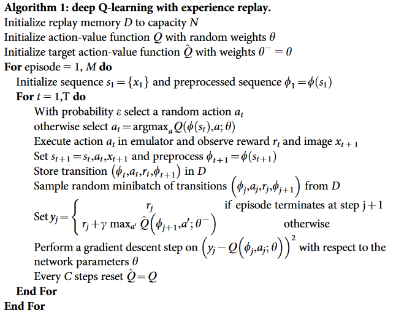  
  
## Double DQN  
同样来自 Google DeepMind，是2015年的一篇文章，几乎完全就是DQN，只做了一点点改动。这个改动来自于一个早已被认可的如下所述的结论。Q-Learning框架中，给一个Q函数，估计它的公式是：  
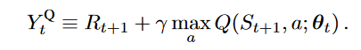  
这个式子很容易从意义上去理解。注意里面那个 $max_a$，这是在执行“选择步骤”，而外面那个 $Q(S_{t+1}m a; \theta_t)$ 是在执行 “评估”步骤，更清楚地说，把这个式子写成等价的形式：  
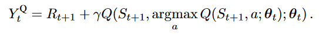  
这样将选择和评估区分，里面的Q是在选择 $S_{t+1}$ 状态下应该使用什么行为，而外面的 Q 是在这一选择下评估累积奖励。**同时用同一个估计函数Q来执行选择和评估，会导致学习到的 Q 做出过大的估计，即overestimated，高估一个行为所能带来的收益**。  
  
早先的结论是，这个高估有上限：$\gamma\epsilon \frac{m-1}{m+1}$，其中 $\epsilon$ 是：估计函数 Q(x, a) 与理论最优估计函数 Q\*(x, a) 的误差位于 $[-\epsilon, \epsilon]$ 的平均分布，m 是所有动作的种类数。  
  
本文证明了对于所有类型的估计函数、包括用状态-动作表来穷举表示的(tabular setting) Q函数都有这样的高估倾向，因为这个高估有 **下界**，是 $max_a Q(s, a)\ge V_*(s)+\sqrt{\frac{C}{m-1}}$，C是一个正数。这个下界是紧凑的（可以取到）。  
虽然随着动作数 m 增加这个下界不断减少，但达到它非常困难，一般的情况是，使用不加改进的 Qlearning 的方法，随着动作数量增加，偏差越来越大。  
证明在后面补。  
  
值得注意的是，高估未必是有害的。如果大家高的都一样，那就没有影响；如果只是应该最高的更高了，那反而有利。当然实际情况是，Q-Learning带来的高估往往会降低稳定性，一般有害。  
  
### Double Q-Learning  
  
而有一种办法缓解上面的 overestimation，也就是将选择行为用的Q和估计奖励用的Q分开来。使用连组参数 $\theta,\theta'$ 来分别用于选择行为和估计奖励，也就是把 Qlearning 的估计函数变为：  
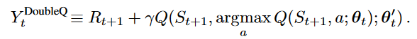  
这个式子里，里面那个做选择用的Q是以 $\theta$ 为参数，而外面的用于评估的是以 $\theta'$ 为参数。  
  
为了公平，他们俩在使用的时候定期互换身份。  
  
### Double DQN  
只用对DQN做非常小的改动就可以实现上面的 Double 思路。DQN天然有一个参数为 $\theta^-$ 的 target 网络，一个参数为 $\theta$ 的 online 网络。——它采用这两个网络，我觉得一开始也是想到了这个高估问题。只需要对 DQN 的估计函数稍作修改：  
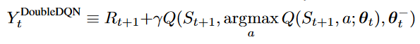  
而损失函数不变。（原本的DQN中，这个式子里的a也是用 $\theta^-$ 模型选择出来的）。  
  
此外，DQN有定期把 $\theta$ 复制给 $\theta^-$ 的操作，这里直接用来代替了原始 Double 方法的 互换 操作。  
  
最后 Double DQN 一般能取得更好更稳定的效果，但也有例外，因为overestimation也可能是有利的。  
  
### 高估下界的证明  
假设一个最优的Q函数 $Q_*(s,a)=V_*(s)$，假设一个期望值 $Q_*$ 相等的估计 $Q_t(x,a)$，有 $\sum_a(Q_t(s,a)-V_*(s))=0$，但每一项都不完全相等，$\frac{1}{m}\sum_a(Q_t(s,a)-V_*(s))^2=C$，其中 $C$ 是一个正数，$m$ 表示一共有这么多个 action。  
  
需要证明：$\max_aQ_t(s,a)\ge V_*(s)+\sqrt{\frac{C}{m-1}}$.  
  
令 $\delta_a=Q_t(s,a)-V_*(s)$，假设：$\max_a\delta_a<\sqrt{\frac{C}{m-1}}$。  
  
让 $\{\delta_a\}$ 中为非负的集合为 $\{\delta^+\}$，数量为 n；而其中负数的集合为 $\{\delta^-\}$，数量为 m-n。如果 n=m，又有 $\sum_a\delta_a=0$，一定有 $\delta_a=0$，全部等于0，这和 $\frac{1}{m}\sum_a(Q_t(s,a)-V_*(s))^2=C$ 矛盾，所以一定有 $n\le m-1$。  
  
继而有：$\sum\delta^+\le \sum\max\delta^+<n\sqrt{\frac{C}{m-1}}$。而正项和与负项和加起来为0，也就有 $\sum|\delta^-|=\sum\delta^+< n\sqrt{\frac{C}{m-1}}$，这个式子也表明 $\max|\delta^-|< n\sqrt{\frac{C}{m-1}}$。  
  
接下来使用平方和为正的约束做文章。平方和可以分成负项平方和加上正项平方和。  
  
$$  
\begin{aligned}  
\sum(\delta^-)^2 &\le \sum|\delta^-|\max|\delta^-|  \\  
 & < n\sqrt{\frac{C}{m-1}}\sum|\delta^-|  \\  
 & < n\sqrt{\frac{C}{m-1}}n\sqrt{\frac{C}{m-1}}  \\  
 & = \frac{n^2C}{m-1}  
\end{aligned}  
$$  
$$  
\begin{aligned}  
\sum(\delta^+)^2 & \le \sum(\max \delta^+)^2  \\  
&< \frac{nC}{m-1}  
\end{aligned}  
$$  
$$  
\begin{aligned}  
\sum\delta_a^2 &=  \sum(\delta^+)^2 + \sum(\delta^-)^2  \\  
&< \frac{nC}{m-1} + \frac{n^2C}{m-1}  \\  
&= \frac{n(n+1)C}{m-1} \\  
&\le mC  
  
\end{aligned}  
$$  
而与约束 $\sum\delta_a^2=mC$矛盾！  
所以  
$$\max_a\delta_a \ge \sqrt{\frac{C}{m-1}}$$  
  
## 带优先级的 replay  
前面在 Replay Memory 中采样来进行训练（experience replay）是随机采样的。一个很简单的想法是，如果不随机采样可能能加速学习。比如，replay memory 中有一些时间步是“无用”的，不是关键的，那么将它的优先级设置到更低就很自然了。  
  
于是就有了带优先级的 experience replay，这个简单的想法很大程度上提高的学习速度，文章 *PRIORITIZED EXPERIENCE REPLAY*  
  
### TD-error based  
TD及时间差分，TD-Error 就是DQN中的损失函数，不过没有平方：  
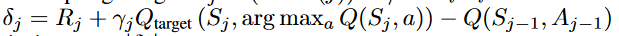  
注意这个差就是 DQN 损失函数梯度中的一部分。  
  
从更新式来看，TD-error越大，这个experience带来的更新就更大，也可以认为向最优的走了一大步。所以可以每次都选用TD-error最大的experience 来训练。  
  
### 问题  
总是在很小一部分的experience上训练，过拟合，不稳定。  
  
### Stochastic: Randomization  
避免上面的为题，还是加入随机部分。将experience 按照 TD-error 降序排序，每个都有自己的 rank，然后每个experience被选择的概率是：  
$$  
P(i)=\frac{p_i^\alpha}{\sum_kp_k^\alpha}  
$$  
其中 $\alpha$ 是动态调整的超参数，而 $p_i=\frac{1}{rank(i)}$。文章还提出了其它的 $p_i$，但这种比较鲁棒。  
这样即使是最小 TD-error 的也有机会被选中。由于 P(i) 是只余位次有关而与  experience 本身无关，所以可以提前计算。  
  
### Anneal unbias  
依然会不可避免地更多尝试 TD-error 大的experience，而随着更新，采样的分布是不一样的（对于每个experience而言），这会带来bias。文章通过 在以此优先级方法采样experience来进行更新的时候 施加衰减来解决这个问题。它称为*重要性采样* ，但因为最后直接在 参数更新的步骤加了衰减，所以是所谓“权重重要性采样”，而不是通常意义的重要性采样。  
$$  
w_i=(\frac{1}{N}\cdot\frac{1}{P(i)})^\beta  
$$  
N 是 memory 中 experience 的总数，$\beta$ 是动态调节的超参数。最后，在更新的时候，将更新量乘以 $\beta$ 来施加一个衰减。  
  
如果 $\beta=1$，上面这个权重使得，每次更新的值的期望大致就是 完全随机采样时 的期望（重要性采样）。  
  
### 关于超参数 $\alpha,\beta$  
在训练过程中，将这两个参数从初始值 $\alpha_0,\beta_0$ 逐渐变化到1。也算是一个逐渐逼近的过程；训练到后来见地越多，越不轻易地相信TD-error最大的那个。开始的时候，是为了加快速度。  
  
### 伪代码  
注意，第 11 行计算 TD-error，第 8 行的 for 1...k 是batch，第13行计算梯度并衰减。  
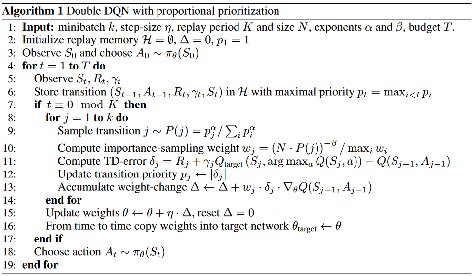  
  
### 实现  
几乎完全就是DQN或者DDQN的实现，只是多了个权重的计算和采样。权重的计算按照上面的公式来即可，权重的采样需要一点讨论：如何高效地按权重进行采样？  
  
思路非常简单原始：令所有项的权重和为S，均匀随机生成一个 0\~S-1 的数，然后看这个数落在哪个项的区间。直接应用会是O(n)的时间界。可以使用一个线段树的数据结构加速到 O(log n)。  
  
让replay buffer中的所有项为线段树的叶子，每个叶子有自己的权重，自底向上，每个中间结点的值为其两个儿子结点的权重和。可见根节点是所有叶子结点的权重和。  
均匀采样一个 0\~S-1 的数，从根节点开始判断，如果这个数小于等于左二子的值，就直接进入左子树递归地继续判断；否则，减去左儿子的值，进入右子树递归判断，最后到叶子结点，就是采样到的项。  
  
## Dueling DQN  
同样是DDQN，只是在作为评估函数的神经网络上做了点修改，多加了一个分支：  
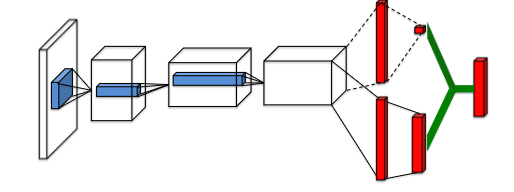  
  
第一个分支计算 V(s)，即值函数，是一个标量；第二个分支计算 Advantage函数  
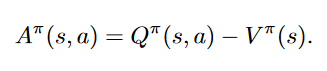  
  
似乎是在试图得到“只和 a 有关的”奖励值...  
  
这个网络仍旧作为对Q函数的估计，最后一层将两个分支融合：  
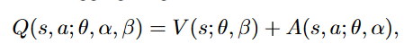  
其中 $\alpha,\beta$ 分别是两个分支的参数。这是对V广播后向量加。  
  
直接加得到的结果很不稳定，因为网络无法区分两个部分，并且也不是对Q函数的正确近似，因为各个分支 V， A不是V、A本身，而是（可能很不准的）估计。  
  
为了让这个网络成为合理的Q函数，开始了修修补补：  
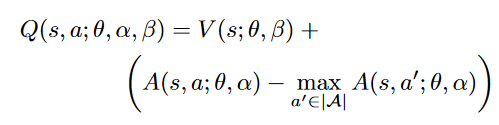  
首先使用了max操作，这样Q中最大的一定是那个V分支的值。这个网络就更像一个Q了；具体有什么道理，我也说不清。  
  
后来发现，用平均而不是最大更稳定平滑：  
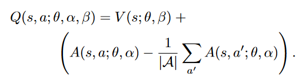  
