:::caution
强化学习理论比较复杂，我是边看边瞎琢磨边记，有时候看到后面（或者过几天）发现前面想的不太对，就有了一些补丁性质的句子(或者干脆没改)，谨慎阅读...
:::
  
## 策略梯度：PG  
前面的DQN是 TD with NN，也就是每步都更新。而PG就是蒙特卡洛with NN，一次采样完一个完整的轨迹($\tau$)，也就是(s,a,r)三元组的序列，然后直接在这整个轨迹上计算从每步开始的$\gamma$折扣累积误差，然后用这个结果做训练。  
PG不再需要Q函数近似，因为蒙特卡洛方法的累计奖励可以直接算出来。  
  
用一个函数（比如神经网络）来作为policy（参数为$\theta$），它做的是输入一个state，输出这个Policy下每个action的可能性，然后根据这个概率进行采样。可见这是一个混合策略，而动作空间是离散的。  
如果使用另一种形式，输入当前状态s和动作a，输出可能性，就可以用于任何动作空间。  
  
策略的目标就是最大化累积奖励：  
$$  
\max_\theta J(\theta) = E_{\tau\sim\pi_\theta} R(\tau) = \sum_{\tau}P(\tau;\theta)R(\tau)  
$$  
其中这个路径的可能性为：  
$$  
P(\tau;\theta) = \prod_{t=0}^T(P(s_{t+1}|s_t,a_t)\pi_{\theta}(a_t|s_t))  
$$  
其中，前面是环境的转移概率，后面是参数为$\theta$的policy在状态为$s_t$的时候预测出的动作 $a_t$ 的概率。前面那个转移概率是不知道的，但是它和$\theta$无关，所以对$\theta$求导的时候不会涉及到它，之后可以直接省略。  
  
对目标函数 J 做点手脚，引入log将累乘变成累加：  
$$  
\begin{aligned}  
\nabla_\theta J(\theta) &= \sum_\tau \nabla_\theta P(\tau;\theta)R(\tau) \\  
&= \sum_\tau P(\tau; \theta)\frac{\nabla_\theta P(\tau; \theta)}{P(\tau; \theta)} R(\tau) \\  
&= \sum_\tau P(\tau; \theta) \nabla_\theta \ln{P(\tau; \theta)} \times R(\tau) \\  
&= E_{\tau\sim\pi_\theta}[\nabla_\theta \ln{P(\tau; \theta)}\times R(\tau)]  
\end{aligned}  
$$  
  
将上式中的 $P(\tau; \theta)$ 拆开，可以得到：  
$$  
\begin{aligned}  
\nabla_\theta \ln P(\tau; \theta) &= \nabla_\theta(\ln  \prod_{t=0}^T(P(s_{t+1}|s_t,a_t)\pi_{\theta}(a_t|s_t)))  \\  
&= \nabla_\theta(\sum_{t=0}^T\ln{P(s_{t+1}|s_t,a_t)}+\sum_{t=0}^T\ln{\pi_{\theta}(a_t|s_t)}) \\  
&= \sum_{t=0}^T\nabla_\theta\ln{\pi_{\theta}(a_t|s_t)}  
\end{aligned}  
$$  
  
最后梯度式变为：  
$$  
\begin{aligned}  
\nabla_\theta J(\theta) &= E_{\tau\sim\pi_\theta}[\nabla_\theta \ln{P(\tau; \theta)}\times R(\tau)] \\  
&=E_{\tau\sim\pi_\theta}[R(\tau)\sum_{t=0}^T\nabla_\theta\ln{\pi_{\theta}(a_t|s_t)}]  
\end{aligned}  
$$  
  
注意这个求期望的E，期望代表着可以用轨迹的平均值去估计：  
$$  
\begin{aligned}  
\nabla_\theta J(\theta) &=E_{\tau\sim\pi_\theta}[R(\tau)\sum_{t=0}^T\nabla_\theta\ln{\pi_{\theta}(a_t|s_t)}]  \\  
&= \frac{1}{m}\sum_{i=1}^m(R(\tau^{(i)})\sum_{t=0}^T\nabla_\theta\ln{\pi_{\theta}(a_t|s_t)}) \\  
&\approx \frac{1}{n}\sum_{i=1}^n(R(\tau^{(i)})\nabla_\theta\pi_\theta(a_{t^{(i)}}|s_{t^{(i)}}))  
\end{aligned}  
$$  
  
**最后那步怎么来的，我不是很理解。怎么用，看下面的“实践中”。**  
  
在自动求梯度的软件中，只用算上式的一个不定积分就可以了——也就是，“损失函数”（仅是为了便于理解）$L_J$是这样的：  
$$  
L_J(\theta) = -\frac{1}{n}\sum_{i=1}^n\big[R(\tau^{(i)})\ln{\pi_\theta(a_{t^{(i)}}|s_{t^{(i)}})} \big]  
$$  
注意我们要的是“梯度上升”，而一般是梯度下降，所以取反。  
  
### 实践中  
在实践中，似乎是直接把一次采样得到的长度为 T 的轨迹拆分成 T 条长度为 T, T-1, T-2, ... 1 的轨迹，然后直接套入上面最后一个公式，将每步开始的累计误差乘以这一步采用这个动作的概率(的ln值)，然后把所有时间步的这个值加起来得到最后的loss（取反）（不用除以n），然后就直接求导了。  
  
也就是，对于轨迹$<s_0,a_0,r_0;\dots;s_T,a_T,r_T>$，从轨迹中时间步 i 开始的$\gamma$折扣累计奖励为 $R_i$，在这个时间步下(状态$s_i$)使用动作$a_i$的概率是 $p_i=\pi(s_i;\theta)$，使用的损失函数为：  
$$  
L_J(\theta) = -\sum_{t=0}^T \ln{p_i} R_i  
$$  
这背后在化简上的考量，我没想懂；但这个式子是非常好实现的。  
  
此外，在累计奖励上，存在一个**标准化**的技巧。需要计算轨迹中从每一步开始的累计奖励，可以从后往前增量式计算，很简单；而算完所有的累计奖励后得到一个数组，对它进行标准化（减去平均值、除以标准差）有助于提高训练速度与效果。——这是因为Policy采样的轨迹之间可能差距较大，如果不对累积误差进行标准化，很可能会引入大方差（当然，即使标准化了，也未必能消除这一点，因为轨迹之间的较大差异毕竟是客观存在的）。——**所有的策略梯度方法，或者是非TD一步一更新的(比如，攒几个batch再更新)，都经常用reward数组的标准化技巧**。  
  
此外，需要有一个结束迭代的时间，一个做法是用一个running_reward,，每次采样得到一个长度为T的轨迹之后就更新为 running_reward = (1-$\alpha$) running_reward + $\alpha$ T，其中$\alpha$ 一般比较小，比如0.01,然后给个阈值, running_reward大于这个阈值之后就结束。——这其实不是很重要。  
  
### REINFORCE  
这是最简单的策略梯度算法，几乎完全就是上面这个公式的实现，伪代码为：  
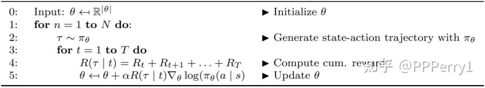  
  
## Actor-Critic框架  
基于TD的DQNs可能因为采样不够而使Q函数与真实的有较大偏差；PG可能因为采样得到的轨迹之间相差过大导致高方差。Actor-Critic将两者结合：一个Actor表示Policy，根据环境做决策，一个Critic做评估。这样，在更新策略的时候，就不直接用轨迹真正的累积奖励，而是用Critic预测的奖励；而Critic的预测结果与真实的累计奖励做比较得到Critic的误差（这个是真正的误差，因为Critic确实是要去拟合值函数V）。  
  
AC框架既可以TD也可以策略蒙特卡洛。如PG的最后所示，策略最大化目标函数J已经被简化成了直接拿当前状态下选择此动作的概率的ln乘以相应的累计奖励(虽然不知道为什么最终简化成这样了)——而Critic可以预测这个累计奖励了、而不需要等到采样出完整的轨迹。J函数的(Policy，or Actor)一端的优化问题解决了。但Q函数那边（评估网络，Critic）的更新需要引入DQN的思想，让Q估计函数具有Q函数该有的性质：满足Bellman方程。下面的Q AC就是一个例子。  
可见第一次更新theta的时候，就是用的上面的J函数，不过把真实的R值换成了Q函数估计的值；更新Q的时候，让Q尽量满足Bellman方程。没有target net，也没有replay。  
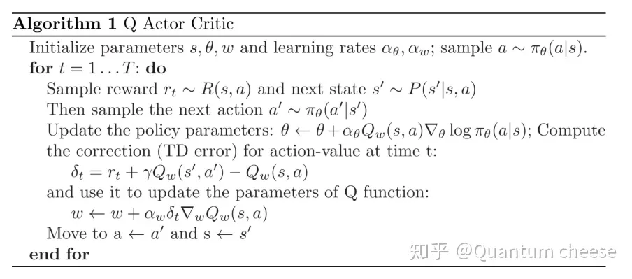  
一般情况下，说AC就是指类似上面这种的QAC，使用TD而非蒙特卡洛。  
  
AC用蒙特卡洛方法去做更加自然，直接采样得到一个完整的轨迹（这个轨迹中包含每步预测出来的Value，即从该步开始的累计奖励），然后用这个轨迹，把上面的J函数中的真实累计奖励R换成预测的累计奖励Value，来更新Actor（Policy）；同时可以从轨迹中算出真正的累计奖励，用预测的奖励Value和真正的累计奖励之间的误差来更新Critic（Q or V）。这里Critic可以用Q也可以用V。Actor和Critic可以用一个双头输出的网络也可以直接用两个网络；如果用双头输出的单个网络需要将两个loss加起来来更新。用双头网络可能从直观理解上更说的过去一点，因为Critic是专门用于评估当前的Actor的，两者间的参数应该有点联系——当然这句是口胡的。  我看到的一个AC的简单实现里，就是用了一个双头的神经网络，一个共用的隐藏层，一个输出层输出各个动作的概率，一个输出层输出当前状态的预测值V。  
  
这个AC框架是不是有点对抗学习的意思，当然并不是对抗学习就是了。常用的AC框架中ActorCritic是同时更新的，是否可以交替更新？  
  
## A2C: Advantage Actor Critic  
AC仍旧有方差较大的问题。这个问题最后似乎还是会回到限制更新量，这在PPO算法那一路有非常详细并且非常数学的讨论。A2C简单地用Advantage函数A代替上面AC框架中Actor(即Policy)的目标函数 J 中的（Critic预测的）累计奖励R。具体为：$A(s,a)=Q(s,a)-V(s)$。在我看到的一个实现中，用Critic拟合值函数V，而Q(s, a) 直接用真实的累计奖励R。而在更新Critic的时候，用了真实的累计误差和所预测的V的均方误差MSE，也就是 $A^2.mean()$  
  
A2C更多的讨论放在了它的并行框架上。它有多个子进程跑了多个独立的env，这样每一个step相当于都获得了一个batch。而且由于env的状态转移不是确定性的，所以多个env可能模拟出不同的转移，获得不同分布数据——这一点联系DQN的replay机制来考虑，replay机制就是为了防止直接更新时在局部时间见太多相近的数据，多个并行的env达到了类似的效果，然后就可以同时每次step直接用当前step训练了——当然，实现的时候还是积累了几个(比如5个)step之后才更新的。  
  
### 实现细节  
一个并行env结构。召唤出m个子进程，每个子进程建立自己的env并且reset，然后接收step等字符串指令。每次收到一个step指令和相应的action后，就step一步，把所有结果(next_step, reward, done, info)通过Pipe返回给这些进程的管理者对象。  
管理者将这些结果stack在一起(这样，返回的reward中，reward\[0,...]就是env0的reward),然后将结果返回。  
  
每次执行若干个step，每个step，除了记录envs返回的next_state和reward，还记录当前state以及动作a以及相应概率的ln值；同时，还计算这次的多个action的分布的熵的平均的累计，也就是 `entropy += action_distribution.entropy().means()` ，根据熵的计算公式 $entropy=\sum p(x)\ln{p(x)}$，这个loss会约束分布密度中的值要么0要么1。收集到所有数据之后，计算真实的累计误差R（注意根据done，如果已经结束了就乘以个0，这通过`reward+gamma*R*(1-done)`实现），将R和记录下来的每步每个env的value作差，得到A。  
  
相A和每步可能性的ln相乘并求平均，LossActor；将A求平方再求平均，LossCritic。  
  
最后的loss是 LossActor, LossCritic, entropy 的加权求和，这个权要根据任务慢慢调，entropy的权一般比较小。  
  
原本来说，似乎是在envs得到多个result的时候就直接求平均，显得好像只有一个results，然实现的时候是保留了所有的原始result，一直到最后算完了loss直接对各个loss求平均，这样比较符合一般的batch操作处理。而最后多个了entropy loss，也应该注意。——OpenAI的Baseline源码中给的注释是：`Entropy is used to improve exploration by limiting the premature convergence to suboptimal policy.`  
  
此外，这个实现里还包含了一个test_env，训练了一定步数就跑一次测试env，这就不是重点了。  
  
OpenAI的baseline里优化器用的是RMSProp。  
  
### A3C  
A3C是更早的版本，是异步的版本。也就是，每个env都有一个local网络，独立地不停地跑，跑完一轮(done)之后通过策略梯度A2C计算梯度，上传到global network，然后将新network更新为这个env的新网络，之后这个env重新跑。这样每个env里的网路都不太一样，而每次用不太一样的网路的梯度更新到了同一个global网络上，说起来就有点问题。  
  
  
## 连续动作空间下的DQN：DDPG  
*CONTINUOUS CONTROL WITH DEEP REINFORCEMENT LEARNING*  
  
DQN无法应对动作空间是连续的情况，因为它的状态-动作估计函数Q（那个神经网络）以状态为输入、所有动作对应的累计奖励估计为输出。人们逐渐发现有必要专门用一个估计函数，比如一个神经网络，来表示一个策略。DDPG (Deep “deterministic policy gradient (DPG)") 使用了**确定性的策略**表示：一个 $\mu(s;\theta^\mu)$，输入当前状态，直接输出当前应该采取什么动作（一个连续向量）。  
  
优化目标当然仍旧是最大化策略的状态-动作函数，仍旧是DDQN的框架，一个神经网络来估计 $Q(s,a;\theta^Q)$，replay，探索和训练用的网络分开（目标网络 $\theta'$，即double方法）都保留。  
  
优化目标是**Critic预测出来的累计奖励**的期望最大，J函数直接就是给定s, a时Q函数在$\theta^\mu$下的值的期望， $J=E_{r_i,s_i-Env,a_i-\pi}[R_1]=E[Q(s, a; \theta^\mu)]$，里面的R仍旧是$\gamma$折扣累积误差，**用Q函数去估计而不是真正的R值**.  
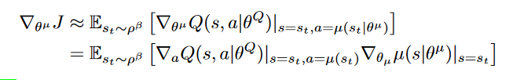  
当然上面是梯度式，但第一行去掉那个梯度算子就是J函数了。$\rho^\beta$ 是一个所谓的 *state visitation distribution*，不知道具体啥意思——大概是采用策略 $\beta$ 的话，环境的状态是一个什么样的分布，因为状态转移是和策略有关的——但实用中一般也是忽略它的。  
我们要优化策略表示中的参数 $\theta^\mu$ 来最大化 J，就要对 $\theta^\mu$ 求梯度，Q函数里面没有 $\theta^\mu$，但有 a ，而 动作 $a=\mu(s;\theta^\mu)$，所以可使用链式求导法则，就是上式的第二行。  
我们在自动求导框架下实现这个式子，是不需要关注什么链式求导，我们只需要让这个梯度所代表的Loss是这样算的就行了：`L=-Q(s; Actor(s;\theta^\mu))` 就可以自动算出导数来了，注意取了反来用梯度下降“解”最大化问题。  
期望代表着这个式子可以用采样取平均来近似，实现中就是一个minibatch的J的平均。  
  
在更新 $\theta^\mu$ 的同时，还应该更新Q函数的 $\theta^Q$，这部分完全和DDQN一样，  
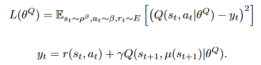  
不过里面的“下一步动作”是用 $\mu$ 函数得来的，而不是最大Q。这个公式仍旧是DQN的思路：让有Q(Critic)有Bellman公式的性质。注意，具体地，因为Actor和Critic都有两个，这个公式里的 y 全部都用 target 网络计算（包括计算下一步动作的$\mu$，用下一步状态和下一步动作预测下一步收益的Q函数）；而与这个 y 做比较的是 current_value，使用当前状和当时使用的动作用Critic(非target)来预测累计奖励（注意，不是真正的R值）。  
  
DDPG的训练仍旧使用 replay。上面的所有学习都在replay buffer 中采样。这和前面的AC框架、A2C不同。A2C使用多环境并行框架来实现打乱观测到的环境分布了。  
  
总的来说，DDPG和DDQN大致一样，不过DDQN中，动作a通过寻找最大化Q的a来实现；而DDPG直接有一个专门的 $\mu$ 来求a。把DDQN中所有寻找动作 a（$\argmax_aQ(s,a)$）的换成 $\mu(s)$（并且考虑相应的double方法修正），并添加更新 $\theta^\mu$ 的那个损失函数，就基本能得到 DDPG。  
  
### 其它修改和 tricks  
其它还有点修改，包括：  
1. 两个目标网络：$\theta^{Q'},\theta^{\mu'}$，在使用double的时候，不是定期完全复制参数，而是每步这样更新： $\theta'=\tau\theta+(1-\tau\theta')$，这个 $\tau$ 取得非常小（0.0001），因而更新地非常慢，不过作者认为由此带来的稳定性outweighted。  
2. 探索时，替代 $\epsilon-$贪心，使用了一个随机过程（Ornstein-Uhlenbeck process）N，选择动作时用 $a_t=\mu'(s_t)=\mu(s_t;\theta^\mu)+N$。  
3. 其它，如网络具体是怎样的，用batch normalization统一尺度，Critic网络用tanh层作为输出层，等等，往往不同任务所需不同，故略过了。  
4. DDPG训练同样可以引入多个并行的env。大部分方法都可以。  
5. 实践里，那个选择action用的随机过程，可以直接用Normal正态分布。OpenAI的baselines里，除了原本的UO、正态分布，还给了一个不知道是什么的 AdaptiveParamNoiseSpec。  
6. DDPG的Actor预测的连续action值都是 -1\~1 范围的（因为Actor输出层的tanh函数的输出就是 (-1,1) 范围的），在env step的时候要乘以action的最大值scaling回去。  
7. DDPG不是像DQN那样每步都从buffer中采样更新的，而是一口气跑好多轮，然后一口气update好多轮。  前面一口气跑好多轮，可以是指定的轮数，也可以一直到跑完整个轨迹。  
  
### DDPG算法伪代码  
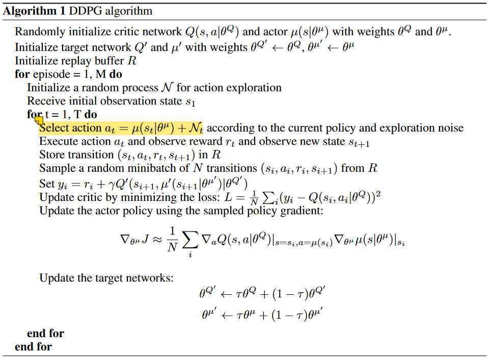  
仍旧是Q-Learning框架，只是有了两个网络要更新。  
  
  
## 策略梯度：PPO  
相比DQNs，PPO所代表的的路子在数学上复杂许多，可以看看这篇文章：[Proximal Policy Optimization (PPO) 算法理解：从策略梯度开始](https://zhuanlan.zhihu.com/p/614115887).  
  
这条路子基于策略梯度 policy gradient - Actor-Critic框架，虽然不是确定性策略而是混合策略，但目标都是最大化期望累积奖励（上面的J）。  
  
### PPO实现  
OpenAI baseline 的PPO2实现是tensorflow的，我这里看的是别人的[pytorch版本](https://github.com/ikostrikov/pytorch-a2c-ppo-acktr-gail)，注意其中的tricks，比如reward,advantage标准化、对正态分布标准差sigma非负约束的处理(exp(.))等。  
  
#### Actor-Critic  
Actor, Critic 的框架。一个单独的Actor，一个单独的Critic。Actor是混合策略，当然离散动作空间和练习动作空间要不太一样的网络。注意激活函数都用了tanh（这和不同的任务也有关系...逐任务调整..）。  
  
此外，之后在梯度更新的时候也用到了 clip_grad_norm_（**不一定用，因为PPO已经有clip来限制更新了，当然也不一定不用..**），进行梯度衰减，来限制梯度的最大最小范围。具体做法是，指定一个梯度的范数（比如L1范数L2范数等，一般默认是2），指定最大范数 max_norm，计算梯度的总范数total_norm，如果maxnorm / total_norm < 1 说明未越界什么也不用做，反之越界，需要scaling：将梯度 / total_nom \* maxnorm。clip_grad_norm限制了梯度更新的范围，一定程度上预防梯度爆炸或过大的抖动。  
  
#### 执行  
PPO同样既可以每步一更新、也可以玩完完整的一轮再更新(until done)。PPO是这样的策略：准备一个buffer，连续探索多轮，每次都把transition（state, action, rewad, next_state, log_action, value_from_critic）推入buffer中，一旦buffer满了，就执行若干步更新，每次更新都在buffer中采样一个minibatch，更新完之后直接**删除弃用这个buffer**，重新累计buffer。——这其实是在积累一个batch。然后在这个batch上训练多次minibatch，训练完规定的轮数之后当然弃用这个batch.  
  
执行的时候，不计算任何梯度，所以都是 with net.no_grad()。对于每一个state，网络输出 action 的分布，从中采样一个得到当次执行的action，然后取其概率的 ln 值为 log_action_prob。将state与action输入到 Critic 中，得到value，然后将action输入到 env 中向前执行一步，得到 reward, next_state, done。  
  
将上面取得的一步信息：Transition（state, action, rewad, next_state, log_action, value_from_critic）压入buffer中，等待后面的更新。此外，还要用action的分布计算一个 entropy，并且加到一个累积变量上，最后要用作 entropy loss。  
  
#### 更新  
每当buffer满了的时候，执行若干步更新：PPO.ppo_epoch步。  
  
##### Advantage  
PPO的J函数是基于优势函数A的。PPO 论文没有规定自己用的什么Advantage实现，不过baseline里用的可以仔细说说。  
  
一般说的势函数是 $A=Q-V$。PPO等很多用到势函数的实现里，都在每步探索的时候保存了一个额外的 `return` 值——每步都有一个return，最后使用的势函数为 `A = return-V`。可见 `return = A+V`，return一般会使用GAE，使用GAE的return会在下一节讨论（现在GAE已经是标配了）。这里暂时先使用普通的 return。  
  
在每步执行的时候，会保存：state, action, log_action, reward, next_state, **value**。注意，把当前状态输入Critic里的Value结果也保存下来。  
然后得到一个轨迹（完整地到done或者只是一个batch），计算 **return**。return的算法是：  
```  
returns[-1] = next_value_in_last_transition  
for step in reversed(range(len(buffer))):  
	returns[step]=Reward[step] + gamma * returns[step+1] * mask[step+1] \  
					+ value[step]  
```  
注意最后那个 +value，之后要在算 advantage的时候还会把它减掉..不知道为什么要加上它，是最后为了计算梯度必须要在更新步骤的时候有这个减法吗？  
里面的 value 是Critic预测出来的。Reward则是真实的。mask = 1-done。如果某一步的时候done了，它mask\[step]就为0.  
  
之后在更新步骤，计算的 Advantage 为:  
```  
Advantage = returns - buffer.value  
Advantage = (Advantage - Advantage.means())/Advantages.std()  
```  
直接把计算出来的returns值减去积累下来的每步预测的 value 值就行了。注意，不要忘记**对Advantage标准化的技巧**！  
  
##### ratio, and action_loss(PG_loss)  
每次从buffer中取出minibatch条 Transition。取出 记录中的log_action 作为 old_log_action（表示模型更新前Actor算出的 log_action_prob）。然后*将state输入到已经进行了一定的更新的 Actor 中取得新的 new_action_distribution，采样得到新的action，并得到相应的 new_log_action_prob。* 注意要重新选择动作，来使得actor能够被更新。  
  
PPO2 是 clipped 版本，所以Actor的Loss是 `PG_loss = exp(new_log_action_porb - old_log_action_prob) * advantage`，然后取个截断：`PG_loss2 = clamp((1-epsilon)*advtange, (1+epsilon)*advantage, PG_loss2)`，最后取两者中的下界 `PG_loss = min(PG_loss, PG_loss2)`。注意要对PG_loss取反。  
  
##### Value_loss (Critic_loss)  
另一边，Critic的Loss：value_loss 的计算为：将state和上面那里算出来的新动作输入 Critic 得到一个 新的 Value —— 显然要更新Critic网络肯定要用它来算个Value纳入Loss中。然后 Value_loss为 `Value_loss = (returns - new_value)**2.means()`（MSE），(return 在前面加过一个value，直接用returns减去new_value好像有点怪...)。  
  
Value_loss 也可以加 Clip(同样出于限制更新量的动机)（上面也可以直接用，不过没有clip的限制），此时会是：  
```  
value_clipped = value + (new_value-value).clamp(-clip_para, clip_para)  
value_loss1 = (returns - new_value)**2  
value_loss2 = (returns - value_clipped)**2  
value_loss = min(value_loss1, value_loss2).means()  
```  
其中 value 是探索过程中积累下来的，new_value 是更新的时候新预测的。  
  
##### at last  
最后算上 entropy loss（它也要取反，否则趋向于滑向中间0.5），做带梯度衰减(clip_grad_norm_，也不一定会用它，因为已经有clip了...)的梯度传播。  
  
更新完一定轮数后，结束更新，然后删除整个buffer，继续探索。  
  
### More about PPO 实现  
#### Details about Advantage  
咕.  
  
#### GAE with PPO  
GAE generalized advantage estimator (GAE在下一节有简单介绍) 能够适用于所有适用了优势函数的方法，包括PPO，它是PPO等方法的baseline的标配了。关于GAE更多具体的东西，在后面GAE小节。  
  
PPO中引入GAE，用的就是下面的GAE的递推形式；引入GAE的环节就是算returns的时候，returns 变成了 GAE+value(探索时预测的)：  
```python  
gae = 0  
value.append(next_value_in_last_transition) # 多加一个，最后一个transition的next_state的value.  
for step in reversed(range(buffer.size)):  
	delta = Reward[step] + gamma * value[step+1] * mask[step+1] - value[step]  
	gae = delta + gamma * lambda_ * gae * mask[step+1]  
	returns[step] = gae + value[step]  
```  
之后就都一样了。GAE就是Advantage，return = GAE+value，之后更新的时候减去value，Advantage就是GAE了。  
  
#### Recurrent  
这是在网络上的技巧了。Actor可以加入递归神经网络来将时序上的一些信息纳入策略的考虑，一般使用 **GRU**，由于GRU额外会输出一个要输入到下一次推理的 ht hidden state，所以在记录 Transition 的时候要把这个 隐状态也同步记录下来，之后更新的时候需要用上（因为更新参数的时候一定需要Actor推理）。  
  
### GAE: Generalize Advantage Estimator  
参考文章：[GAE](https://zhuanlan.zhihu.com/p/45107835)（其实下面这节内容几乎完全来源于它）。  
  
梯度估计方差大的问题在所有RL方法中都存在。GAE是一种广泛适用的advantage估计方法，这种估计方法能够减小方差。  
  
首先，试图对大部分PolicyGradient的RL方法做个总结，它的目标函数（J函数）是这样的：  
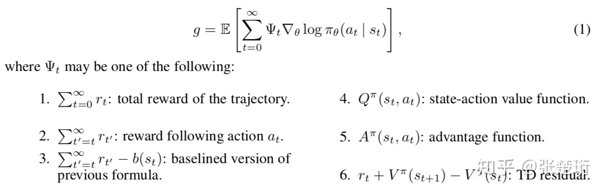  
（这里的g相当于前面讨论中的J）他们都是无偏估计（注意，这里是指当QVA都是准确的时，而非估计函数估计出来的），其中 4， 6 有最小的方差。  
  
上面的累计误差是直接把每步的reward加起来，我们熟悉的一般是 $\gamma$折扣累积误差，这里将 $gamma$ 以参数的意义引入：  
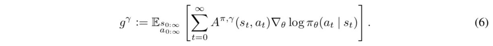  
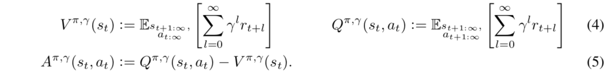  
注意，这里的 $g^{\gamma}$ 相对于前面的 g 就是*有偏* 的了。我们前面的reward带有折扣的RL方法里策略的目标函数都是这种。  
  
是否可以找到一种 $A^{\pi,\gamma}$，使得在无穷步下，$g^\gamma$ 和 $g$ 能取得一样的期望？——这被称为 $\gamma-just$  
  
论文证明如下击中都是 $\gamma$-just。  
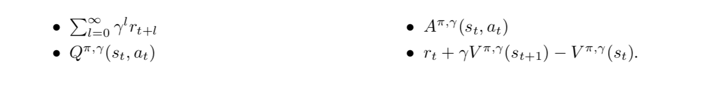  
(用这些函数去替换上满 $g^\gamma$ 中的 $A^{\pi,\gamma}$)  
  
更加generalize一点，取一般形式(GAE)为：  
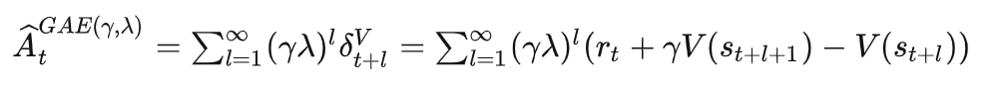  
（这里有个问题，$\Sigma$中下标l应该从0开始）  
  
它有如下性质：  
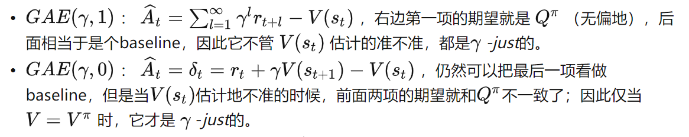  
  
可以看出，$GAE(\gamma,1)$ 就是上面说的优势函数，$GAE(\gamma,0)$ 就是TD差分。这也从理论上暗示了为什么后续使用优势函数 $A=Q-V$ 能获得更好的结果。  
  
这实际上是不断把势函数一般化的过程：$\gamma$ 控制着 $g^\gamma$ 和 真正无偏的 g（应该不能取得？）的偏差，$\lambda$ 控制着一般化形式 $GAE(\gamma, \lambda)$ 的偏差。我们希望学习用的梯度的方差尽量小，就需要较小的 $\gamma,\lambda$，但这一定会引入额外的偏差。有了两个参数，可能可以有些弥补或 trade off？  
  
GAE 和另一种技术 reward shaping 有关系，但我没看。GAE像是从另一个“起始点”审视了 policy 最优化目标函数的问题。我从一开始看西瓜书就是 折扣累积奖励，没想过这方面的。——实际上，最“正宗”的累计奖励就是每步的reward加起来才自然，引入折扣来强调相近的时间必有损失（虽然实践上需要这么做），GAE就进行了这一点的讨论，这是学习中的实际情况（梯度方差）和函数估计的理论偏差之间的 trade off。  
  
实践里，GAE当然也有自己的递推形式：  
$$  
GAE_t^{\gamma,\lambda}=\delta_t+\gamma\lambda GAE_{t+1}^{\gamma,\lambda}  
$$  
其中  
$$  
\delta_t = r_t+\gamma V(s_{t+1})-V(s_t)  
$$  
