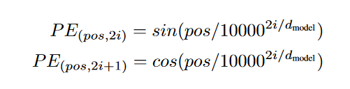

# Transform  
## 整体结构  
论文（Attention is all you need）里的Transformer结构是这样的：  
  
  
分为encoder和decoder。这俩是栈式结构，每个有六层，实际上是这样的：  
  
图中的每个 encoder 都是 多头注意力+前馈网络（其实是两层全连接层，中间用ReLU激活函数）。而每个 decoder 都是 Masked多头注意力（为了用于序列预测时当前输出只能受之前序列的影响，需要屏蔽后面的，后面会单独记录）、多头注意力和前馈神经网络。  
  
编码器的输出圈闭输入到解码器各层多头注意力的 Query 端。每个“组件”（即多头注意力或前馈网络）前后都形成残差层，直接相加并且标准化。  
  
为了能够在网络中流动，所有层输入输出维度数一样，论文中是512.  
  
此外，为了保留输入序列相对或绝对的顺序，在输入编解码两端之前，都进行位置编码，然后将原序列和其位置编码 直接求和（控制维度一样）。  
  
编码器的最终输出输入到解码器各层Multi-Head Attention 中的Q, K中。  
  
## 多头注意力(multi-head attention)与self-attention  
注意力机制主要有三种输入：Query, Key, Value。暂不关注具体从源头来说，这是怎么来的，有没有什么特殊的意义。  
  
### Scaled Dot-Product Attention  
文中介绍了一种此前常用的简单的注意力机制作为前置。Query和Key都是维度为 $d_k$ 的数组，而 Value 是维度为 $d_v$ 的数组。点乘注意力机制的计算非常简单，先将 Query 和 Key 点乘，然后将结果除以 $\sqrt{d_k}$（减小点乘后的方差，防止点乘导致数据越来越大），最后，将这个常数乘以 Value，得到输出。  
当然，上面的内容没有“注意力”，因为都不存在“序列”，更无从说学习序列中的相关性等。将多条数据组织成矩阵形式：$Q, K,V$（横向量组成矩阵），计算为 $Y=softmax(\frac{QK^T}{\sqrt{d_k}})V$，这样，每个Q都和输入序列中的所有K点乘，除以常数之后做Softmax归一化，每个Q最后都形成了一行权重，而这个Q最后得到的就是所有V以这行权重为权重的加权和。权重体现了对整个输入序列的重要性的选择。于是，注意力就体现出来了。  
上述是翻译了公式的计算过程。具体来说，输入一个长度为 n 的序列，序列中的每个元素都是自己的 q k v 向量。使用上述矩阵形式去计算后，Q的第一行（序列中第一个元素）与所有的 k 向量点乘形成了新矩阵的第一行。进行scale和softmax归一化之后，这第一行就形成了一个对所有序列元素的权重。最后的一个矩阵乘法得到结果，V矩阵中所有行（就是序列中所有元素的v）以第一行的权重加权求和，得到了第一个元素对应的输出向量。权重就体现了对序列中所有v的选择。  
  
对于除以 根号 dk，论文给出的解释是这样的：防止数据越来越大的趋势（或者是，越来越“散”？）。假设q, k 向量中的元素是独立的随机变量，均值为0方差为1，点乘后: $\sum_{i=1}^{d_k}q_ik_i$，得到的结果的随机变量就是均值为0方差为$d_k$。所以除以 $\sqrt{d_k}$ 矫正增大的方差。  
  
### Multi-Head Attention  
多头注意力改进了上面的算法。直接对序列中的向量组合成的矩阵Q,K,V讨论，对于Q，用x个全连接层将矩阵变换到x个平行的Q'；对于KV也做相同处理；全连接层算完后得到了平行的x对 Q', K', V'，也就是所谓的多头。对于每对 Q' K' V'，进行上面的 Scaled Dot-Product Attention计算，得到与 V 同纬度的x个 V''，然后将所有 V'' concat起来，通过一个全连接层，得到最后的输出（与V同纬度）。  
  
  
  
## 前馈神经网络  
transformer结构中，每个多头注意力的输出都立刻进入了一个“前馈神经网络”。它由两个全连接层组成，第一个全连接层升维（到2048），第二个全连接层降维回到512（和输入相同）。中间用ReLU激活函数和标准化处理。  
  
## 位置编码  
因为结构中不存在递归结构，所以为了保留序列中的相对或绝对的先后顺序，对序列按位置进行编码。和NeRF中见到的位置编码类似。  
  
序列中每个元素都有一个由它所处的位置计算得到的位置编码向量：  
  
  
其中 i 是向量中的第 i 维。控制这个向量长度和输入序列中的向量一致，然后**直接相加**，再输入到网络中。  
  
## 序列预测(Decoder端)-Mask  
仍未想明白的一个问题：解码器的输入是什么，是和输入相同吗？  
  
做序列预测的时候，需要保证当前位置的输出之和这个位置之前的输入有关，所以要把这个位置之后信息遮蔽掉。也就是说，第一个输出只能看第一个输入，第k个输出只能看第k个输入及之前的。这使用这个形状的一掌mask对 **QK^T^** 进行mask处理即可：  
  
  
注意，这个mask发生在多头注意力的 点乘注意力阶段，对 **QK^T^** 进行处理！这样，第一行输出中只有第一行的Value，第二行的输出只涉及第二行的Value，以此类推。  
  
# LSTM  
[LSTM](https://zhuanlan.zhihu.com/p/24018768)  
遗忘门，输入门，输出门先空着...  
  
# GRU  
简单易懂的一篇文章：[人人都能看懂的GRU](https://zhuanlan.zhihu.com/p/32481747)  
  
GRU (*Gated Recurent Unit* ) 形式上和RNN几乎一样，而内部思想和LSTM有许多相似之处。一般情况下GRU能取得和LSTM相近的结果，而计算开销更小，所以现在一般选用GRU。  
  
  
  
GRU的形式几乎和RNN一样，输入$x^t$以及上个阶段传进来的隐状态 $h^{t-1}$，输出一个输出 $y^t$ 和要输入到下一次计算的隐状态 $h^{t}$。  
  
GRU有两个门控：**重置门 r 以及更新门 z**，说是门，其实是两个值。计算如下:  
$$  
\begin{aligned}  
r &= Sigmoid(W_r(x^t, h^{t-1})) \\  
z &= Sigmoid(W_z(x^t, h^{t-1}))  
\end{aligned}  
$$  
其中小括号 ( ) 表示将两个输入进来的向量 concat 起来。将两个矩阵W视作一个大矩阵的两个分块，可以写在一起（下面的式子中忽略了转置等细节）：  
$$  
(r,z)=Sigmoid((W_r,W_z)(x^t, h^{t-1}))  
$$  
  
这两个门有不同的作用。r 更像 LSTM 中的一个“选择门”，对之前的记忆做“选择”：  
$$  
h' = h^{t-1}\odot r  
$$  
h' 将为真正的输出做贡献：  
$$  
y^t = \tanh(W_{out}(x^{t},h'))  
$$  
另一个 z 是更新门，用来决定当前这个GRU要传给下一步什么信息：  
$$  
h^t=(1-z)\odot h^t+zh'  
$$  
注意后面那个是 h'，经过了 r 的选择。  
  
  
