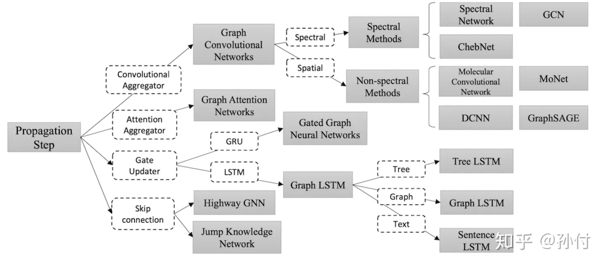
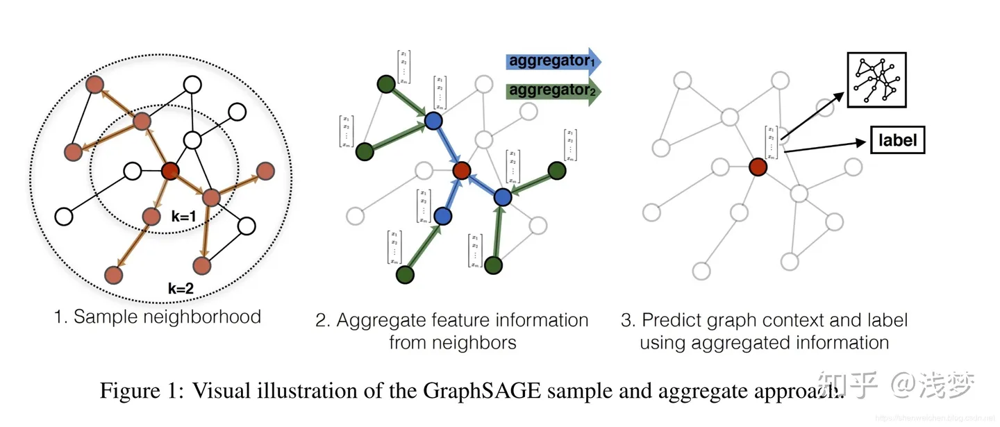
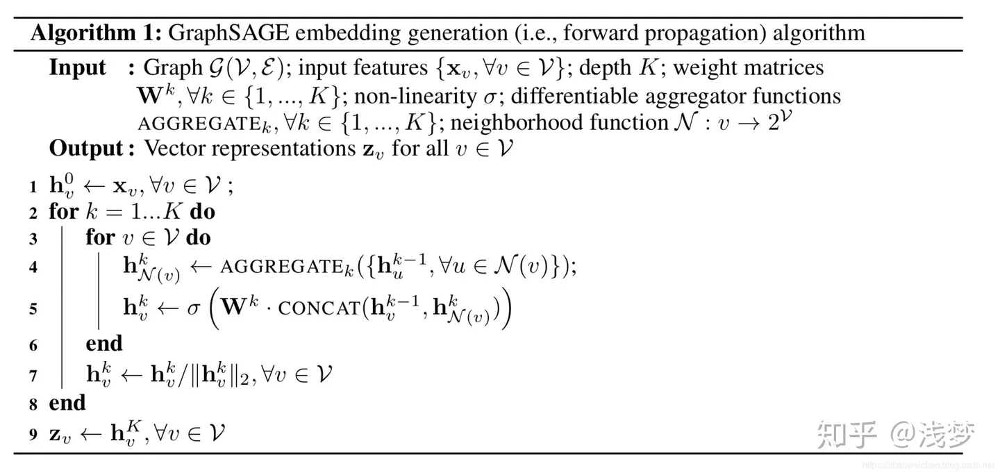
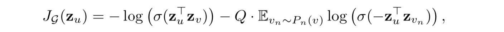

  
图神经网络GNN是处理图数据的网络，而不是网络本身的结构是个图。网上搜索GNN一般会直接蹦出来关于清华孙茂松组在2018年的一篇关于GNN的综述：[Graph Neural Networks: A Review of Methods and Applications](https://arxiv.org/pdf/1812.08434.pdf)。  
  
综述里对GNN的分类是这样的：  
  
  
关于这个综述，(为了省事...)我主要看的是这个 [综述简介](https://zhuanlan.zhihu.com/p/68015756)，里面涉及了一些GNN的公式的简单而不求甚解的讲解。  
  
## GNN的任务  
GNN的任务本质是编码。输入一个图，图有节点V、有边E，每个节点和边都有自己的特征x，GNN的任务就是对每个节点进行编码，然后用这个编码进行下游其它应用。  
在有监督学习中，GNN往往不只是编码，而是把下游任务也一起放进来了（比如一个分类器），从而能用数据集进行有监督的学习。  
  
GNN本质是一个编码：  
$$  
h_v=f(x_v,x_{co(v)},h_{N(v)}, x_{N(v)})  
$$  
四个输入分别是：节点自己的特征、节点连接的边的特征、节点的邻居的编码表示、节点的邻居的特征。  
  
## GCN  
GCN的形式是这样的：  
$$  
H^{t+1}=\sigma(\~AH^tW^t)  \\  
\~A=I_n+D^{-\frac{1}{2}}AD^{-\frac{1}{2}}  
$$  
这是一个多层的网络，所以有 t+1, t。然后 Wt 是每层的参数。然后矩阵 $\~A$ 其实是一个标准化后的拉普拉斯矩阵，A矩阵是邻接矩阵，D矩阵的图的度矩阵，度矩阵是一个对角矩阵，$D_{ii}$为节点 i 的度。$\sigma$是一个激活函数。  
这个公式好像没有卷积？需要注意的是，图上的离散卷积和我们平时用在图像上的不太一样，上面这个公式其实是**已经进行了卷积、然后不断对这个卷积式子化简后的结果**——这个式子直接是卷积的简化后的结果，换句话说，这个式子本身就是图上卷积。  
  
$\~A$ 矩阵是和整个图的结构有关的一个矩阵量。*我所理解的* GCN是：给定一个图有n个顶点的图，有了这个图就直接有$\~A$矩阵了，图上每个顶点有自己的初始特征，所有顶点特征向量拼在一起成为第一层的输入矩阵 $H^1$，然后进行一次卷积并经过激活函数得到第一层的输出第二层的输入 $H^2=\sigma(\~AH^1W^1)$（还可以纳入一个bias...），然后继续接下来几层，最后得到输出H，为每个顶点的编码向量。然后用这个编码做下游任务，用下游任务的结果的loss来更新整个网络...  
  
可见，GCN只能用在一个给定的固定的图上。  
  
GCN的核心的图上卷积操作是怎么来的，挺复杂的。  
  
W是否可以用其它网络，而不是一个矩阵相乘呢？  
  
### 拉普拉斯矩阵  
拉普拉斯矩阵 L 是图论上常用的表示图的一些特点的矩阵，定义为:  
$$  
L=D-A \\  
L_{ij}=\begin{cases}  
D_{ii}, \quad i=j \\  
1,\quad v_i, v_j 邻接 \\  
0, \quad otherwise  
\end{cases}  
$$  
其中D为度矩阵，A为邻接矩阵(不考虑自环，即对角线为0)。  
  
拉普拉斯矩阵有很多性质：  
+ L 是实对称矩阵，可以谱分解 $L=U\Lambda U^T$，其中U为正交矩阵，列向量两两正交，每个列向量都是单位向量，逆为自己的转置。$\Lambda$是由 L 的特征值组成的对角阵。  
+ L是半正定的。  
+ 特征值中0的个数就是连通分支的个数。  
+ 最小特征值为0.  
+ 最小非零特征值是图的代数连通度。  
  
拉普拉斯矩阵存在两种标准化形式：  
$$  
\begin{aligned}  
L^{sn}&=D^{-\frac{1}{2}}LD^{-\frac{1}{2}} = I-D^{-\frac{1}{2}}AD^{-\frac{1}{2}}  \\  
L^{sn} &= \begin{cases}  
1,  &i=j \And D_{ii}\neq 0  \\  
-\frac{1}{\sqrt{D_{ii}D_{jj}}}, &i\neq j \And v_i,v_j 不相邻 \\  
0, &otherwise  
\end{cases}  
\end{aligned}  
$$  
这就是我们上面见到的 $\~A$。  
  
还有一种 Random Walk Normalization 的，先不管。  
每个节点的特征是否可以是高维数据？  
  
### 图上卷积  
上面那个卷积式子看起来和我们熟悉的卷积八竿子打不着...这其实从原始形式一步步推理简化来的，整个过程还比较复杂。  
  
先空着。  
  
## GraphSAGE  
主要看的这个 [GraphSAGE简介](https://zhuanlan.zhihu.com/p/79637787)  
  
GCN只能应对静态图，无法处理动态图（“不能应对归纳问题”），是天然的不利；而且 $\~A$ 矩阵仍旧很大，每次要对整个图进行推理和更新，很难用到大规模数据上。GraphSAGE给出了一种框架，能够应对各种图，并且是局部更新。  
  
这是一个有一定通用性的框架，它分为三个步骤：  
1. 采样。对顶点的邻居采样。  
2. 聚合。将采样的邻居的上一轮特征码用一个聚合函数进行聚合，得到邻居聚合码$h_{N(v)}^k$。  
3. 更新。将刚刚的聚合结果和自己节点上一轮的编码拼接$\{h_v^{k-1}||h_{N(v)^k}\}$，进行一个变换并经过激活函数后，得到这个节点的新编码 $h_v^k=\sigma(f^k(\{h_v^{k-1}||h_{N(v)^k}\}))$.  
  
  
  
伪代码如下：  
  
伪代码里更新每个节点的时候用了所有邻居，这就是“无偏”的，在相邻节点比较少、图比较稀疏的时候比较可以用。但当图非常大，一个节点有非常多邻居的时候就比较昂贵了，需要从邻居中采样。此外，最后要对编码进行归一化防止越来越大。  
  
其中 $W^k$ 是一个变换，这里写成了一个参数矩阵相乘，但也可以用GRU，LSTM等，总之是一个函数或者变换。  
  
最外层遍历了K层其实就是说这个网络结构有K层。这个K的值代表最多考虑了与每个节点最短路径为K的邻居。在第K层的时候，可以直接对节点的K跳邻居进行采样、聚合，而在聚合的时候*通过一跳邻居进行多次聚合向内传播到正在处理的节点*，最后更新节点。上面的图中显示了一个k=2的情况。  
  
比如，一开始，每个节点都只是自己的特征，只考虑了自己。然后做一轮采样聚合更新，每个节点就结合了相邻的那个一跳邻居。进行第二轮采样聚合更新后，每个节点又一次考虑了相邻节点（上一轮）的编码，而这个上一轮编码是考虑了这个相邻节点的相邻节点的，相对于正在被更新的节点就是最多为2跳，所以k为2的时候最多考虑了两跳邻居。  
  
### 聚合函数Aggregate  
有多种聚合函数，用于聚合步骤，即上面伪代码的第四行。比如MEAN, 比如Pooling，比如 LSTM GRU，甚至图卷积GCN。  
  
#### Mean Aggregate  
Mean Aggregate直接将聚合更新两个步骤（伪代码的4、5行）混在一起了：  
$$  
h_v^{k+1}=\sigma(W*Mean(\{h_v^k\}\cup\{h_i^k|i\in N(v)\}))  
$$  
也就是，直接将自己当前的编码和其邻居的编码求平均，然后经过一个线性变换，最后经过激活函数，就得到新的编码了。  
  
#### Pooling Aggregate  
这就是上面伪代码单独的第四行了。  
$$  
h_{N(v)}^{k+1}=max\{\sigma(W_{pool}\times h_{u}^k+b)|u\in N(v)\}  
$$  
先对每个相邻节点的编码进行一次非线性变换，然后用max pooling或者mean pooling。  
  
#### 图卷积  
以节点为中心对其邻居采样，包括本节点，就形成了一个子图（而且是局部的、比较小的子图），应该就可以图卷积了。  
  
#### LSTM，GRU  
这类网络，其结果和输入的顺序密切相关。邻居节点的编码一个个先后丢入LSTM后者GRU，而我们知道LSTM和序列输入顺序密切相关，我们不希望聚合函数和邻居顺序有关，所以每次聚合之前要对邻居节点打乱 shuffle。  
  
### 训练  
有无监督和有监督两种。无监督主要基于下面这个目标函数：  
  
其中v是通过固定长度的随机游走出现在u附近的顶点，$p_n$是负采样的概率分布， $Q$是负样本的数量。——我也不懂。  
  
有监督就是结合下游任务，用有标签的数据集连着GNN和下游网络一起训练，更好理解。  
  
## GAT  
GAT, Graph Attention Networks, 主要参考了 [这个](https://zhuanlan.zhihu.com/p/81350196)。  
  
顾名思义，就是注意力机制的 GNN——那就比较明确了：注意力就是对输入“序列”的加权和嘛！在GNN、在一个图上，这个“序列”就是一个节点的相邻节点的编码。一个节点的编码要考虑其相邻节点，而哪些邻居对于这个节点比较重要，就应该有更大的权重。注意力就是干这事的。  
  
对于一个节点 i，其相邻节点的权重为：  
$$  
e_{ij}=a([Wh_i||Wh_j]),\quad j\in N(i)  
$$  
其中，用一个“共享参数”（所谓共享参数，就是说对于所有的i和j，这一步用的W(注意和下面多头里用的W区分)都是同一个）W 对 hi 和任何相邻节点j的 hj 做变换，然后 concat，最后通过一个 a 函数将向量映射到一个实数eij，对所有邻居做同样的操作，得到每个邻居的权重eij.  
  
回忆，scaled-dot attention 就是QK点乘，然后除以向量维度的开平方，得到一个作为向量的实数。  
  
之后，对于所有 i 的相邻节点的权重，做softmax归一化：  
$$  
\alpha_{ij}=\frac{\exp(LeakyReLU(e_{ij}))}{\sum_{k\in N(i)}\exp(LeakyReLU(e_{ik}))}  
$$  
注意这里用了 leakyrelu，一个trick。  
  
最后当然是加权求和：  
$$  
h_i' = \sigma(\sum_{j\in N(i)}\alpha_{ij}Wh_i)  
$$  
注意，这里还是需要先用W做一个变换！  
  
当然，注意力还得**多头**。  
$$  
h_i' = ||_{k=1}^K\sigma(\sum_{j\in N(i)}\alpha_{ij}^{(k)}W^(k)h_i)  
$$  
\||表示concat！  
  
和自注意力一样，多头始于用K个不同的W对h做变换，进入多个头。  
  
***  
基于类 GraphSAGE 的方法，在两个节点有很多公共邻居的时候，他们的特征表示大多都是由这些公共邻居产生的，那么他们的编码就可能很相似，在层数叠地较多的时候，可能会 **over-smooth**（有时候这是可以的，但有更多时候这样不好）。  
