:::caution
强化学习理论比较复杂，我是边看边瞎琢磨边记，有时候看到后面（或者过几天）发现前面想的不太对，就有了一些补丁性质的句子(或者干脆没改)，谨慎阅读...
:::

## 概念与符号  
强化学习的基本情景是，一个代理人（Agent），在一个未知的环境E中做决策，它有一个可以采取的动作（Action）集合A，环境本身有很多状态形成状态集合X，在任何一种状态下执行任何一种动作，都会得到一个回馈reward R（这个回馈一定是环境和动作共同带来的，但未必是当前动作直接带来的）。代理人需要在有不同的先验的情况下（对于上述E，A，X，R的认知的不同，即这些因素是否位置。可能全都不知道），通过不断采取行动试探环境的回馈，训练出一个最优的策略。一个策略指，在任何状态（单一状态/状态序列...）下应该采取何种行动action.  
  
以一个经典的情景来说：*K摇臂赌博机*。  
一个赌博机器，有K个摇臂，每个摇臂以不同的概率吐出筹码。赌徒不知道每个摇臂的信息，需要通过试探学出最优的摇摇币策略。  
  
显然，“试探”，你得先对所有摇臂做一定程度上的试探，而避免过早地陷入局部最优之中。什么时候应该探索，什么时候应该利用探索的结果（始终使用当前所指的最优动作），这就是“探索-利用窘境”。以什么方式进行探索和利用，称为 Policy。一个经常使用的 Policy 是 $\epsilon$-贪心，每次要做动作的时候，以 $\epsilon$ 的概率进行探索，随机选一个动作；以 $1-\epsilon$ 的概率选择利用，使用当前已知的最优动作。  
  
下面是一些数学上的表述：  
经典的强化学习情景是 **马尔科夫决策过程(MDP)**，Reward只与当前状态和动作有关。状态转移也是如此。定义状态集合X，动作集合A，状态转移 $P: X\times A \times X$，表示在状态x下采取了动作a，然后转移到状态x'的概率。Reward $R: X\times A \times X$，表示在状态x下采取了动作a，然后转移到了状态x'时，发生的得分。环境 $E=<X,A,P,R>$  
  
策略定义为 $\pi$，$a=\pi(x)$表示在此策略下，状态x时应该采取哪个动作；$\pi(x,a)$ 表示在当前决策下，状态x的时候采取动作 a 的概率（混合决策）。  
  
强化学习中，需要的是在长期下得到最大的累计奖赏。有两种常用的累计奖赏：T步累计奖赏$E[\frac{1}{T}\sum_{t'=1}^Tr_t]$和 $\gamma$折扣累计奖赏$E[\sum_{t'=0}^T\gamma^tr_{t+1}]$。E是期望，t表示第t步。前者多用于随机探索完一整条路径的蒙特卡洛方法，后者多用于逐步累积（动态规划）的 Q-learning 等方法。  
注意，对于累积奖赏，建立这样一种认识可能有利于理解强化学习常用的一些公式：t步累计是针对一段序列的，并且序列是定终点而非定起点的。T是序列中1-T，而T-1是序列中 2-T 而非 1-(T-1)。  
  
此外，还有对策略的评估，他们是优化策略的基础。  
**值函数** $V^{\pi}(x)$ 表示从状态x出发，使用策略$\pi$所带来的累积奖赏。  
**状态-动作函数** $Q^\pi(x,a)$ 表示从状态 x 出发，使用动作a，然后使用策略 $\pi$ 所带来的的累计奖赏。  
  
使用不同的累计奖励函数，有：  
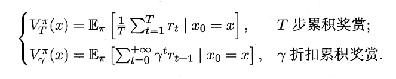  
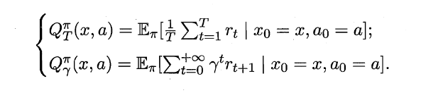  
  
### Bellman equation  
由于MDP具有马尔可夫性，上述两个式子可以推导成递推式。  
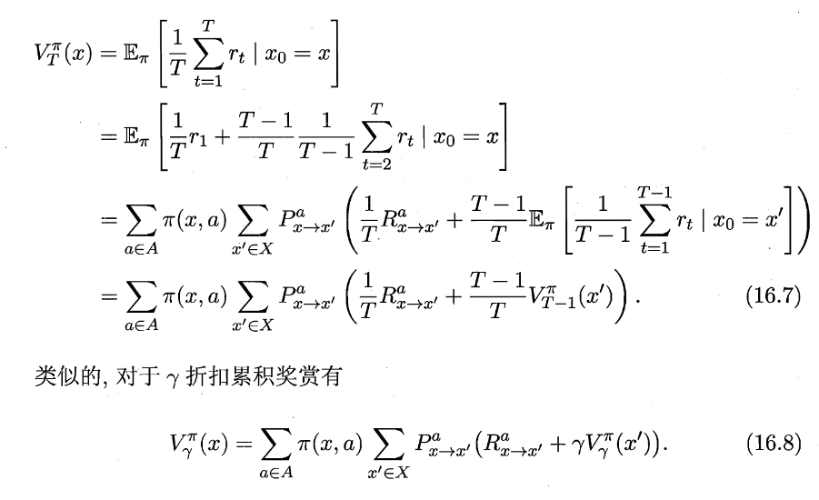  
首先对所有可能的行动a求期望，然后对采取了这个行动a之后所有可能的下一个状态求期望。  
  
而对于状态-动作函数Q函数，只用把前面对A中所有可能的动作a求期望的累加项去掉即可。  
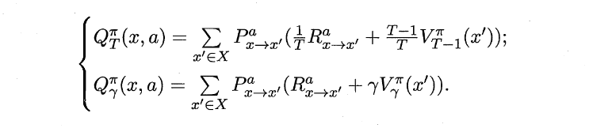  
  
## Model-Based  
如果E已知，包括R，P函数都已知，则是基于模型的强化学习。  
学习目标是得到一个策略，最大化累积奖赏。  
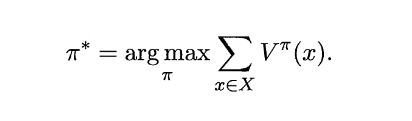  
  
如果一个值函数已经达到最优，那么它的累积奖赏值最大，利用的时候一定只用最优的那个action，因此没必要遍历所有动作，直接取最大的那个动作即可（这好像回到探索-利用问题了，不知道对不对）。改写Bellman公式为：  
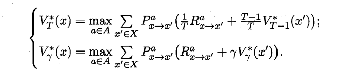  
  
发现右边的含义不就是最优的状态-动作函数值吗，于是：  
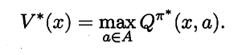  
  
将上面那个式子代入 Q 的递推（直接把V当做V*\换掉），有：  
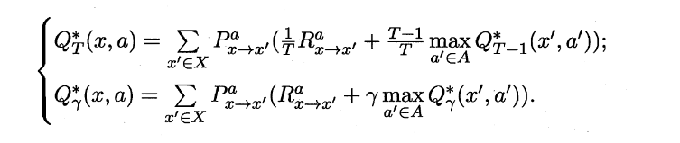  
  
上面的公式暗示我们，优化策略，就是将策略所选择的动作更换为当前最优的动作。可以证明（见西瓜书），这样做一定会让值函数递增。  
  
### 策略优化  
基于这一思想，有了策略优化方法：  
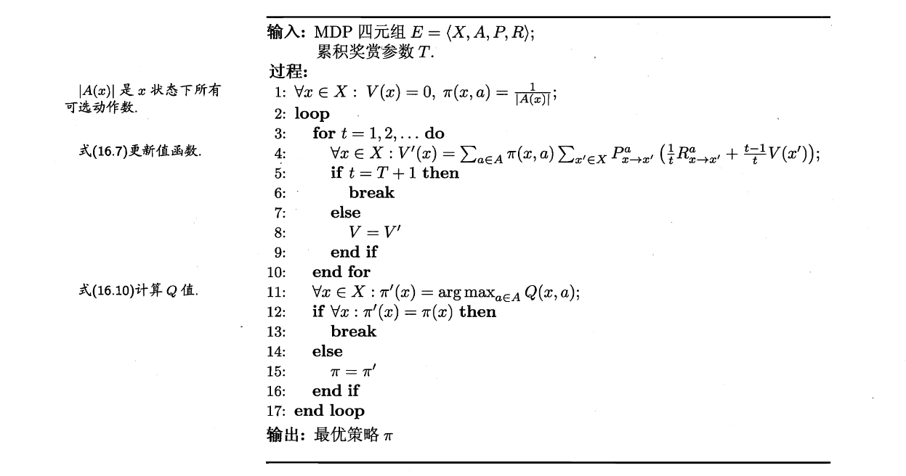  
首先，初始化最开始的策略：全部随机。然后开始迭代：  
1. 在当前策略下，递推计算出$V_T$。  
2. 有了 VT，就相当于有了 QT (Bellman 等式)。  
3. 更新策略：对于所有状态x，将应该执行的动作更新为 QT 所中让这个状态最大的 a。  
4. 如果策略更新前后不变，则结束。  
5. 如果变了，就更新为新状态，继续迭代。  
  
### 值函数优化  
上面的方法虽然简单直观，但不够高效。我们知道有了最优值函数就能通过Bellman公式计算最优的状态-行为函数，有了最优状态-行为函数就有了最优策略，因而我们可以只优化值函数。  
我们已经得到值函数的递推（和前面最优值函数一样）：  
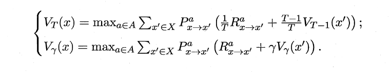  
  
于是有值函数优化算法：  
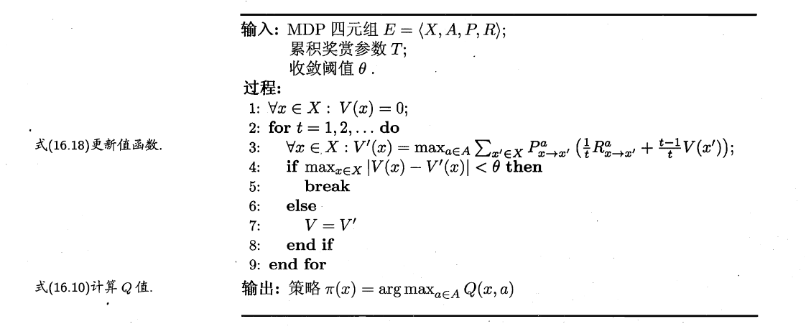  
注意，值函数更新是对所有状态x都更新。不断利用递推式遍历动作a直接优化值函数。  
  
看起来有点“左脚踩右脚上天”的感觉，本质上是基于模型的方法 E四元组全部已知带来的。  
  
## Model-Free  
大部分时候，我们对环境一无所知。就像上面的K摇臂机器，我们不知道每个摇臂给出的奖励到底是多少（即不知道R）。一般情况下，R、P都是未知的，有时候X和A同样是未知的。  
  
这时候，我们需要试探环境，就引入了上面的policy问题。  
  
### 蒙特卡洛方法  
同上面的K摇臂机的描述，我们需要进行试探来获取环境的信息，比如，用每个摇臂的收益的平均值来当做这个摇臂的收益的期望。这就是用平均当做收益R期望的思路，这个简单的想法一直沿用。  
  
一个自然的想法是，采样一条长度为T的轨迹$<x_0;a_0,r_1,x_1;a_1,r_2,x_2;\dots;a_{T-1},r_T,x_T>$，然后在这个轨迹上对所有的r（关于x,a）求平均。即从 t 步开始的、这个采样路径所代表的策略的累计reward为：$R_t=\frac{1}{T-t}\sum_{t'=t+1}^Tr_t$。  
  
而状态-动作函数为：  序列中所有在x状态下采用了a行为产生的收益的平均。假设序列中有$l_1, l_2, \dots, l_m$ 步是在状态x下采用了a行为，产生的单步reward是 $r_{l_i+1}$，而状态-动作函数的定义就是在状态x下采取状态a后使用策略 $\pi$ 能获得多少累积奖赏，因而不能直接用这些 r 的平均值来估计Q，而是从某一个时间步 i 开始，计算之后的所有这个状态-动作对带来的单步reward的累计奖励（T累计或者$gamma$折扣累积）$R_i$，有 $Q(x,a)=\frac{1}{m}\sum_{i=l_1}^{l_m}R_{i+1}$。而假设 $Q_i$ 为从 $l_1$ 到 $l_i$ 的平均状态-动作键值函数，显然前面说的 $Q$ 就是 $Q_T$，可以写成递推形式为：  
$$  
Q_i(x,a)=\frac{(i-1)Q_{i-1}(x,a)+R_{i}}{i}  
$$  
  
#### 同策略（on-policy）蒙特卡洛  
每一次试探出一个策略都通过平均值得到了该策略的状态-动作函数，然后可以根据该状态-动作函数得到在此Q下的最优策略，可以将这个方法作为新的策略再次迭代。  
  
同样，涉及采样就涉及探索-利用问题，怎么采样？使用 $\epsilon$-贪心。  
  
于是有一个蒙特卡洛面模型策略迭代算法，上面的思路中“随机采样一条路径，以估计当做期望”的做法契合了蒙特卡洛方法一贯风格。  
  
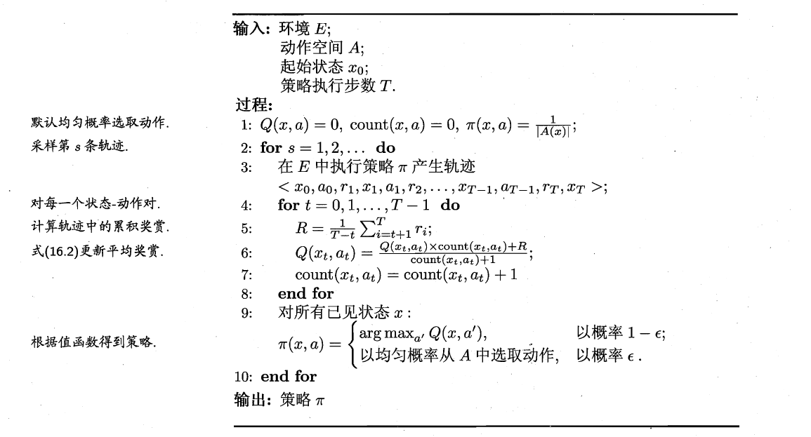  
(这里使用了T步累计奖励，见第5行。)  
  
而我们发现，这个方法在采样的时候基于 $\epsilon$ -贪心，它的特点是Q函数显示出的最优动作不一定会被执行；之后该方法直接用这个贪心出来的路径的Q函数算更优策略。然而引入 $\epsilon$-贪心 只是为了探索，在利用的时候不需要这样，而是直接拿最优即可。而基于贪心路径得到的Q优化来的策略，是否还需要用 贪心 去采样？然而在利用阶段，我们不希望贪心。  
  
用概率角度来说，在探索的时候，我们在一个分布上采样（$\epsilon$-贪心的分布，以$\epsilon$的概率均匀随机选一个；以$1-\epsilon$选最大的），而在利用的时候，我们在另一个分布上采样（对于每一个x，让Q最大的那个a概率为1，其它为0）。  
  
上面采样和优化都在**同一个分布**（这里指$\epsilon$-贪心表示的分布）下进行的算法，称为同策略 **On-Policy**。  
  
#### 异策略（Off-Policy）蒙特卡洛  
解决上面的问题，需要某种“变换”，把我们分布A（“探索”使用）采样得到的Q的期望变换为分布B（“利用”所使用）上的Q的期望，或者说用分布A的采样计算Q在分布B下的期望，然后在分布B的Q的期望上更新策略，这个得到的策略就可以放心的“利用”了。  
  
对于上面的“变化”，下面是一些数学上的讨论。  
函数 $f(x)$ 在分布 $p(x)$ 下的期望为：$E_p=\int p(x)f(x)dx$，离散地近似，就是在概率分布 p(x)上采样一组数(x1, x2, x3, ..., xm)，然后 $E_p=\sum_{i=1}^mf(x_i)$。  
  
引入另一个分布 q(x)，有 $E_P=\int q(x)\frac{p(x)}{q(x)}f(x)dx$，可以看做是函数 $\frac{p(x)}{q(x)}f(x)$ 在分布 q(x) 下的期望。有和上面相似的离散近似方法，在q下采样x1', ..., xm'，$E_p=\frac{1}{m}\sum_{i=1}^m \frac{p(x_i')}{q(x_i')}r_i$。  
  
回到我们的问题上来，实际上使用一个分布p来采样得到r，Q就是r在分布p下的期望：$Q(x,a)=\frac{1}{m}\sum_{i=1}^nr_i$；而如果改用分布 q 来采样，则Q在分布p下的期望同样可以计算：$Q(x,a)=\frac{1}{m}\sum_{i=1}^n\frac{p(x_i)}{q(x_i)}r_i$，其中 $x_i$ 是在分布q下采样出来的。  
  
在强化学习问题中，探索和利用是两个不同的policy，两个不同的分布，探索（$\epsilon$贪心）相当于上面的q分布，而利用相当于p分布，off-policy方法直接通过q分布的采样计算Q在p分布下的期望。为了便于表述，我们把使用贪心和不使用贪心的两种采样方法当成两种策略，为 $\pi'$ 和 $\pi$。在策略 $\pi$ 下，出现一个轨迹序列的概率为 $P^{\pi}_i=\prod_{t=0}^{i-1}\pi(x_t,a_t)P^{a_t}_{x_t\to x_{}t+1}$。用$\pi'$策略采样得到的轨迹计算 Q 在 $\pi$ 策略下的期望为：  
$$  
Q(x,a)=\frac{1}{m}\sum_{i=1}^{m}\frac{P^{\pi}_i}{P^{\pi'}_i}r_i  
$$  
  
两个 P 相除消掉了未知的转移概率P，有  
$$  
Q(x,a)=\frac{1}{m}\sum_{i=1}^{m}\frac{\pi(x,a)}{\pi'(x,a)}r_i  
$$  
  
而基于 贪心方法的 $\pi'$，其分布为：  
$$  
\pi'(x,a) = \begin{cases}  
1-\epsilon+\frac{\epsilon}{|A|}, &a=\pi'(x); \\  
\frac{\epsilon}{|A|}, &otherwise  
\end{cases}  
$$  
而确定性策略 $\pi$ 的分布为：  
$$  
\pi'(x,a) = \begin{cases}  
1, &a=\pi'(x); \\  
0, &otherwise  
\end{cases}  
$$  
  
得到 off-policy 版本的蒙特卡洛算法：  
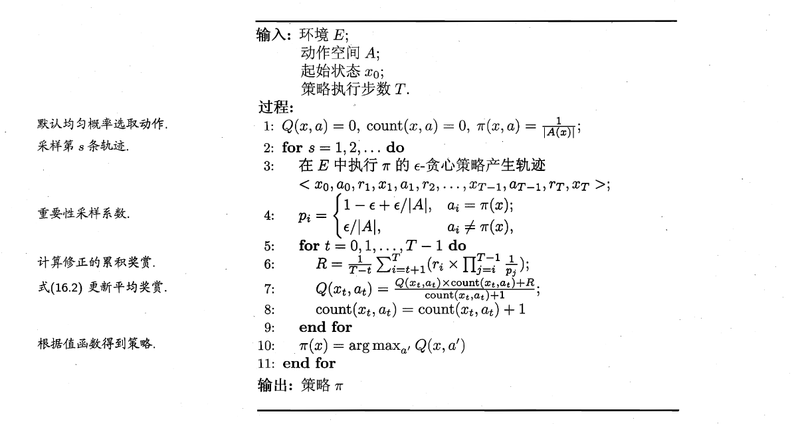  
  
其过程是，用当前策略和贪心policy得到一条轨迹，然后计算贪心策略的分布，再计算确定性策略的分布，后者 / 前者 \* r 得到 确定性策略分布下 Q 的增量，然后更新Q在确定性分布下的期望，然后基于此Q迭代新的策略。  
  
### 时序差分 TD  
蒙特卡洛方法的思路非常简单：用一个策略尝试一轮，用尝试结果的序列估计每个状态-动作对能带来的累计奖励R，然后用R的平均值作为期望直接得到状态-动作函数Q，用这个试探出来的Q计算更优的策略$\pi$。但是我们知道Q本身是有一个递推形式的，也就是下面这个：  
$$  
\begin{aligned}  
Q_i^{\pi}(x,a)&=\frac{(i-1)Q_{i-1}^{\pi}(x,a)+R_{i}}{i}  \\  
&= Q_{i-1}^{\pi}(x,a) + \frac{R_{i}-Q_{i-1}^{\pi}(x,a)}{i}  
\end{aligned}  
$$  
  
很自然想到可以用一种增量式计算的方法来迭代，也就是动态规划，而不必得到了完整的序列之后才更新。由于是每一步、每一次尝试都更新，我们不知道将来有多少步，一般使用 $\gamma$折扣累积奖赏。而这个累积奖赏有另一个好处，就是可以很方便地写出递推式：$\sum_{t=0}^{\infty}\gamma^tr_t = r_0+\sum_{t=1}^\infty\gamma^tr_t = r_0+\gamma\sum_{t=0}^\infty\gamma^tr_{t+1}$，有就是有类似这样的递推：  
$$  
R^\gamma_t=r_t+\gamma R^\gamma_{t+1}  
$$  
于是能够写出 $\gamma$ 累积奖励下 Q 的递推。下面为了一般性，将后半部分那个分式写成乘以一个系数 $\alpha$。  
$$  
\begin{aligned}  
Q_{i+1}^{\pi}(x,a) &= Q_{i}^{\pi}(x,a) + \alpha(R_{i+1}-Q_{i}^{\pi}(x,a))  \\  
&=Q_{i}^{\pi}(x,a) + \alpha(R_{x\to x'}^a+\gamma Q_{i}^{\pi}(x',a')-Q_{i}^{\pi}(x,a))  
\end{aligned}  
$$  
其中，状态-动作对（x,a）为当前的，而 (x', a') 为下一步的，即这个状态x下使用动作a转移到了 x'，然后在x'的时候使用了动作 a'。上式中将 $R_{i+1}$ 展开成了 $R_{x\to x'}^a+\gamma Q_{i}^{\pi}(x',a')$，其中前一项是这次行动产生的单步奖励，后一项则是就像前面 $R^\gamma_t$ 的递推式那样，因为我们的Q本质上就是$\gamma$累积奖励，而当前迭代的时候假设当前的Q就是当前策略的Q，那么从（x, a）转移到 （x',a'），除了单步奖励 $R_{x\to x'}^a$，而要计算累积奖励还需要 (x',a') 之后的累计奖励，它就是 $Q_{i}^{\pi}(x',a')$。这里，单步奖励 $R_{x\to x'}^a$ 相当于上面的 $r_t$，而 $Q_{i}^{\pi}(x',a')$ 相当于上面的 $R^\gamma_{t+1}$。  
  
基于此递推，同样有On-policy 和 Off-policy 的方法，前者是 Sarsa 算法，后者就是大名鼎鼎的 **Q-learning**。  
  
#### Sarsa  
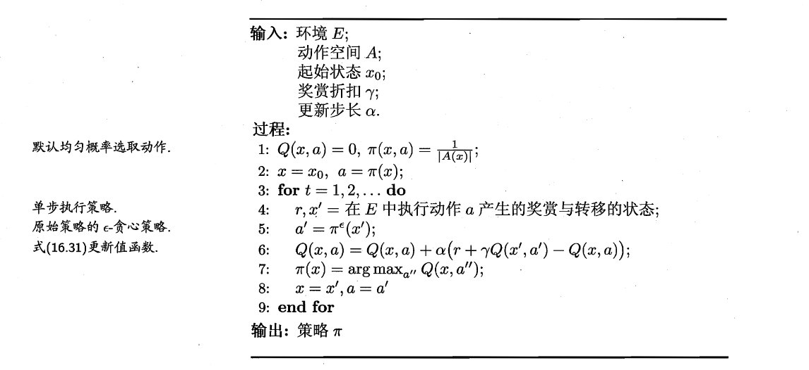  
  
#### Q-Learning  
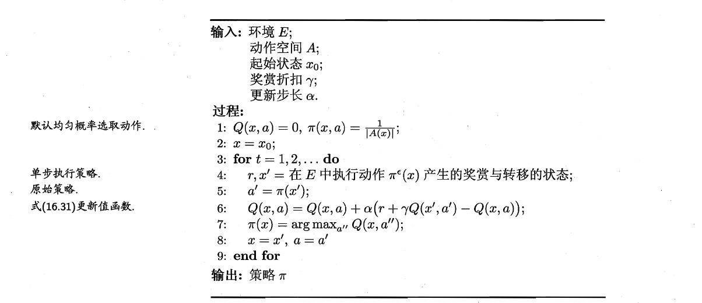  
  
非常相似。其实我还没有完全理解其中的差别。  
  
之所以是Off-policy，我们来看每次迭代的 x(当前状态)、a(在当前状态下使用了哪个动作)（这俩也就是更新用的递推式里代表“当前时间步”的那个Q(x,a)，也是作为更新对象的左端项Q(x,a)）是怎么产生的：x'来自上一次执行得到的后继结果，a来自更新前策略对于x'的最优动作。但是我们发现它在执行的时候是用 $\epsilon$-贪心 去执行的，得到的x'和r也是这么来的——但是在更新Q的时候直接更新在了没有使用 $\epsilon$-贪心 时的确定性策略 （x, a）上了，所以是一种 off-policy...  
  
## 其它话题  
### 值函数/Q函数近似  
实际情况中，状态和动作空间都可能是连续的，不可能用一张表或其它东西来枚举所有V、Q的值。需要用一个函数去拟合它。最简单的例子是一个线性函数，形如$\textbf{w}^T\textbf{x}$，也可以用非线性的函数，一般通过核技巧实现。在深度学习流行之前，用的就是这些函数。  
  
但是简单的线性函数或者MLP难以处理以图像等高维状态，必须额外的人工或自动的特征挖掘。随着深度学习逐渐流行，有更多模型来拟合Q函数，这之后引出了第一个将深度学习引入RL的工作：DQN，这个工作中用一个卷积神经网络来拟合Q。  
  
### 模仿学习  
加入监督的要素，即人工专家提前给出一个决策序列。有多种方法对待它，一个简单的直觉是先直接用监督学习方法根据这个序列做状态到决策的回归，以之为迭代的起点。  
  
### 逆强化学习  
合理的奖励函数很难被设计出来。逆强化学习所作的就是试图从人类专家的决策中学习奖励函数。  
