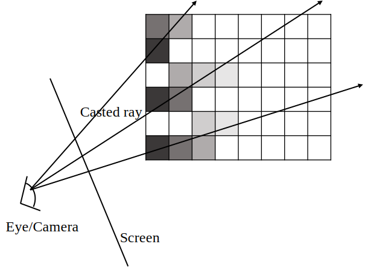
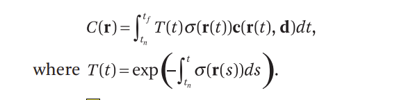
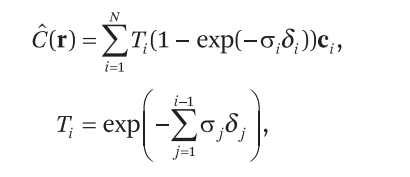

**原文**  
[NeRF: Representing Scenes as Neural Radiance Fields for View Synthesis](https://dl.acm.org/doi/pdf/10.1145/3503250)  
  
  
## 任务与中心思想  
NeRF并不是像我之前误以为的那样是做从多角度平面图生成完整的模型的——或者说至少不是传统意义上的模型。NeRF做的其实也是从多角度照片中建立场景，但它采用了**隐式建模**的想法。它并没有建立真正的有模型、有光照的场景，而是建立了一个方程（这个方程的形式是多层感知机MLP，也就是多层全连接层），以视线方向、所看的点的三维坐标（即从哪个方向看哪个点）为输入，输出这个点的rgb三维坐标和*体素密度*（这一点将在体渲染中提及）。  
给定一个相机位置，像点穿过图像中的每个像素得到很多条射线，在每条射线上采样得到射线上许多点的rgb颜色和体素密度，通过*改进的体渲染方程* 求解每个射线方向的视线最后看到的颜色，渲染到对应像素上。  
这个过程是一种隐式建模，你只有一个从视角和位置映射到rgb+体素密度的方程。你不需要有真的场景，只要知道从每个视角看过去能看到什么就行了。所以结果只是拿来看的，不能直接用来做更多，比如交互，所以并不是3D生成。  
  
## 体渲染  
### 体渲染简介  
不同于基于光栅化的渲染方法，体渲染没有三角形面片，只有一个个体素。体素的值可以理解成**不透明度(Opacity)**（虽然有各种说法，比如一般称**密度**，但我觉得就说是不透明度也是一个直观的理解）。每个体素有自己的rgb颜色（可能各向同性也可能各向异性，如果把光照移到外面另行处理的话，模型的体素色值应该是各向同性的..吧，大概。NeRF使用的模型中，rgb是各向异性的，因为光照本身也包含在其中了）。  
体渲染的思想是，每个体素按照其rgb色值向四面八方发射光线，有的光线被其它体素遮挡（也可称吸收..?），有的被折射，最后全部发射的光线打入人眼的部分混合为看到的颜色（这里说的是吸收+发射模型）。完整的体渲染模型，对于每个**方向**上的光线有一下几种变化：  
  
+ 发射。新体素在该方向上发射光线。  
+ 吸收。该方向上的一些光线被其上的体素吸收（遮挡）。  
+ 汇入。该方向汇入一些从其它方向折射或反射来的光线。  
+ 分离，该方向上的光线，一些被折射或反射到其它方向产生分离。  
  
想想，光是一个光线追踪路径追踪就足以算不动，需要大量简化。上面的东西连连续方程都不容易给出，更加无法实现。实际应用中，只考虑**光线的发出和吸收**，所以光线不会转向，只用考虑射向相机的光线即可。  
  
实现中不会真的让所有体素往四面八方发射光线。由于光路可逆，采用从相机像点穿过像素点往外发射射线的**光线投射法**进行简化。将每个体素的从射线方向看的信息表示为$(r,g,b,\sigma)$，其中$\sigma$为不透明度，渲染方程如下：  
$$  
\begin{aligned}  
\^C &= \int_{t_n}^{t_f}(1-\^A(t))c(t) dt \\  
\^A(t) &= \int_{t_n}^t(1-\lim_{x\to t^-} \^A(x) )\sigma(t)dt  
\tag{1}  
\end{aligned}  
$$  
(这个公式是我自己琢磨这写的，不一定对)  
其中c为体素颜色，$\sigma$为体素不透明度，t~f~为射线最远端，t~n~为最近端，$\^C$为射线方向上的累积颜色，$\^A$为射线方向上至 t 点的累计不透明度。将其离散化，在射线方向上采样若干个点，然后：  
$$  
\begin{aligned}  
\^C_i&=(1-\^A_{i-1} ) C_i+\^C_{i-1}  \\  
\^A_i&=(1-\^A_{i-1}) \sigma_i+\^A_{i-1}  
\tag{2}  
\end{aligned}  
$$  
  
  
  
  
### NeRF渲染方程  
虽然作者自己提出了一个所谓的辐射场以希望和体渲染做出区分，但最后的渲染方程形式上非常相似，只是具体的**累积不透明度**公式有变化，也就不做额外解释。  
放上公式：  
  
离散化如下：  
  
  
其中，C是累积颜色，T是累积“不透明度”，这里用不透明度也许已经不合适了，就称为体素密度，这只是一个建模上的概念。此外，$\delta$是相邻两个采样点之间的距离，**r( t )** 表示这个射线上的 t 点位置。  
  
### NeRF的两次离散化采样  
NeRF有两次采样过程：粗采样和细采样，对应粗网络的推理和细网络的推理。  
首先是粗采样，在射线的远近范围内，将线段均匀分为N份，在每一份中均匀随机选上一个点，得到第一次粗采样的结果。  
第一次采样结果在粗网络中可以得到一个粗的体素密度，体素密度更大意味着这个位置附近有更多的有意义的点（不是空的），所以细采样以这些离散点的体素密度值作为体素密度**概率密度**的散点近似，在此概率分布上二次采样，将两次采样结果丢入细网络中，得到最终的$(r,g,b,\sigma)$.  
  
## NeRF的网络结构  
NeRF不以复杂的网络为特点（当然这不意味着它计算量不大，其计算量主要在其它步骤，它同样很慢）。  
这个网络在整个过程中扮演什么角色？NeRF的中心思想就是隐式建模，它需要找到一个函数 $F_\Theta$，能够将从 视线方向+点的三维位置（自变量） 得到这个点的 $(r,g,b,\sigma)$（因变量）。NeRF的神经网络的作用，就是**充当这个函数！**。  
找这个函数显然是个最优化的问题，当下来说想到深度学习的方法再“自然”不过。文中也给出了一些比较理论上的说法：体渲染方程（那个积分式）表明这个渲染方程是*可微* 的，这就决定可以用随机梯度下降法做最优化。能优化出一个函数 $F_\Theta$，使得最后渲染结果最接近真实值（照片里的像素颜色）。  
  
NeRF的网络**全是全连接层**，也就是一个多层感知机MLP。网络分为两个部分，第一部分为前八层，**只以点的坐标为输入**，前八层(in_channal = 256, out_channal = 256)（除了第一层要把输入扩展为256这个不太一样外）(with ReLu)（由于过程中还有点变化，所以理解为*始终让输出为256好了*）。分岔出现在第八层，这里一方面**直接输出一个体素密度 $\sigma$**，另一方面仍旧输出256维向量的特征值，这个特征值**加入视线方向(视线方向在实现中用笛卡尔坐标系下单位向量表示，且并非OpenGL相机坐标系。它的z轴指向相机前方**。  
  
第二部分只有两层，将结合了视线方向特征（具体就是把视线方向接到第一层输出的256特征的后面）丢入第一个全连接层输出长度128的向量，过relu后下一层直接输出3个值的rgb，经过*sigmoid*后输出为最终rgb。  
  
还有一个细节，在第五层后的时候会把输入的原始位置向量接在上一层输出特征的末尾，再进入下一层。这也是前面说，是让每一层的输出特征固定为长度256。  
  
## 傅里叶特征编码  
直接用$(x,y,z)$三维空间坐标作为输入，因为值很大程度上是连续的，无法分辨出一些**高频几何形状特征**，结果表现出来就是很糊，分辨率很低。所谓高频，意思就是在较小的空间范围内多次出现，比如履带上的疙瘩，这种小空间中直接用三维空间坐标的相差很小，采样也做不到那么细，可能很多时候采样到的两点恰好采到了相似形状处等，都导致结果不理想。总而言之，分辨率低很大程度是因为高频几何形状在小空间内频繁出现、但在这小空间中采样的点的三维坐标相差很小网络分辨不出导致的。（明明输入差距这么小，输出差距却比较大——训练可能失效）  
  
用傅里叶特征编码可以将输入的空间坐标**区别开**，也就是将输入的低维特征扩展到高维空间，形成较明显的差异。而用傅里叶特征区分“频率”上的差异（提高高频几何形状训练效果），自然联想到傅里叶变换将时域转换为频域，有专门的文章讨论了傅里叶特征在这方面的效果。  
  
三维坐标 $\vec x$ 的傅里叶特征为：  
$$  
\gamma(\vec x)=(\sin (2^0\pi \vec x),\cos(2^0\pi\vec x),\dots,\sin(2^k\pi\vec x), \cos(2^k\pi\vec x), \dots)  
$$  
要多少维取决于自己的规定。NeRF取k到10.  从代码来看，应是对$\vec x$ 做广播，把结果的括号去掉，也就是 sinx0, sinx1, sinx2, cosx0, cosx1, cosx2, sin2x0, sin2x1, sin2x2, cos2x0, cos2x1, cos2x2...这样来的。具体实现在另一篇文章。  
  
同样，对视线方向也做傅里叶特征编码处理。**前面的所有输入位置、输入实现方向，输入的都是经过编码后的高维空间中的特征！**  
  
## 视线相关rgb  
文章还比较了，在第二部分网络前后加入或不加入视线方向的结果（不加入视线方向就只需要点的位置坐标了），发现加入视线方向的视线相关推理能更好的推理出光照现象，包括光照、阴影等。这很显然，因为有光照，将光照考虑为模型的一部分，那模型中每个体素颜色本就应该是各向异性的，当然要视线相关。  
  
## 训练流程  
NeRF的训练过程就是整个建模过程。前面二次采样的章节已经暗示了训练流程。  
整体流程是：  
  
1. 随机选择一些射线  
2. 在每条射线上一次均匀采样  
3. 对每个采样点算三维坐标，对空间坐标和视线方向（方向向量）做傅里叶特征编码。  
4. 配合射线方向向量，丢入粗网络推理，得到第一个$\sigma$估计。  
5. 根据粗网络的 $\sigma$ 估计，以之为概率密度，进行二次采样。（逆变换采样方法）  
6. 将一二次采样的点都丢入细网络推理，得到最终的$(r,g,b,\sigma)$。  
7. 每条射线上的所有采样点都有这个四元组，通过离散化的NeRF渲染方程，算出每个射线看到的颜色（像素颜色）  
8. 用这个粗细采样后经过粗细网络得到的两个像素颜色和照片上像素颜色的均方差误差反向传播，同时优化粗细两个网络  
  
### 数据集  
数据集需要若干张从不同角度拍摄的照片，每个照片都需要有相机位姿和内参等信息（相机坐标、由内参算穿过像素的射线的方向....）。相机上像素点的颜色是渲染结果的ground truth.  
  
### 逆变换采样  
如何在计算机中，按照一定的概率密度进行采样？对概率分布为$F(X)$的随机变量$X$，定义随机变量 $Y=F(X)$，显然Y在\[0,1]范围内。对$Y$的概率分布为：  
$$  
\begin{aligned}  
F_Y(y)&=\int_{-\infty}^yf_Y(y) dy \\  
&=\int_{0}^yf_Y(y) dy \\  
&=F(F^{-1}(y)) \\  
&=y \\  
f_Y(y)&=1  
\end{aligned}  
$$  
直观来说，即随机变量 $Y$ 从负无穷到 y 的概率为 $X$ 从负无穷到 $F^{-1}(y)$的概率，也就是$F(F^-1(y))=y$。（由于F是单调递增，所以F的反函数一定存在）  
也就是说，$Y$是\[0,1]的均匀分布，均匀分布采出一个y值，然后$x=F^{-1}(y)$，得到的x就可以认为是从目标概率分布采样得到的。  
