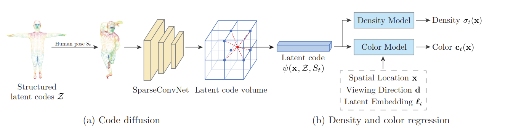
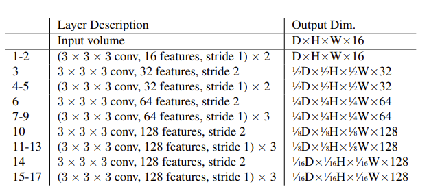

**人体的隐式建模 Neural Body.**  
*Neural Body: Implicit Neural Representations with Structured Latent Codes for Novel View Synthesis of Dynamic Humans*  
项目源码不太容易看，挺绕。。  
## 任务目标  
最直接的目的是，NeRF需要采集大量不同视角的对场景的照片，希望减少相机视角数量，用图片完成隐式建模，并取得好结果。  
  
显然，这个问题是更加病态的，所以不会直接对场景进行渲染，而是对*人体*进行渲染。对于机器而言，人体本身已经有大量的“先验“的知识，比如SMPL，人体大致形状结构等，有机会用更少的角度完成人体的隐式建模任务。  
  
## 不需要一些东西，就会需要一些其它东西  
既然不需要那么多角度的相机，就会需要一些其它东西。这里主要是一些人体的先验知识，以及使用视频来获取更多的帧数等。  
  
### SMPL模型  
*A skinned multi person linear model. ACM TOG, 2015*  
  
SMPL模型是人体参数化模型，有几十个参数，训练这些参数可以得到大部分体型和动作的人体模型，这个模型已经包含了人体的拓扑形态、关节链接等“知识”。通过训练这些模型，使之摆出和照片相似的动作和体型（pose $\theta$, shape $\beta$）。体型参数有10个，每个都有其大致意义，姿态参数有24\*3个，为24个关节节点，每个子骨骼相对于父的轴向旋转。  
neural body首先将SMPL模型根据多角度图片进行训练，得到一个相近的人体和姿态，这已有现成的方法，文中用的是 *A 3d deformation model for tracking faces, hands, and bodies. CVPR, 2018*。这个方法应该是是更进一步，提出了能表现衣服、头发、具体手势表情等的模型（当然也是基于SMPL。。）。  
  
### 视频  
不同于NERF每个角度的相机只需要一张照片，neural body每个相机需要一个视频。视频中每个帧都是一个用来训练的图片，因而可以积累到但角度比较多的图片。而由于人在视频中会动，这些帧也能为训练提供更多信息。  
此外，用统一结构化潜码应用到所有不同姿态上，为训练单一模型、适应不同姿态，形成动态人体提供了基础。即需要将这个结构化潜码用在不同姿态的SMPL人体上都能有效。  
  
## 方法  
  
  
### 流程  
1、首先，用现有方法，根据每帧 t 多角度图片，优化出适合该帧pose的SMPL参数 $S_t$。从这个参数得到SMPL 6980个顶点每个顶点的坐标。为这些坐标用 embedding 赋予一个长度为16的潜码。  
2、将空间离散化为体素，这样有的体素有潜码（之前6980个顶点对应的体素），大部分的全0. 用 *SparseConvNet* 稀疏卷积（3D卷积）进行**扩散(diffusion)**，将每个顶点的潜码扩散到周围去。后续，如果需要对某一个特定的空间点取潜码，则在此点所属的体素内，用该体素与周围体素的潜码的 *trilinear interpolation* 得到该点的潜码。任意空间点在第t帧的动作下的潜码用 $\psi(\vec x, Z, S_t)$ 表示。  
3、接下来计算视线上每个体素的rgb和体素密度。  
+ 体素密度。这个网络是两层的全连接层，直接以该体素的结构化潜码为输入。  
+ rgb。这是一个四层的全连接层网络。应该每一层都加入了新东西（也可能是在一开始就把所有拼接在了一起）（但考虑到NeRF的处理，我倾向于一层层加入）（**看看源码**，但是源码有亿点绕，不好看），依次加入 该点结构化潜码、视线方向单位向量傅里叶空间编码后的结果(同NeRF)、该点xyz位置空间编码后的结果、该帧 ( t ) 做了embedding后的向量(nn.Embedding(Nt, 128))。  
  
4、得到每个点的rgb和体素密度，用NeRF一样的渲染方程渲染。或者用体素密度，用现有的“体素蒙皮”方法3D重建。  
  
没有那么多采样过程，应该可以直接以实现方向上潜码的值为暗示进行采样，不为0的地方应该多采样。直接用人体包围盒，把人体截取出来，在包围盒中均匀采样应该也可以。  
  
### 结构化潜码structural latent code  
SMPL有6980个顶点，其所谓“结构化潜码”，就是给这6980个顶点每个赋了一个编码。**注意这编码是针对SMPL模型的每个顶点的，不是针对某一帧的。所以最后训练完后，这个编码会跟随着SMPL模型的每个顶点应用到所有帧的所有姿态上，保持不变。** 这样能在同一个人的不同姿态动态过程中，保持一定的一致性，这是动态渲染所要求的。  
根据源码，这个潜码直接用 **nn.Embedding(6980, 16)** 计算，也就是说，这个潜码本质是这6980个点，每个点在其总点集中的查找向量。  
```  
embd = nn.Embedding(6980, 16)  
psi = embd(np.arange(6980))  
省略了一些关于shape的操作  
```  
可见潜码是和顶点编号绑定，也就是和某个特定的顶点绑定，而无关这个顶点在哪里。也就是所有姿态中的同一个顶点都用同一个潜码，这里蕴含了动态的连续一致。  
***  
**关于编码**  
要深度学习、或者要自动处理的往往都需要编码。如果有什么包含了重要信息，比如这里的SMPL模型顶点，要将之纳入深度学习，就要对这些比较“抽象”的东西进行编码。而nn.Embedding()是一个比较万能方法。当然，只能在全集确定的情况下用。  
embedding也是可以训练的。  
***  
### 扩散 latent code diffusion  
后面需要得到连续空间点（任意实数三维坐标）的潜码，而前面从SMPL只得到6980个潜码。与这些顶点相近的位置潜码当然不应该是0。**需要把原油的6980个潜码扩散到周围**。这里使用 *SparseConvNet* （3D卷积）完成。  
NERF是体素渲染，这里自然也是。那么把场景（主要是由SMPL人体模型引入的“场景”，其实就是这个模型的周围，6980个顶点分布在这个空间中）体素化就是相当自然的想法。文章把人体包围盒形成的长方体分为 *5mm\*5mm\*5mm* 的小体素，6980个含有潜码的顶点就在其中。  
  
所用的稀疏卷积网络是3D卷积。把这个四维数据（三维空间坐标+一维潜码向量）丢入卷积网络，得到扩散后体素空间。  
  
  
  
扩散后，任意（连续）点的潜码，由其所在的体素的包围立方体体素中，用顶点的潜码三线性插值得到。  
注意世界坐标下的空间三维坐标，应该首先转化为SMPL模型坐标，再进行接下来的步骤。  
  
***  
**Q1**：继续了解3D卷积。然后这个四维数据是怎么组织的，潜码向量是在第0维(axis = 0)还是第3维？  
**Q2**：潜码的embedding的那个矩阵以及SparseConv都需要训练吗，还是只用训练其中一个，那么另一个用什么参数？如果两个都要训练，感觉怪怪的，仿佛是同时训练输入与网络。  
***  
**关于扩散**  
想把某个位置的某种“影响”或“作用”（这里是潜码）扩散到其周围，这个想法就是diffusion。这里用3D卷积实现了扩散。  
***  
### RGB $\sigma$  
体素密度网络是一个两层的MLP，即两个全连接层。直接以所查询点的潜码为输入。输出一个体素密度 $\sigma$。  
  
RGB网络是一个四层的MLP，输入有四个部分：查询位置的潜码、视线方向傅里叶空间编码后的结果、空间位置（SMPL坐标）傅里叶空间编码后的结果、第 t 帧（正用于训练的这一帧）的embedding (*即那个奇怪的 $l_t$*)。  
输入四个部分，恰好四层，可能是每一层都拼上新东西，也可能是只在最开始全部拼上。由于*NERF是在网络中间拼，所以我倾向是每层拼新东西*。  
  
具体每个网络 in_channels, out_channels 是多少，到底怎么给输入，还得看看源码。。  
  
## 最后“落地”  
介绍了两种应用：生成新视角图片，以及人体3D重建。  
  
对于某一帧生成新视角图片，因为是在同一帧，动作不变，所以SMPL模型是和训练中一样的，其体素化的包围盒中每个体素的潜码是不变的。所以直接从新视线方向在体素空间中采样潜码，然后丢入RGB$\sigma$的两个网络，得到rgb和体素密度，走一遍NERF体渲染就可以了。  
  
人体3D重建，这个同样是姿态不变，体素空间中有所有体素的潜码。由于体素密度是视线无关的，直接把每个体素的潜码丢入体素密度的两层MLP，得到每个体素的密度，然后用现有方法给体素“蒙上一层mesh”： *Marching cubes: A high resolution 3d surface construction algorithm. In SIGGRAPH, 1987*. （Marching cubes 算法)。  
  
对每一帧做新视角合成，就得到了自由视角视频。最后该方法似乎没有在动态下有动作上穿帮。  
他们在具体做的时候，先把人体根据包围盒投影剪了下来。这也很自然。（不对，好像是说，只在包围盒投影范围内计算评价指标PSNR, SSIM）。  
