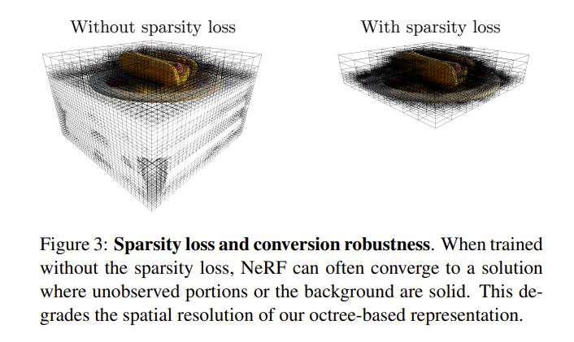
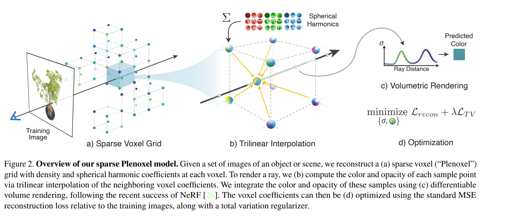
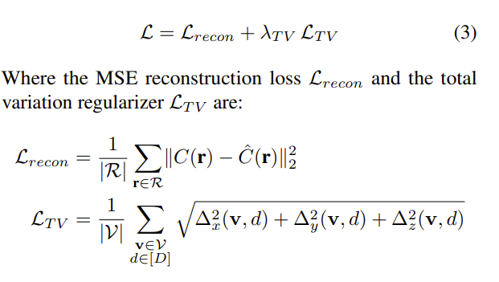
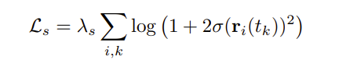
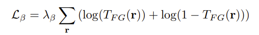

# PleOctree  
## Overview  
**PlenOctrees for Real-time Rendering of Neural Radiance Fields**  
PlenOctree的工作很简单：建立了一种能高速实时渲染NeRF训练结果的方法。其实本质上就是把NeRF的隐式建模*拆解* 为显式的，变成一个3D体素Grid，然后把这个Grid化简为八叉树表示（本质上是尽可能排除空的体素），最后在八叉树上直接进行Fine-Tune。  
这样实际上是退化为了传统的体素渲染方法，有了完整的八叉树表示的体素Grid，对每个光线做碰撞检测找到涉及的体素，运用NeRF渲染方程即可。  
快在于：渲染的时候不需要像NeRF那样多重采样（因为所有体素已经提前定死了），并且不需要走神经网络来获取每个体素的 rgb and $\sigma$。  
  
## 相较于NeRF的变化  
### NeRF-SH  
本文采用的是NeRF-SH。这个变动是对NeRF需要输入视线到神经网络获取视线相关的rgb的改进。NeRF-SH中每个体素的颜色用**二阶球谐系数(9\*3=27个)**。这样只用输入体素位置、获得SH即可，神经网络直接输出SH，不需要视线。  
关于球谐函数SH，见同一目录下的《球谐系数与环境光照》的前半部分。简单来说，球谐函数是一组基函数，输入球坐标下的方向$(\theta, \phi)$能得到每个基函数的值（每阶基函数本身长什么样可以查表），然后以球谐系数为权值求和即可得颜色值。三通道三组球谐系数。  
  
最后算得的rgb用**Sigmoid**函数标准化。  
  
*已经训练好的NeRF可以用来估计每个体素的SH*。对每个体素，用随机的视线方向，由训练好的NeRF计算rgb，知结果rgb，知球谐函数值（用视线方向去算），最后应该是个线性方程组，方程数量由视线方向数量决定。如果忽略 Sigmoid，应该可以直接最小二乘。如果有 Sigmoid，用极大似然可能可以估计。  
  
### Sparsity Prior Loss  
普通的NeRF在照片看不到的地方可能生成任何结果，这对于结果质量影响不大，但会影响八叉树表示的结果，也会把八叉树的Grid“冲稀”。如下图所示：  
  
  
本文提出了Sparsity Prior Loss，对较大的sigma做出惩罚。  
$$  
\begin{aligned}  
L_{sparsity}&=\frac{1}{K}\sum_{k=1}^K |1-\exp(-\lambda \sigma_k)|  
\\  
L_{loss}&=\beta_{sparsity}L_{sparsity}+MSE  
\end{aligned}  
$$  
其中 $\lambda, \beta_{sparsity}$ 是超参数。这个损失函数会让整体的sigma 有减小的倾向。对于有用的体素，渲染方程补正了这一倾向；而空体素不会，更倾向于很小的数，归0.  
  
## Method  
### NeRF-SH转化为八叉树  
就是提前计算出所有体素的结果，滤掉那些空的、贡献度小的。  
  
1. *Evaluation* 用一个均匀的密集3D体素 Grid，对每个Grid上的点（体素）在NeRF中取出 sigma。首先，如果sigma直接小于某个阈值1的，直接舍弃（归0）。  
2. *Filtering* 对所有训练用图像上的所有射线，计算每个体素的 *alpha map*，即每个射线上体素的 $T_i(1-\exp(-\sigma_i \delta_i))$，每个体素，用所有射线得到的最大的结果作为标志。滤掉这个标志小于一个阈值2的体素。  
（注意，这里就是$T_i(1-\exp(-\sigma_i \delta_i))$），文中少了T~i~，是笔误.  
3. *Sampling* 对留下的体素取 SH。做法是在每个体素范围内抽样256个点，丢入 NeRF-SH 算SH，求均值。  
抽样8个点能加速10倍，质量下降较少。 这个八叉树“不谋而合”  
4. 成树。所谓形成八叉树，只是尽可能把全部舍弃掉的体素合并为大叶子。而上面过程中保留的一并是叶子，不再合并。这样渲染的时候可以快速跳过无意义的体素。  
  
### PlenOctree Optimization  
NeRF的渲染方程是可微的。可以直接优化转换完的 Octree 上每个叶子的 sigma and sh。  
使用 MSEloss + SGD。  
  
## Limitations  
空间需求大。几GB，最大压缩也有一百MB+。  
不能unbounded scene(不能处理background等)，不能 6DOF 漫游。（为何不能？）  
这里的Real forward facing , real 360 都不一样，有什么区别？  
  
  
# Plenoxel  
## Overview  
**Plenoxels: Radiance Fields without Neural Networks**  
Plenoxels 的贡献是在NeRFs中，彻底丢弃了神经网络，直接在voxel grid 上优化 SH-coef and sigma。同时比NeRF加速100倍（训练加速100倍，渲染类似PlenOctree也很快），没有目视质量损失。同时将方法扩展到了unbounded开放场景，也就是可以一定程度上处理背景前景。  
该方法证明了NeRF的真正核心是可微渲染，而非神经网络，所以简单的MLP就能解决问题——其实根本不是MLP的威力。  
该方法一定程度上承接自 PlenOctree，是同一个团队搞得，这个显然牛很多。  
  
  
  
## 场景表示  
类似上面的 Octree，不过这里没有强套 Octree 的概念。  
一个密集的 3D Grid，每个角点有 opacity 和 rgb 27个SH-coef。直接优化这所有角点上的 sigam and SH-coef。  
对于空间中任意一点，它用于渲染的 sh-coef和sigma就是从它*所属于的体素的8个角点 三线性插值* 而来的。  
  
## 优化  
### Sparse：Corse to Fine  
这里同样用了由粗到细+稀疏网格的方法。首先*Corse*，在较低分辨率（比如256^3^）上对所有角点的参数优化；到一定程度后（文章显示1~2分钟后，就只有不到 10% 的点的sigma不是0了），**删去没用的、sigma很小的** 体素（大抵是用角点判断，怎么用角点的opacity删立方体，具体怎么做我也没看源码。许是删角点-删去与它相接的边？），然后，剩下的体素就成了稀疏体素Grid。之后 *Fine*，把剩下的体素一分为八（每个边中间切开，切完后新角点的参数盲猜线性插值），接着优化出最终结果。  
  
这里删点的方法和 PlenOctree 相同。也是先直接删掉本来就很小的，再删掉所有训练图像的视线中最大的 T(1-exp(-sigma delta)) 小于某个阈值的点。  
同时，文中表示一个角点会对其周围点的插值产生影响，不能删的太随意。只有它邻居点也应该删的时候才能删。具体怎样，恐怕得看源码。。  
### 损失函数  
首先，对于每个渲染出来的图片，使用均方差损失，记得用射线数量做平均。  
然后，还使用了 **variation regularization (TV)** 损失函数来促使*更平滑的结果*。  
  
  
  
其中，R是训练图片涉及的所有射线集合，V是Grid中所有体素集合，D为1~9，表示第几个球谐系数（每个rgb三通道）。而$\Delta_x^2(\vec v,d)$表示体素 v(i,j,k) 的第d个球谐系数和体素 v'(i+1, j, k)的第d个球谐系数的平方差，y,z同理，记得索引 +1 的位置也跟着改变。  
直观上来看，确实会导致比较平滑的结果，毕竟是在相邻体素SH作差。  
  
文章的三线性插值使可以在任意空间点得到参数，但似乎仍旧用了和 PlenOctree类似的方法光线投射渲染（而不是在光线上任意选点），其实也可以是任意选点，在每个体素内可以随便选一个点，毕竟有了Corse步骤后，每个体素已经代表了NeRF的第一层抽样（滤去了无用的体素）。  
计算MSE的时候，随机抽选一些射线，计算TV的时候，随机抽取一些体素来算。MSE需要渲染出一个结果，TV却不需要，直接随便选就行了，这两者是独立、分开的。  
两者的优化用同样的learning rate，但独立分辨更新lr，也是因为两者计算过程本就相对独立。  
  
最后，还从最优化算法上谈了谈我看不懂的东西。说这个优化任务：优化量大、纬度高、病态问题，推荐的解决办法是 second-order algorithm，但是无法实现。文章用了 *RMSProp* 算法，这也是一种梯度下降优化器，改进自Adagrad。  
文章表示，自己方法不受目前的 autodiff 支持，所以实现了自定义CUDA算子。应该是TV的反向传播比较奇怪。  
  
## Unbounded  
```  
what is multisphere image background and its grid?  
```  
把场景扩展到 Unbounded 上去，可以合成背景、前景。  
文中说用 multisphere image background model，和NeRF++类似。每一个背景图层也有自己的 opacity, rgb(但是好像不记SH-Coef?是类似天空盒了吗)。文章说每个MSI图层也有自己的 Grid，和前面一样，并且里面的参数也是用类似的过程学出来的。这个grid用等距柱面投影投成了球形（地图制法）。  
我不懂这个 grid 是什么意思。但是不同图层之间有类似的 opacity 积累应是和体素渲染原理差不多？  
似乎是multiplane的路子。  
可能 NeRF++的论文里说的比较清楚？  
  
## 不同的 Regularization  
文章推荐对不同的任务 Synthetic scene, Real Forward-Facing Scene, Real 360° scene 用不同的regularization.  
```  
这三者，除了第一个是来自电脑建模生成的数据集，后面两个有什么区别？  
```  
对于 第一个，用TV。  
  
对于第二个，用 lambda_TV更大的TV（Result一节中简单讲到的实现），或者用基于柯西损失的sparsity prior:  
  
其中 $\sigma(\vec r(t_k)$ 是射线 r 上的第k个体素的sigma.  
  
对于第三个，用  
  
尽可能使前景背景不透明度要么0要么1。（损失函数中间大两头小）。  
  
## Limitations  
artifacts. 我不知道怎么翻译这个，是某种效果不行（比如架子鼓反光不行等）。所有病态逆问题的通病。  
引入了一些超参数。没有理论上的最好，得调。  
可以引入正确的反走样方法以 scale。  
用分层数据结构加速。  
