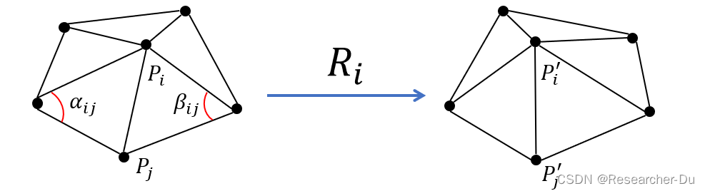

在这里总结了看论文中遇到的各种度量。由于开始记录得比较晚，应当不完全记录了所见过的。  

## 峰值信噪比PSNR  
这部分大部分直接来自于：[质量评估指标](https://blog.csdn.net/Doctor__Chen/article/details/124781119)  
***  
峰值信噪比( PSNR ) 用于表示信号的最大可能功率与影响其表示的保真度的破坏噪声的功率之间的比率。由于许多信号具有非常宽的动态范围，因此 PSNR 通常使用分贝标度表示为对数量。 PSNR 在图像处理上主要用于量化**受有损压缩影响的图像**和**视频的重建质量**。  
  
PSNR基于均方差误差MSE定义，对于二维图像：  
$$  
\begin{aligned}  
PSNR &= 10\lg(\frac{MAX^2}{MSE})  \\  
&= 20\lg(MAX)-10\lg(MSE)  
\end{aligned}  
$$  
其中，$MAX$ 是最大可能信号值，图像处理中就是最大可能的像素值，常见的八位，就是255.  
  
PSNR用于评价有损压缩的编码器、解码器，将压缩结果和原始数据比较，PSNR**越大越优**。  
据说在估计图像质量、尤其是人类感知的图像质量中，与其他指标相比性能较差。  
但图像处理也没有统一的质量评价体系，很大程度是人力直观。  
  
## 结构相似性指标SSIM  
结构相似性理论将图像相似性分为亮度、对比度、结构相似性。其中结构相似性被认为是比较“绝对”、不受各种光照等条件影响的。直观来说，临近的像素不是独立的。画面中有一小块是一片白墙，那么显然白墙区域的像素都不是独立的，它们都应该是白色。这些由图像中物体的几何形状等导致的区域内像素相关性，就是*结构相关性*。  
该理论以均值衡量亮度，用标准差衡量对比度，用协方差衡量结构相似度。  
  
SSIM：  
$$  
\begin{aligned}  
SSIM(X,Y) &= \frac{(2\mu_x\mu_y+c_1)(2\sigma_{xy}+c_2)}{(\mu_x^2+\mu_y^2+c_1)(\sigma_x^2+\sigma_y^2+c_2)}  
\end{aligned}  
$$  
其中 $\mu$ 表示均值；$\sigma$ 表示标准差，下标为 xy 的表示协方差；$c_1=(k_1L)^2$, $c_2=(k_2L)^2$，其中 $(k_1, k_2)=(0.01,0.03)$为默认值，$L$为信号最大动态宽度，八位图像为255.  
  
## Geodesic Distance  
测地线距离。原本是地理上用的，地球表面两点间的最短距离（经过地表），在数学图论和图形学中用来表示图上两点间的最短路径长度。  
图形学中，mesh表面的三角形网格天然是图，点云则需要先从点建立类似网格的结构。  
  
平均测地线距离，图上一点到其它所有点的测地线距离的平均值。可以用来衡量某点是否位于图的【中心】。  
  
## ARAP(as-rigid-as-possible)  
来自论文：[As-rigid-as-possible Surface Model](https://igl.ethz.ch/projects/ARAP/arap_web.pdf)。解读见[经典论文推导：ARAP](https://blog.csdn.net/u011426016/article/details/79128909)。  
在深度学习图形学中，很多涉及了几何表面修正的方法都用到了arap loss，其思想正是来自于这篇论文。该论文中将任一顶点 i 和它的 1-邻域（与 i 顶点距离为1的顶点集）N(i) 记为一个刚性变换单元，假设这个单元中的顶点与 i 只进行*相对* 旋转变换，即：$p_i-p_j=R_i(p_i'-p_j')$，其中 $p_j \in N(i),R_i$ 是旋转矩阵。  
为了保证尽可能进行刚性变换，用以下能量函数做约束：  
$$  
E(C_i,C_i')=\sum_{j\in N(i)}w_{i,j}||(p_i'-p_j')-R_i(p_i-p_j)||^2  
$$  
其中 C~i~, C~i~' 表示变换前后的刚性变换单元 i，R~i~ 是未知旋转矩阵，$w_{i,j}=\frac{1}{2}(\cot \alpha_{i,j}+\cot \beta_{i,j}$ 表示边 {p~i~, p~j~} 的权重。  
  
  
全局能量公式：  
$$  
E = \sum_{i=1}^n E(C_i, C_i')  
$$  
找到 $R_i, P'$（其中P'是变形后的顶点坐标，即使变换前后顶点确定，R也是可以有很多中的，所以这俩是两个待优化变量）使得能量函数最小。原论文自己提出了基于迭代的优化办法，分别固定R,P然后单独优化另一个。我们用它作为损失函数不关心这个。  
  
arap损失函数的形式大致和上面的公式相同。  
