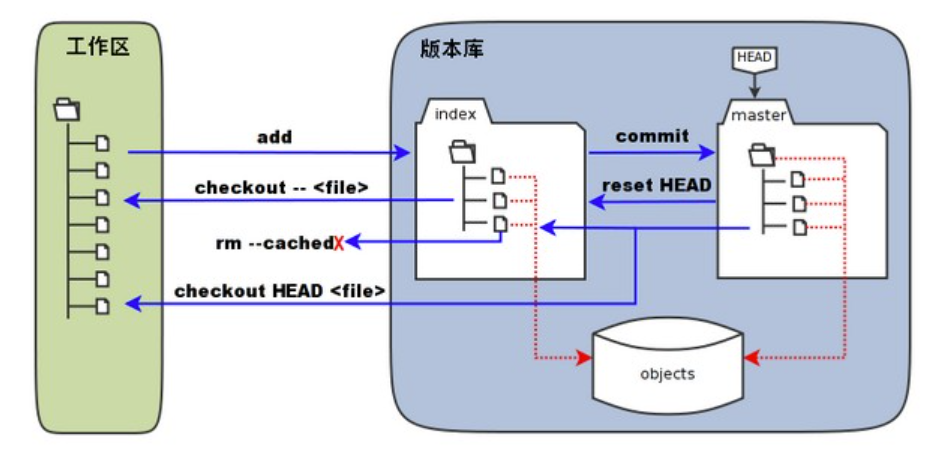
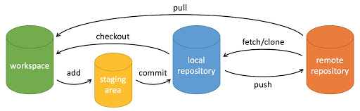

## 菜鸟教程  
[菜鸟教程](https://www.runoob.com/git/git-install-setup.html)  
[官方文档](https://git-scm.com/docs)  
  
## .git / config  
git有一些配置文件，最简单的就是记录作者名称和邮箱。用户文件夹下有全局的配置文件，而每个 git 仓库文件夹下有 local 的配置文件。  
**修改配置**  
```  
git config (--global) [item] [改成这个]  
比如：  
git config --global user.name Li  
```  
其中 --global 表示修改全局配置文件（用户文件夹下的那个），没有就只习概当前文件夹下的项目的配置文件。  
而 item，比如有 user.name, user.email, http.postBuffer(不懂), merge.tool(解决合并冲突时的差异分析工具)，但是不懂()。  
  
**查看配置**  
不要最后那个`[改成这个]`就可以直接查看  
`git config --list`查看所有配置。  
  
**其它**  
`git config -e`针对当前仓库进行后续编辑（这样后面如果没有 --global就只会修改当前仓库的配置文件）。  
`git config -e --global`针对本地所有仓库。  
  
  
## 简单工作流程  
+ 克隆 Git 资源为工作目录。  
+ 在克隆的资源上修改。  
+ 如果别人有修改，可以刷新。  
+ 提交前查看修改。  
+ 提交修改。  
+ 修改完成后，如果发现问题，可以撤回提交再修改，再提交。  
  
## 核心概念：工作区、暂存区、版本库  
将 git 仓库克隆到本地，或者在本地创建 git 仓库，你看到的就是一个工作区，它和实际的资源库是*隔离* 开的，你的操作必须通过`git add`以及`git commit`等提交到远程存储的资源库中。  
  
版本库和工作区相对，就是实际上存储这个仓库内容的东西。  
版本库中有三个部分：`暂存区（索引index),对象库，HEAD指针`。其中：  
+ 对象库你 add / commit 到版本库中的所有文件都会变成对象库中的一个对象，通过文件索引找到这些对象在对象库中的位置，然后就能获得这个文件。你在工作区看到的清晰的文件目录层次结构，在对象库中可以是不存在的，你看到的是索引，然后通过索引+对应的文件建立的仓库。  
+ HEAD是一个指针，指向 master 文件夹，直观理解为仓库中的*当前版本*。这个文件夹实际上也是一个索引，它以目录的层次结构一个个指向对象库中的文件。因此同一个文件在对象库中可能有不同的版本，但是 HEAD 指向的 master 中的那个索引指向哪个版本，你看到的就是哪个版本。  
+ 暂存区，也称索引 *index*，保存了你*暂时的修改*（还没有正式提交）。这同样是一个按照目录层次结构组织的索引，指向对象库中的文件。它和 HEAD 指向的正式索引区别开，暂存区保存暂时的、没有正式提交的修改。然而即使没有正式提交，只是`git add`，对象库中也会新建一个这个文件的对象（或者新版本），然后更新 暂存区 的指针指向这个新的对象。但是先不变 HEAD 指向的当前的”真实内容“。  
  
***  
Git仓库中有一个 `.git/`隐藏目录，里面包括了对象库的所有文件对象和暂存区等，包括暂存区 `.git/index`，对象库`.git/objects`  
  
master 是一个分支，具体是什么意思目前暂时不重要。  
  
### add, commit 操作时发生了什么  
当你 `git clone` 克隆远程仓库的时候，git 根据这个仓库的 HEAD 指向的master目录索引，在对象库中查找相应文件，下载到你本地的工作区上。  
你在工作区做出任何修改，远程仓库中的内容不会发生任何改变。  
  
当你修改了一个文件，或者创建了一个新文件的，并且 `git add`的时候，远程仓库会在*对象库* 中加入已有文件的新版本，或者新建一个文件对象，并且在*暂存区* 中，把旧的文件索引换成指向这个新版本的索引，或者新建指向新文件的索引。  
也就是当 `git add` 的时候，对象库中其实已经有你做出的修改了，但是因为 HEAD 指向的 真·文件索引 没有修改，所以看上去好像没发生变化。  
`git add` 在对象库中创建对象，并更新暂存区的目录树，不更新HEAD的目录树。  
  
当你进一步 `git commit` 的时候，会把 HEAD 指向的文件索引中的旧索引换成你刚刚修改的文件在对象库中的索引，成了新索引，所以你的修改正式生效了。  
注意，commit 会提交暂存区中的所有修改。而`git commit -m "instruction"` 包含提交说明。  
  
  
  
### 图中除了add,commit的其它操作(危险)  
```  
git reset HEAD  
```  
重置暂存区的目录树，将暂存区的目录树复制为HEAD指向的目录树，但是本地工作区不发生变化。此举会丢失暂存区目录树中未提交的改动。  
```  
git rm --cached <file>  
```  
直接从暂存区的目录树中删除某个文件。  
```  
git checkout .  
git checkout --cached <file>  
```  
用暂存区的目录树中的全部或某个特定文件，替换掉工作区的文件。这会丢失工作区中未add的东操作。  
```  
git checkout HEAD .  
git checkout HEAD <file>  
```  
用 HEAD 指向的分支的目录树中的文件，替换掉暂存区和工作区的文件。使暂存区和工作区与 HEAD 一致！会丢失暂存区和工作区中的改动！  
  
## 创建仓库  
在当前目录创建仓库 `git init`  
在指定目录创建仓库 `git init fold`  
创建后，会在创建了目录的位置增加一个 .git (隐藏)文件夹，里面包含了上面提到的暂存区索引、对象库等版本管理的成分。  
创建了仓库后，要将已有文件纳入版本管理，需先`git add`告诉Git追踪这些文件，然后 commit 提交。  
```  
git add *.c  
git add README.md  
git commit -m "initialize"  
```  
上述命令将文件夹下所有.c与README.md文件提交到Git仓库中。  
***  
**注意**：Linux中，Git commit -m  的提交说明用*单引号*，Windows中用 *双引号*。  
***  
  
## 克隆仓库  
```  
git clone <repo>  
git clone <repo> <directory>  
```  
前者克隆到当前目录，后者克隆到目标目录 \<directory>。  
如果要指定仓库名称，可以在最后加上自定义名字字符串。  
这样是直接把*仓库*克隆下来了，包括 .git 文件夹下的各种内容。  
  
## Git基本操作集合  
  
（注：stage 为暂存区）。  
  
### 最简流程  
```  
git init  
git add ...  
git commit -m "..."  
```  
  
### 创建仓库  
|命令|描述|  
|:-:|:-:|  
|`git init`|在当前目录创建仓库|  
|`git clone`|从远程仓库拷贝到本地仓库|  
  
### 提交与修改  
Git的主要工作 就是，提交并保存你的项目快照（当前HEAD），并与前后的快照（不同版本）进行对比。  
|命令|描述|  
|:-:|:-:|  
|`git add <file>`|将文件添加到暂存区（此时文件已在对象库中有了一席之地）只能用本文件夹下的目录或文件。。可以用目录表示递归地提交整个目录..|  
|`git commit`|正式提交暂存区中的所有修改到**本地**仓库。后接`-m "introduction"`进行提交描述。|  
|`git statue`|查看当前仓库状态，显示**所有变更的文件**|  
|`git diff`|比较不同，比较暂存区文件和工作区文件的差异|  
|`git reset`|回退版本|  
|`git rm`|将工作区或暂存区的文件删除。比如`git rm --cached <file>`|  
|`git mv`|移动或重命名工作区文件.(移动到同一文件夹下的不同文件名为重命名）|  
  
### 回退版本  
#### 已提交，但没Push  
`git reset --soft <提交编号>` 撤销刚才的提交，但不撤销 add。（是否可以省略编号？）版本号也许是跳到这个版本号，撤销刚才的提交，但不会撤销版本号之后的、刚才提交之前的提交。  
  
`git reset --mixed <提交编号>`撤销提交与add。提交编号的意义与上面相同。  
  
#### 已push  
`git reset --hard <提交编号>` 撤销并舍弃版本编号之后的所有提交。  
`git push -f` 强制推送到远程。但是之前的所有提交都被覆盖。因为提交记录不一样了，所以只能强制push。  
  
`git revert <提交编号>` 撤销提交编号的提交，但是保留提交记录。这时候相当于把前面的一个版本完整拿过来放到了下一个版本，可以直接Push。  
  
可以用 `git reflog` 查看所有提交与撤销等。  
  
```  
git reset --soft commit_id 回退到之前版本，从记录中撤销刚才的提交。此时本地暂存区没变。  
git reset --hard commit_id 回退到之前版本，撤销从这个之前版本到刚才提交的所有提交。  
git revert commit_id 不撤销刚才的提交，把前面的版本复制过来成为下一个版本。  
  
只有提交记录覆盖了远程仓库才能直接Push，否则必须 git push -f，这很危险。  
```  
  
### 删除仓库  
用`git init`删除仓库中所有内容。`git branch -d (branchname)`删除分支。  
`git init` 删除仓库中所有内容后还剩下.git隐藏仓库，可以命令行del等删除。  
  
### 查看提交历史  
|命令|描述|  
|:-:|:-:|  
|`git log`|查看历史提交记录|  
|`git blame <file>`|以列表形式查看指定文件的历史修改记录|  
  
### 远程操作  
|命令|描述|  
|:-:|:-:|  
|`git remove`|后接其它git命令，远程操作仓库|  
|`git fetch`|远程获取新分支|  
|`git pull`|下载远程代码并**合并**|  
|`git push`|上传远程代码并**合并**|  
  
## 查看提交历史（git log)  
```  
git blame <file> 查看目标文件提交记录  
git log 查看所有提交记录，有很多选项。  
```  
关于**git log**。  
[git log参数](http://git-scm.com/docs/git-log)  
|参数|效果|  
|:-:|:-:|  
|--oneline|简洁显示。每次只显示commit提交说明|  
|--reverse|逆向显示日志。默认是时间*从近到远*|  
|--graph|查看历史中什么时候出现分支、合并,以图的形式给出|  
|--author=XXX|只查看XXX为作者的提交|  
|-数字|只显示最近[数字]条的日志|  
|--since --after|只显示这个时间之后的提交。其中时间格式为{年-月-日}（比如{2010-10-01}），或者{4.weeks.ago}这样。|  
|--until --before|只显示这个时间之前的提交。时间格式同上|  
|--no-merges|隐藏合并提交。|  
  
## Git标签 git tag  
有时候在一个开发的重要节点，希望永远记住这个版本的快照，用 git tag打标签。  
使用`git tag -a [tagname]`在当前HEAD打上一个带注解（时间、谁打的等）的标签。用 `git tag -a`后会打开一个编辑器让你编辑标签内容。  
用`git tag -a XXX 16进制数字提交编号`可以追加标签。每次提交都会有十六进制编号，在commit 后会显示，在 git log 中也会显示。  
  
有了标签后，在`git log --decorate`就可以在查看包含标签的日志了。  
用`git tag`查看所有标签。  
  
指定标签信息：`git tag -a [tagname] -m "content"`  
PGP签名版标签(?)：`git tag -s [tagname] -m "content"`  
